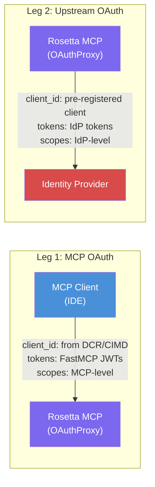
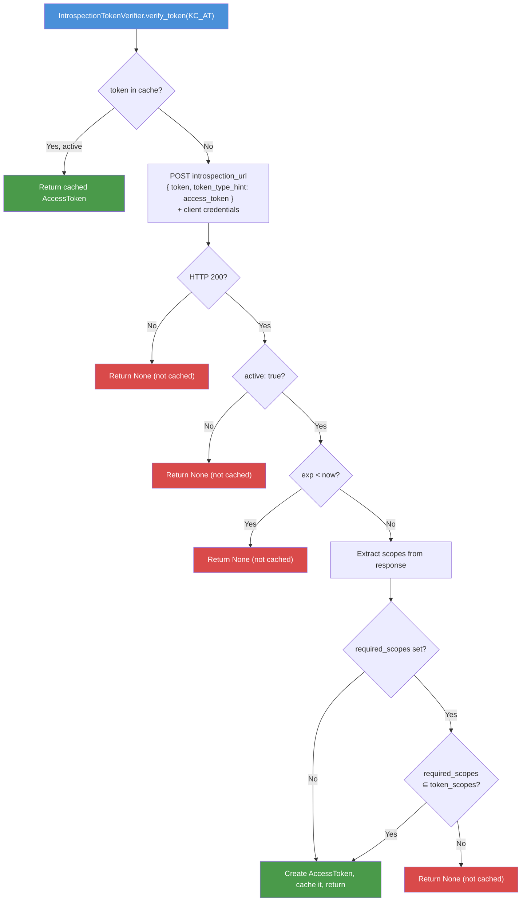
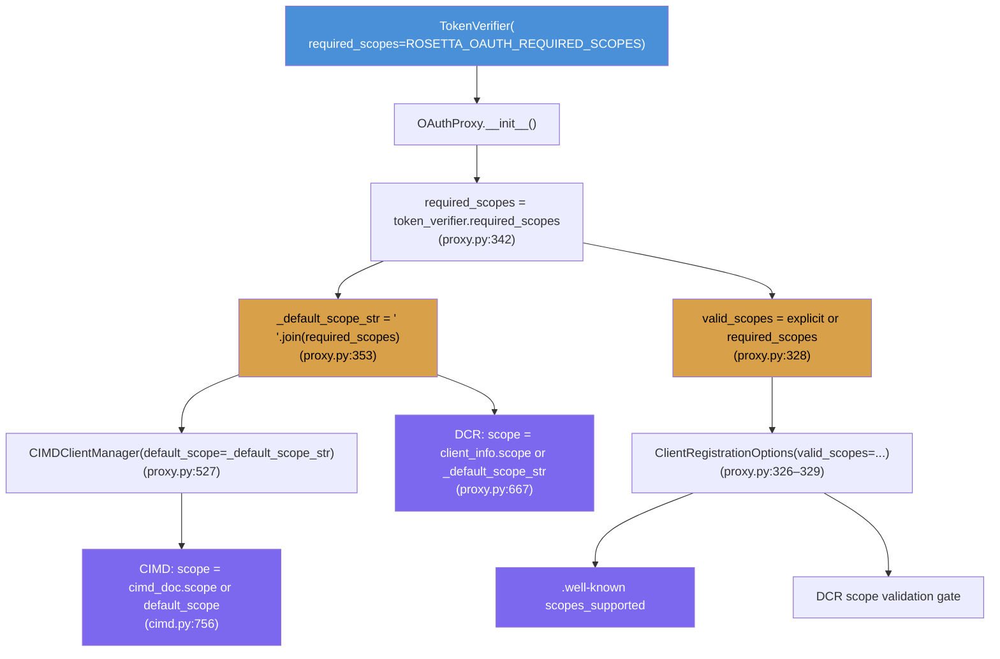
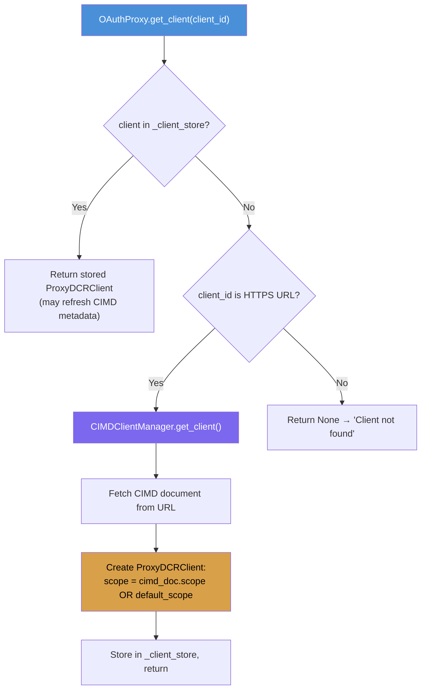
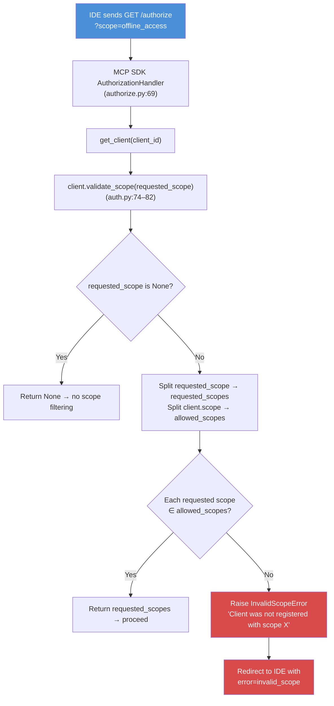

# Authentication

**Who is this for?** Contributors and operators who need to understand how Rosetta MCP authenticates users before changing OAuth configuration, debugging token issues, or deploying to new environments.

**When should I read this?** After [ARCHITECTURE.md](ARCHITECTURE.md). Before touching OAuth configuration, IdP setup, or token-related code.

---

## Authentication Modes

Rosetta MCP supports two transports, each with a different authentication model:


| Transport           | Auth mechanism                   | Where configured                          |
| ------------------- | -------------------------------- | ----------------------------------------- |
| **Streamable HTTP** | OAuth 2.1 via FastMCP OAuthProxy | Environment variables (`ROSETTA_OAUTH_*`) |
| **STDIO**           | API key                          | `ROSETTA_API_KEY` environment variable    |


STDIO is simple: the API key is passed directly. The rest of this document covers HTTP OAuth.

Rosetta MCP supports three OAuth modes, controlled by `ROSETTA_OAUTH_MODE`:

| Mode     | Env var value | Provider class   | Token verifier                 | When to use                                                                        |
| -------- | ------------- | ---------------- | ------------------------------ | ---------------------------------------------------------------------------------- |
| `oidc`   | `oidc`        | `OIDCProxy`      | `JWTVerifier` (auto)           | Any OIDC-compliant IdP (Keycloak, Okta, Auth0, Azure AD, etc.)                     |
| `oauth`  | `oauth`       | `OAuthProxy`     | `IntrospectionTokenVerifier`   | Non-OIDC providers or when real-time token revocation is a hard requirement         |
| `github` | `github`      | `GitHubProvider` | `GitHubTokenVerifier` (auto)   | GitHub as the identity provider                                                    |

All modes use `build_oauth_provider()` in [`src/ims-mcp-server/ims_mcp/auth/oauth.py`](../src/ims-mcp-server/ims_mcp/auth/oauth.py). OAuth is only activated when `ROSETTA_TRANSPORT=http` and the required env vars are set.

> [!NOTE]
> Authentication applies exclusively to HTTP-based transport. STDIO transport relies on local execution environment security.

---

## Architecture

### Two-Leg OAuth Proxy

Rosetta MCP does not authenticate users directly. It acts as an **OAuth proxy** between the MCP client (IDE) and an upstream identity provider. There are two independent OAuth relationships:




**Leg 1 (IDE ↔ OAuthProxy):** The IDE discovers the server via `/.well-known/oauth-authorization-server`. If the IDE's `client_id` is an HTTPS URL (e.g. `https://vscode.dev/oauth/client-metadata.json`), OAuthProxy fetches the CIMD document from that URL to create a synthetic client. Otherwise, the IDE registers via DCR (RFC 7591). The IDE receives FastMCP-issued JWTs signed with `ROSETTA_JWT_SIGNING_KEY`. These JWTs are reference tokens — their real authorization comes from upstream token validation, not from the JWT claims alone.

**Leg 2 (OAuthProxy ↔ IdP):** OAuthProxy uses a **pre-registered** OAuth client with the IdP. It exchanges authorization codes, stores upstream access and refresh tokens, and validates them on each request.

> [!IMPORTANT]
> The two legs have completely separate token lifecycles. The IDE never sees IdP tokens. The IdP never sees FastMCP JWTs.

### Why OAuthProxy

FastMCP offers multiple authentication strategies. Rosetta MCP uses **OAuthProxy** (and its subclass **OIDCProxy**) because Rosetta must work with **any** OAuth 2.0 / OpenID Connect identity provider — not just those that natively support MCP's Dynamic Client Registration. OAuthProxy satisfies both constraints simultaneously:

1. **IdP-agnostic** — works with any traditional OAuth provider using a single pre-registered client.
2. **MCP-compliant** — presents a DCR/CIMD-compliant interface to MCP clients while bridging to the upstream IdP.
3. **Token separation** — the IDE receives FastMCP-issued JWTs, never raw IdP tokens.

---

## OIDC Mode

### Overview

OIDC mode uses `OIDCProxy`, which extends `OAuthProxy` with OIDC auto-discovery. A single `ROSETTA_OAUTH_OIDC_CONFIG_URL` pointing to `/.well-known/openid-configuration` replaces four separate endpoint env vars. `OIDCProxy` creates a `JWTVerifier` from the OIDC `jwks_uri` automatically — upstream tokens are validated locally using IdP public keys with no network call per request.

**Active when:** `ROSETTA_OAUTH_MODE=oidc`

### OIDC Mode Configuration

Required env vars:

| Env var                          | Purpose                                                                   |
| -------------------------------- | ------------------------------------------------------------------------- |
| `ROSETTA_OAUTH_OIDC_CONFIG_URL`  | OIDC discovery URL (e.g. `https://idp.example.com/realms/X/.well-known/openid-configuration`) |
| `ROSETTA_OAUTH_CLIENT_ID`        | Pre-registered IdP client ID                                              |
| `ROSETTA_OAUTH_CLIENT_SECRET`    | IdP client secret                                                         |
| `ROSETTA_OAUTH_BASE_URL`         | Public URL of Rosetta MCP (used as JWT issuer and callback base)          |
| `ROSETTA_JWT_SIGNING_KEY`        | Secret for signing FastMCP JWTs                                           |

Optional env vars:

| Env var                          | Purpose                                                                   |
| -------------------------------- | ------------------------------------------------------------------------- |
| `ROSETTA_OAUTH_CALLBACK_PATH`    | Custom callback path (default: `/oauth/callback`)                         |
| `ROSETTA_OAUTH_REQUIRED_SCOPES`  | Scopes advertised in `.well-known` and assigned to CIMD/DCR clients       |
| `ROSETTA_OAUTH_EXTRA_SCOPES`     | Forwarded to IdP on upstream authorize redirect (e.g. `openid email offline_access`) |

> [!NOTE]
> In OIDC mode, `ROSETTA_OAUTH_VALID_SCOPES` is ignored. Only `ROSETTA_OAUTH_REQUIRED_SCOPES` controls `.well-known` scopes.

### OIDCProxy Internals

`OIDCProxy` extends `OAuthProxy` ([source](../refsrc/fastmcp-3.2.4/src/fastmcp/server/auth/oidc_proxy.py)). It does three things in `__init__`:

1. **Fetches** `config_url` → parses `OIDCConfiguration` containing all endpoints (`oidc_proxy.py:320–322`)
2. **Creates** a `JWTVerifier` from `jwks_uri` + `issuer` + `required_scopes` (`oidc_proxy.py:346–351, 465–471`). This verifies upstream tokens locally using JWKS public keys — no introspection call per request.
3. **Delegates** to `OAuthProxy.__init__()` with all discovered endpoints (`oidc_proxy.py:353–397`)

The `required_scopes` propagation chain works identically to OAuth mode — `OIDCProxy` passes them through `JWTVerifier` → `OAuthProxy.__init__` → `_default_scope_str` → CIMD/DCR clients.

### OIDCProxy Parameters

All `OAuthProxy` parameters are available, plus OIDC-specific ones ([OIDCProxy docs](https://gofastmcp.com/servers/auth/oidc-proxy)):

| Parameter                              | Type          | Default                    | Purpose                                                                                                                                            |
| -------------------------------------- | ------------- | -------------------------- | -------------------------------------------------------------------------------------------------------------------------------------------------- |
| `config_url`                           | str           | **required**               | OIDC discovery URL. All endpoints auto-discovered.                                                                                                 |
| `client_id`                            | str           | **required**               | Pre-registered IdP client                                                                                                                          |
| `client_secret`                        | str           | **required**               | IdP client secret                                                                                                                                  |
| `base_url`                             | str           | **required**               | Public URL of Rosetta MCP (including mount path)                                                                                                   |
| `required_scopes`                      | list[str]     | None                       | Propagates to JWTVerifier, `_default_scope_str`, `.well-known`                                                                                     |
| `token_verifier`                       | TokenVerifier | None                       | Custom verifier (overrides default JWTVerifier). Cannot be combined with `required_scopes` or `algorithm` on OIDCProxy — set them on the verifier. |
| `verify_id_token`                      | bool          | False                      | Verify OIDC `id_token` instead of `access_token` (for IdPs with opaque access tokens)                                                              |
| `audience`                             | str           | None                       | OIDC audience (required by some providers like Auth0)                                                                                              |
| `extra_authorize_params`               | dict          | None                       | Forwarded to upstream authorize endpoint (e.g. `{"scope": "openid email offline_access"}`)                                                         |
| `extra_token_params`                   | dict          | None                       | Forwarded to upstream token endpoint                                                                                                               |
| `client_storage`                       | AsyncKeyValue | Encrypted disk             | Storage backend for client registrations and tokens                                                                                                |
| `jwt_signing_key`                      | str/bytes     | Derived from client_secret | Secret for signing FastMCP JWTs                                                                                                                    |
| `require_authorization_consent`        | bool          | True                       | Show consent screen before authorization                                                                                                           |
| `allowed_client_redirect_uris`         | list[str]     | None (all allowed)         | Patterns with wildcards (e.g. `"http://localhost:*"`)                                                                                              |
| `fallback_access_token_expiry_seconds` | int           | None                       | Expiry when upstream omits `expires_in`                                                                                                            |
| `enable_cimd`                          | bool          | True                       | Accept CIMD URLs as client identifiers                                                                                                             |
| `strict`                               | bool          | None                       | OIDC configuration validation strictness                                                                                                           |
| `token_endpoint_auth_method`           | str           | None                       | `"client_secret_basic"`, `"client_secret_post"`, or `"none"`                                                                                       |

### JWTVerifier vs IntrospectionTokenVerifier

OIDC mode defaults to `JWTVerifier`. `IntrospectionTokenVerifier` is only needed when real-time token revocation is a hard requirement:

|                         | JWTVerifier (OIDC default)    | IntrospectionTokenVerifier (opt-in)  |
| ----------------------- | ----------------------------- | ------------------------------------ |
| Validation              | Local — JWKS public keys      | Remote — IdP introspection endpoint  |
| Latency                 | ~0ms                          | ~50–200ms per uncached call          |
| Revocation detection    | No (must wait for JWT expiry) | Yes (within cache TTL)               |
| `required_scopes` check | JWT `scope` claim             | Introspection response `scope` field |
| Network dependency      | Only at JWKS key refresh      | Every uncached request               |

To override with introspection in OIDC mode, pass a custom `token_verifier` to `OIDCProxy`:

```python
from fastmcp.server.auth.providers.introspection import IntrospectionTokenVerifier

token_verifier = IntrospectionTokenVerifier(
    introspection_url="...",   # or use oidc_config.introspection_endpoint
    client_id="...",
    client_secret="...",
    cache_ttl_seconds=900,
    required_scopes=["offline_access"],  # set HERE, not on OIDCProxy
)

auth = OIDCProxy(
    config_url="...",
    client_id="...",
    client_secret="...",
    base_url="...",
    token_verifier=token_verifier,   # overrides default JWTVerifier
    # required_scopes must NOT be passed when token_verifier is provided (oidc_proxy.py:311–315)
    extra_authorize_params={"scope": "openid email offline_access"},
)
```

### OIDC Mode Phase 4: Token Validation

When the IDE sends a request with `Bearer PROXY_JWT` in OIDC mode:

1. `JWTIssuer.verify_token(PROXY_JWT)` — checks signature, `exp`, `iss`, `aud`
2. JTI → upstream token mapping
3. Retrieve stored IdP access token (KC_AT)
4. `JWTVerifier.verify_token(KC_AT)` — validates against JWKS locally, checks `exp`, `iss`, `required_scopes`
5. Valid → request proceeds; else → HTTP 401

---

## OAuth Mode

### Overview

OAuth mode manually constructs `OAuthProxy` with an `IntrospectionTokenVerifier`. Each endpoint URL is configured separately. Upstream tokens are validated via RFC 7662 introspection — a network call to the IdP per request (cached for 15 minutes). This mode provides real-time token revocation detection at the cost of per-request latency.

**Active when:** `ROSETTA_OAUTH_MODE=oauth` (default when `ROSETTA_OAUTH_MODE` is unset)

### OAuth Mode Configuration

Required env vars:

| Env var                                | Purpose                                           |
| -------------------------------------- | ------------------------------------------------- |
| `ROSETTA_OAUTH_AUTHORIZATION_ENDPOINT` | IdP authorization endpoint URL                    |
| `ROSETTA_OAUTH_TOKEN_ENDPOINT`         | IdP token endpoint URL                            |
| `ROSETTA_OAUTH_INTROSPECTION_ENDPOINT` | IdP token introspection endpoint URL              |
| `ROSETTA_OAUTH_CLIENT_ID`             | Pre-registered IdP client ID                      |
| `ROSETTA_OAUTH_CLIENT_SECRET`         | IdP client secret                                 |
| `ROSETTA_OAUTH_BASE_URL`              | Public URL of Rosetta MCP                         |
| `ROSETTA_JWT_SIGNING_KEY`             | Secret for signing FastMCP JWTs                   |

Optional env vars:

| Env var                              | Purpose                                                                                      |
| ------------------------------------ | -------------------------------------------------------------------------------------------- |
| `ROSETTA_OAUTH_REVOCATION_ENDPOINT`  | IdP token revocation endpoint URL                                                            |
| `ROSETTA_OAUTH_CALLBACK_PATH`        | Custom callback path (default: `/oauth/callback`)                                            |
| `ROSETTA_OAUTH_REQUIRED_SCOPES`      | Scopes advertised in `.well-known` and assigned to CIMD/DCR clients; validated at introspection |
| `ROSETTA_OAUTH_VALID_SCOPES`         | Explicit override for `.well-known` and DCR validation; falls back to `ROSETTA_OAUTH_REQUIRED_SCOPES` if not set |
| `ROSETTA_OAUTH_EXTRA_SCOPES`         | Forwarded to IdP on upstream authorize redirect                                              |

### Token Introspection

Rosetta MCP uses `IntrospectionTokenVerifier` for opaque token validation via RFC 7662 ([FastMCP docs](https://gofastmcp.com/servers/auth/token-verification)). The verifier authenticates to the IdP's introspection endpoint using client credentials and queries it on each bearer token.

#### Introspection Flow




**Source**: `refsrc/fastmcp-3.2.4/.../providers/introspection.py:300–404`

Key behaviors:

- `active: false` responses are **not cached** — they may become valid later (`introspection.py:347–349`)
- `required_scopes` failures are **not cached** — permissions may be updated dynamically (`introspection.py:371`)
- Only `active: true` + valid responses are cached
- Scopes are extracted from the introspection response's `scope` field (space-separated string or array, `introspection.py:255–270`)
- Client authentication defaults to `client_secret_basic` (HTTP Basic Auth header). Can be changed to `client_secret_post` via `client_auth_method` parameter

#### Introspection Caching

Caching is **disabled by default** (`cache_ttl_seconds=None`). Rosetta sets it to **15 minutes** (`INTROSPECTION_CACHE_TTL_SECONDS` in `constants.py`). Maximum cache size is 10,000 tokens by default.

Implication: token revocation at the IdP takes up to 15 minutes to propagate to Rosetta MCP.

#### `required_scopes` During Introspection

Per [FastMCP docs](https://gofastmcp.com/servers/auth/token-verification): "`required_scopes` specifies which OAuth scopes must be present in validated tokens. Tokens lacking required scopes are rejected."

The check (`introspection.py:372–381`): `set(required_scopes).issubset(set(token_scopes))`. If the introspected token's `scope` field does not contain all `required_scopes`, the verifier returns `None` and the request fails.

#### Connection Pooling

`IntrospectionTokenVerifier` accepts an optional `http_client` parameter (httpx.AsyncClient, v2.18.0+) for connection pooling. Without it, a fresh HTTP client is created per introspection call. For production with high request volume, pass a shared `httpx.AsyncClient` and manage its lifecycle via the server lifespan.

### IntrospectionTokenVerifier Configuration

Parameters we use vs available:

| Parameter            | Our value                              | Default                    | Notes                                           |
| -------------------- | -------------------------------------- | -------------------------- | ----------------------------------------------- |
| `introspection_url`  | `ROSETTA_OAUTH_INTROSPECTION_ENDPOINT` | —                          | IdP introspection endpoint                      |
| `client_id`          | `ROSETTA_OAUTH_CLIENT_ID`              | —                          | Pre-registered IdP client                       |
| `client_secret`      | `ROSETTA_OAUTH_CLIENT_SECRET`          | —                          | IdP client secret                               |
| `cache_ttl_seconds`  | 900 (15 min)                           | None (disabled)            | Trades revocation latency for performance       |
| `required_scopes`    | `ROSETTA_OAUTH_REQUIRED_SCOPES` or None | None                      | Propagates to CIMD/DCR clients as default scope |
| `client_auth_method` | default (`client_secret_basic`)        | `client_secret_basic`      | IdP supports both methods                       |
| `http_client`        | not set                                | None (new client per call) | Consider setting for production                 |
| `max_cache_size`     | default (10000)                        | 10000                      | —                                               |
| `timeout_seconds`    | default (10)                           | 10                         | —                                               |

### OAuth Mode Phase 4: Token Validation

When the IDE sends a request with `Bearer PROXY_JWT` in OAuth mode:

1. `JWTIssuer.verify_token(PROXY_JWT)` — checks signature, `exp`, `iss`, `aud` → `JoseError` if expired → HTTP 401
2. JTI → upstream token mapping
3. Retrieve stored IdP access token (KC_AT)
4. `IntrospectionTokenVerifier.verify_token(KC_AT)` — introspects with IdP (cached 15 min)
5. `active: true` → request proceeds; `active: false` → HTTP 401

---

## GitHub Mode

### Overview

GitHub mode uses `GitHubProvider`, which extends `OAuthProxy` with hardcoded GitHub endpoints and a `GitHubTokenVerifier` that validates tokens via the GitHub API. No introspection endpoint or OIDC discovery URL is needed — just a GitHub OAuth App's client credentials.

`GitHubProvider` is a built-in FastMCP provider ([docs](https://gofastmcp.com/integrations/github)). It creates a `GitHubTokenVerifier` that calls `https://api.github.com/user` to verify tokens and extract user identity (login, name, email, avatar).

**Active when:** `ROSETTA_OAUTH_MODE=github`

### GitHub Mode Configuration

Required env vars:

| Env var                          | Purpose                                                                   |
| -------------------------------- | ------------------------------------------------------------------------- |
| `ROSETTA_OAUTH_CLIENT_ID`       | GitHub OAuth App Client ID (e.g. `Ov23liAbcDefGhiJkLmN`)                 |
| `ROSETTA_OAUTH_CLIENT_SECRET`   | GitHub OAuth App Client Secret                                            |
| `ROSETTA_OAUTH_BASE_URL`        | Public URL of Rosetta MCP (HTTPS required for production)                 |
| `ROSETTA_JWT_SIGNING_KEY`       | Secret for signing FastMCP JWTs                                           |

Optional env vars:

| Env var                          | Purpose                                                                   |
| -------------------------------- | ------------------------------------------------------------------------- |
| `ROSETTA_OAUTH_CALLBACK_PATH`   | Custom callback path (default: `/auth/callback`)                          |
| `ROSETTA_OAUTH_REQUIRED_SCOPES` | Required GitHub scopes (default: `user`). Use `user:email` to guarantee email availability. |

> [!NOTE]
> In GitHub mode, `ROSETTA_OAUTH_VALID_SCOPES`, `ROSETTA_OAUTH_EXTRA_SCOPES`, `ROSETTA_OAUTH_AUTHORIZATION_ENDPOINT`, `ROSETTA_OAUTH_TOKEN_ENDPOINT`, `ROSETTA_OAUTH_INTROSPECTION_ENDPOINT`, and `ROSETTA_OAUTH_REVOCATION_ENDPOINT` are ignored. GitHub endpoints are hardcoded in `GitHubProvider`.

### GitHub OAuth App Setup

1. Go to **Settings → Developer settings → OAuth Apps** at [github.com/settings/developers](https://github.com/settings/developers)
2. Click **"New OAuth App"** and fill in:
   - **Application name**: e.g. "Rosetta MCP"
   - **Homepage URL**: your Rosetta MCP public URL
   - **Authorization callback URL**: `<ROSETTA_OAUTH_BASE_URL>/auth/callback` (must match `ROSETTA_OAUTH_CALLBACK_PATH`)
3. Save the **Client ID** and generate a **Client Secret**

> [!WARNING]
> GitHub allows `http://localhost` for development but requires HTTPS for production callback URLs.

### GitHubTokenVerifier

`GitHubTokenVerifier` validates GitHub OAuth tokens by calling the GitHub API:

1. `GET https://api.github.com/user` with `Bearer <token>` — verifies token and retrieves user profile
2. `GET https://api.github.com/user/repos` — reads `X-OAuth-Scopes` header to determine granted scopes
3. Checks `required_scopes ⊆ granted_scopes`
4. Returns `AccessToken` with claims: `sub` (GitHub user ID), `login`, `name`, `email`, `avatar_url`

> [!NOTE]
> GitHub users with private email settings return `null` for the `email` claim. Rosetta falls back to `ROSETTA_USER_EMAIL` when `email` is not available. Consider requiring `user:email` scope if email-based identity is needed.

### GitHub Mode Phase 4: Token Validation

When the IDE sends a request with `Bearer PROXY_JWT` in GitHub mode:

1. `JWTIssuer.verify_token(PROXY_JWT)` — checks signature, `exp`, `iss`, `aud`
2. JTI → upstream token mapping
3. Retrieve stored GitHub access token (GH_AT)
4. `GitHubTokenVerifier.verify_token(GH_AT)` — calls GitHub API, checks scopes
5. Valid → request proceeds; else → HTTP 401

---

## Shared: Full Authentication Flow

Phases 1–3 are identical in all three modes. Phase 4 differs (see mode-specific sections above).

```mermaid
sequenceDiagram
    participant IDE as MCP Client (IDE)
    participant PROXY as OAuthProxy (Rosetta MCP)
    participant KC as Identity Provider

    rect rgb(40, 40, 60)
    Note over IDE,PROXY: Phase 1: Discovery + Client Resolution
    IDE->>PROXY: GET /.well-known/oauth-authorization-server
    PROXY-->>IDE: { scopes_supported: [...], registration_endpoint, ... }
    Note right of PROXY: scopes_supported from<br/>ClientRegistrationOptions.valid_scopes<br/>(= ROSETTA_OAUTH_VALID_SCOPES or<br/>token_verifier.required_scopes)

    alt CIMD client (client_id is HTTPS URL)
        Note over IDE,PROXY: IDE sends client_id=https://...metadata.json
        PROXY->>PROXY: CIMDClientManager.get_client() fetches URL
        Note right of PROXY: scope = cimd_doc.scope or _default_scope_str
    else DCR client (traditional registration)
        IDE->>PROXY: POST /register { redirect_uris, scope?, ... }
        Note right of PROXY: MCP SDK RegistrationHandler:<br/>if scope=None → default_scopes<br/>if scope set → validate against valid_scopes
        PROXY->>PROXY: OAuthProxy.register_client()<br/>scope = client_info.scope or _default_scope_str
        PROXY-->>IDE: { client_id, client_secret }
    end
    end

    rect rgb(40, 60, 40)
    Note over IDE,KC: Phase 2: Authorization
    IDE->>PROXY: GET /authorize ?scope=... &code_challenge=... &redirect_uri=http://127.0.0.1:PORT/
    Note right of PROXY: MCP SDK AuthorizationHandler:<br/>client.validate_scope(requested_scope)<br/>→ checks each scope ∈ client.scope<br/>→ InvalidScopeError if not found

    PROXY->>PROXY: Store OAuthTransaction(scopes, PKCE, redirect_uri)

    PROXY->>KC: REDIRECT → /auth ?scope=EXTRA_SCOPES &client_id=pre-registered-client
    Note right of KC: Scope built by _build_upstream_authorize_url():<br/>1. transaction.scopes (from Leg 1)<br/>2. extra_authorize_params OVERRIDES scope<br/>(= ROSETTA_OAUTH_EXTRA_SCOPES)

    KC-->>IDE: IdP login page (browser)
    IDE->>KC: User authenticates

    KC->>PROXY: Callback ?code=KC_AUTH_CODE
    PROXY->>KC: POST /token (code exchange, PKCE)
    KC-->>PROXY: { access_token: KC_AT, refresh_token: KC_RT, expires_in }

    PROXY->>PROXY: Store UpstreamTokenSet(KC_AT, KC_RT)<br/>encrypted in client_storage
    PROXY-->>IDE: REDIRECT → http://127.0.0.1:PORT/ ?code=PROXY_CODE
    end

    rect rgb(60, 40, 40)
    Note over IDE,PROXY: Phase 3: Token Exchange (Leg 1)
    IDE->>PROXY: POST /token grant_type=authorization_code code=PROXY_CODE
    PROXY->>PROXY: Validate PKCE, issue FastMCP JWT + refresh token
    Note right of PROXY: JWT expires_in = KC expires_in<br/>(mirrors upstream, NOT configurable)
    PROXY-->>IDE: { access_token: PROXY_JWT, refresh_token: PROXY_RT, expires_in }
    end

    rect rgb(40, 50, 60)
    Note over IDE,KC: Phase 4: Normal Operations (mode-specific — see OIDC Mode / OAuth Mode sections)
    IDE->>PROXY: MCP request + Bearer PROXY_JWT
    PROXY->>PROXY: JWTIssuer.verify_token(PROXY_JWT)<br/>checks: signature, exp, iss, aud
    PROXY->>PROXY: JTI mapping → UpstreamTokenSet
    PROXY->>KC: Validate upstream token (JWT or introspection)
    KC-->>PROXY: Valid / Invalid
    PROXY-->>IDE: Tool result or 401 invalid_token
    end
```




---

## Shared: Scope Architecture

Scopes serve different purposes on each leg. Mixing them causes failures. Understanding the scope propagation chain is essential for correct configuration.

### The `required_scopes` Propagation Chain

The primary mechanism for scope configuration is `required_scopes` on the `TokenVerifier`. Per [FastMCP OAuthProxy docs](https://gofastmcp.com/servers/auth/oauth-proxy): **"Dynamic clients created by the proxy will automatically include these scopes in their authorization requests."** This chain applies to both OIDCProxy (via JWTVerifier) and OAuthProxy (via IntrospectionTokenVerifier), since OIDCProxy inherits OAuthProxy:




`required_scopes` controls four things simultaneously:

1. **Default scope for CIMD clients** — assigned when the CIMD document has no `scope` field
2. **Default scope for DCR clients** — assigned when the client sends no `scope` in registration
3. **`.well-known` scopes_supported** — advertised to MCP clients (unless `valid_scopes` explicitly overrides)
4. **Token scope validation** — checked during upstream token verification (JWT claim or introspection response)

### Three Scope Controls


| Parameter                                                     | Source                                    | Purpose                                                                                                                                   |
| ------------------------------------------------------------- | ----------------------------------------- | ----------------------------------------------------------------------------------------------------------------------------------------- |
| `required_scopes` on `TokenVerifier`                          | `ROSETTA_OAUTH_REQUIRED_SCOPES` env var   | Default scope for all clients. Advertised in `.well-known` (unless `valid_scopes` overrides). Validated during token verification.        |
| `valid_scopes` on `OAuthProxy`                                | `ROSETTA_OAUTH_VALID_SCOPES` env var      | Explicit override for `.well-known` and DCR validation. Falls back to `required_scopes` if not set. **Not used in OIDC mode.**             |
| `extra_authorize_params` on `OAuthProxy`                      | `ROSETTA_OAUTH_EXTRA_SCOPES` env var      | Forwarded to IdP on the upstream authorize redirect. Not visible to MCP clients. Overrides the scope parameter in the upstream URL.       |


### Which Scopes Go Where


| Scope            | `required_scopes` | `ROSETTA_OAUTH_EXTRA_SCOPES` | Why                                                                                             |
| ---------------- | ----------------- | ---------------------------- | ----------------------------------------------------------------------------------------------- |
| `offline_access` | Yes               | Yes                          | Clients need it as default scope to enable refresh. IdP needs it to issue a refresh token.      |
| `openid`         | No                | Yes                          | IdP-level concept. Would fail token scope validation if added to `required_scopes`.             |
| `email`          | No                | Yes                          | IdP-level concept. Needed for user identity extraction from IdP claims.                         |


> [!CAUTION]
> Putting `openid` or `email` in `required_scopes` or `ROSETTA_OAUTH_VALID_SCOPES` causes `invalid_scope` errors. The MCP SDK validates requested scopes against the client's allowed scopes. IdP-specific scopes fail this validation because they are meaningless at the MCP protocol layer.

### How `extra_authorize_params` Works

When the OAuthProxy builds the upstream IdP redirect, it constructs the URL in this order:

1. Base query parameters (`response_type`, `client_id`, `redirect_uri`, `state`)
2. Scopes from the MCP client's authorize request (Leg 1 scopes)
3. `extra_authorize_params` merged **last** — **overrides** the scope parameter

This means `ROSETTA_OAUTH_EXTRA_SCOPES` replaces whatever scopes the MCP client requested with the full set the IdP needs.

---

## Shared: Token Lifecycle

### Token Types


| Token                  | Issued by            | Held by             | Lifetime                        | Purpose                              |
| ---------------------- | -------------------- | ------------------- | ------------------------------- | ------------------------------------ |
| **PROXY_JWT** (access) | OAuthProxy (FastMCP) | MCP client (IDE)    | Mirrors upstream `expires_in`   | Bearer token for MCP requests        |
| **PROXY_RT** (refresh) | OAuthProxy (FastMCP) | MCP client (IDE)    | Mirrors upstream refresh TTL    | Client-initiated token refresh       |
| **KC_AT** (access)     | Identity Provider    | OAuthProxy (stored) | IdP session config              | Validated on each MCP request        |
| **KC_RT** (refresh)    | Identity Provider    | OAuthProxy (stored) | IdP offline session config      | Server-side token renewal            |


### Token Refresh

No custom refresh mixin. Rosetta MCP uses the standard OAuth refresh flow only.

The MCP client handles token refresh by sending `grant_type=refresh_token` with `PROXY_RT` to the proxy's token endpoint. OAuthProxy uses the stored upstream refresh token (KC_RT) to obtain new IdP tokens, then issues a new `PROXY_JWT` and `PROXY_RT` to the client.

Requires two independent scope settings:

- `offline_access` in `ROSETTA_OAUTH_REQUIRED_SCOPES` → advertised in `.well-known` → MCP clients receive it as default scope → client can request refresh
- `offline_access` in `ROSETTA_OAUTH_EXTRA_SCOPES` → forwarded to IdP authorize URL → IdP issues a refresh token

> [!NOTE]
> Both settings are required for refresh to work end-to-end. One without the other breaks the flow at different points.

---

## Shared: State Persistence

OAuthProxy stores all state in a pluggable `client_storage` backend via the `client_storage` parameter ([FastMCP docs](https://gofastmcp.com/servers/auth/oauth-proxy)). State **survives MCP server restarts** by default.

**Default storage (no `client_storage` provided):** Fernet-encrypted file tree at `~/.fastmcp/oauth-proxy/{key_fingerprint}/` (`proxy.py:426–450`). The `key_fingerprint` is derived from the JWT signing key via SHA-256. Different keys get isolated directories. Decryption errors are treated as cache misses — key rotation causes re-registration, not hard failures. Per FastMCP docs: "clients are automatically persisted to an encrypted disk store, allowing them to survive server restarts as long as the filesystem remains accessible."

**Redis storage (production):** Pass a `FernetEncryptionWrapper`-wrapped `RedisStore` as `client_storage`. Rosetta MCP does this when `REDIS_URL` is set, encrypted with `FERNET_KEY`. Per FastMCP docs, custom storage must be wrapped in `FernetEncryptionWrapper` for encryption at rest.

**Stored collections:**


| Collection                | Model                  | Contents                                                    |
| ------------------------- | ---------------------- | ----------------------------------------------------------- |
| `mcp-oauth-proxy-clients` | `ProxyDCRClient`       | Registered DCR/CIMD clients with scopes, redirect URIs      |
| `mcp-oauth-transactions`  | `OAuthTransaction`     | Active authorization flows (15 min TTL)                     |
| `mcp-authorization-codes` | `ClientCode`           | Auth codes with PKCE + upstream tokens (5 min TTL)          |
| `mcp-upstream-tokens`     | `UpstreamTokenSet`     | KC_AT + KC_RT, encrypted at storage layer                   |
| `mcp-jti-mappings`        | `JTIMapping`           | FastMCP JWT JTI → upstream token ID                         |
| `mcp-refresh-tokens`      | `RefreshTokenMetadata` | Refresh token metadata keyed by hash (not the token itself) |


> [!WARNING]
> DCR/CIMD clients persist with their **original scope** across restarts. If you change `ROSETTA_OAUTH_VALID_SCOPES` or `ROSETTA_OAUTH_REQUIRED_SCOPES`, existing clients retain their old scope. The old client gets loaded from storage, and `validate_scope` checks against the **stored** scope, not the new configuration. To fix: clear the storage directory or Redis collection `mcp-oauth-proxy-clients`.

---

## Shared: FastMCP OAuthProxy Internals Reference

This section documents the exact code paths in FastMCP 3.1.0 and MCP Python SDK 1.26.0 that control authentication, scope validation, and token lifecycle. Line references are to `refsrc/` copies. All behavior described here is verified against source code, not documentation.

### Client Resolution

Two client types exist. The type is determined by the format of `client_id`.




**CIMD path** (`proxy.py:634–641`, `cimd.py:722–769`):

- Triggered when `client_id` is an HTTPS URL (e.g. `https://vscode.dev/oauth/client-metadata.json`).
- `CIMDClientManager.get_client()` fetches the JSON document at that URL.
- Creates `ProxyDCRClient` with `scope = cimd_doc.scope or self.default_scope` (`cimd.py:756`).
- `self.default_scope` = `self._default_scope_str` = `" ".join(self.required_scopes or [])` (`proxy.py:353,527`).
- `self.required_scopes` comes from `token_verifier.required_scopes` (`proxy.py:342`).
- **With `required_scopes=["offline_access"]`**: CIMD clients whose document has no `scope` field get `scope = "offline_access"`.
- **Without `required_scopes`**: CIMD clients get `scope = ""`, and ANY scope in `/authorize` triggers `InvalidScopeError`.

**DCR path** (`proxy.py:644–691`, `register.py:34–136`):

- MCP SDK `RegistrationHandler.handle()` parses the registration request.
- **Line `register.py:62–63`**: If `client_metadata.scope is None` and `self.options.default_scopes is not None`, assigns `default_scopes` to the client. OAuthProxy does **not** set `default_scopes` (`proxy.py:326–329`), so this path is never taken.
- **Line `register.py:64–75`**: If `client_metadata.scope is not None` and `self.options.valid_scopes is not None`, validates requested scopes are a subset of `valid_scopes`. Rejects with `invalid_client_metadata` if not.
- Calls `OAuthProxy.register_client(client_info)` (`proxy.py:644`).
- `proxy.py:667`: `scope = client_info.scope or self._default_scope_str`.
- **With `required_scopes=["offline_access"]`**: scope-less DCR clients get `scope = "offline_access"` via `_default_scope_str`.

> [!IMPORTANT]
> **`valid_scopes` ≠ `default_scopes` ≠ `required_scopes`.** Three separate concepts in `ClientRegistrationOptions` (`settings.py:7–8`) and `OAuthProvider`:
>
> - `valid_scopes` — what scopes are ALLOWED during DCR and advertised in `.well-known`. Set by OAuthProxy.
> - `default_scopes` — what scopes are ASSIGNED by the MCP SDK when a client sends no scope in DCR (`register.py:62–63`). **Not set by OAuthProxy.**
> - `required_scopes` (on `TokenVerifier`) — propagates to `_default_scope_str` which serves as default for CIMD and DCR clients at the OAuthProxy level (`proxy.py:667`, `cimd.py:756`). Also falls back to `valid_scopes` if not explicitly set (`proxy.py:328`). This is the **primary configuration mechanism** per FastMCP docs.

### Scope Validation During Authorization




**Source**: `mcp/shared/auth.py:74–82` (`OAuthClientMetadata.validate_scope`):

```
if client.scope is None → allowed_scopes = []
if client.scope is "" → allowed_scopes = [] (empty string split)
```

Any requested scope against an empty `allowed_scopes` list raises `InvalidScopeError`.

**Implication**: If the client was registered/resolved with `scope=""` (because CIMD doc has no scope and `required_scopes` is empty), then ANY scope requested in `/authorize` will fail.

### Upstream Authorize URL Construction

**Source**: `consent.py:248–282` (`_build_upstream_authorize_url`):

1. `scopes_to_use = transaction.scopes or self.required_scopes or []` (line 259)
2. If `scopes_to_use` is non-empty, set `query_params["scope"]` (line 260–261)
3. `extra_authorize_params` merged last via `query_params.update()` (line 278–279)
4. If `extra_authorize_params` contains `"scope"` key, it **replaces** step 2's value

### Token Issuance (PROXY_JWT Lifetime)

**Source**: `proxy.py:904–930` (`exchange_authorization_code`):

```
if "expires_in" in idp_tokens → expires_in = idp_tokens["expires_in"]
elif fallback_access_token_expiry_seconds is set → use that
elif upstream returned refresh_token → 1 hour (DEFAULT_ACCESS_TOKEN_EXPIRY_SECONDS)
else → 1 year (DEFAULT_ACCESS_TOKEN_EXPIRY_NO_REFRESH_SECONDS)
```

PROXY_JWT `expires_in` mirrors the upstream `expires_in`. When the IdP always returns `expires_in`, the JWT lifetime equals the IdP access token lifetime. **There is no OAuthProxy parameter to override this when the upstream provides `expires_in`.**

### Token Validation (load_access_token)

**Source**: `proxy.py:1384–1454`:

1. `jwt_issuer.verify_token(token)` — verifies signature, **checks `exp`**, checks `iss`, `aud` (`jwt_issuer.py:219–237`). If expired → raises `JoseError` → returns `None` → HTTP 401.
2. Lookup `_jti_mapping_store.get(jti)` → if missing → returns `None`.
3. Lookup `_upstream_token_store.get(upstream_token_id)` → if missing → returns `None`.
4. `_token_validator.verify_token(verification_token)` — validates upstream token (JWT or introspection).
5. If validation fails → returns `None` → HTTP 401.

### `.well-known` Metadata

**Source**: `mcp/server/auth/routes.py` → `build_metadata()`, `mcp/server/auth/handlers/metadata.py`:

`scopes_supported` in the `.well-known/oauth-authorization-server` response comes from `ClientRegistrationOptions.valid_scopes`. OAuthProxy sets this to `valid_scopes or token_verifier.required_scopes` (`proxy.py:328`).

### Relevant Open Issues

- **[#3492](https://github.com/jlowin/fastmcp/pull/3492)** (open): Fixes OAuthProxy to prefer IdP-granted scopes over client-requested scopes. When an IdP silently downgrades scopes (per RFC 6749 §5.1), the proxy was storing the requested scopes, not the granted ones. Directly relevant to `offline_access` handling.
- **[#3465](https://github.com/jlowin/fastmcp/pull/3465)** (merged): Fixes scope patching in `load_access_token` for OIDCProxy when `verify_id_token=True`.
- **[#3425](https://github.com/jlowin/fastmcp/issues/3425)** (closed, dup of #2862): OAuth token cache preserves stale `expires_in` after reload — affects token lifetime correctness on server restart.
- **[#3509](https://github.com/PrefectHQ/fastmcp/issues/3509)** (open): OAuthProxy: refresh_expires_in=0 (Keycloak offline_access) causes PROXY_RT to never be issued.

#3509 is directly affecting us => src/ims-mcp-server/ims_mcp/auth/offline_refresh_fix.py is implemented to fix that refresh_expires_in=0 to predefined value until #3509 is fixed.

---

## Key Code References


| File                                                   | Purpose                                               |
| ------------------------------------------------------ | ----------------------------------------------------- |
| `src/ims-mcp-server/ims_mcp/auth/oauth.py`                 | `build_oauth_provider()` — constructs OIDCProxy, OAuthProxy, or GitHubProvider based on mode |
| `src/ims-mcp-server/ims_mcp/auth/__init__.py`              | Auth module exports                                   |
| `src/ims-mcp-server/ims_mcp/config.py`                     | OAuth environment variable loading                    |
| `src/ims-mcp-server/ims_mcp/constants.py`                  | TTL constants (`INTROSPECTION_CACHE_TTL_SECONDS=900`, `PROXY_SESSION_TTL_SECONDS=2592000`) |


| FastMCP / MCP SDK Reference                         | Key Lines                                                                                                                                           |
| --------------------------------------------------- | --------------------------------------------------------------------------------------------------------------------------------------------------- |
| `refsrc/fastmcp-3.2.4/.../oauth_proxy/proxy.py`     | `__init__` (228–534), `register_client` (644–691), `authorize` (697–810), `exchange_authorization_code` (855–1047), `load_access_token` (1384–1454) |
| `refsrc/fastmcp-3.2.4/.../oauth_proxy/consent.py`   | `_build_upstream_authorize_url` (248–282)                                                                                                           |
| `refsrc/fastmcp-3.2.4/.../oauth_proxy/models.py`    | `ProxyDCRClient` (136–253), `UpstreamTokenSet` (80–99), constants (25–29)                                                                           |
| `refsrc/fastmcp-3.2.4/.../auth/cimd.py`             | `CIMDClientManager.get_client` (722–769), `default_scope` (693–704)                                                                                 |
| `refsrc/fastmcp-3.2.4/.../auth/jwt_issuer.py`       | `verify_token` (205–244) — checks exp, iss, aud                                                                                                     |
| `refsrc/fastmcp-3.2.4/.../auth/oidc_proxy.py`       | `__init__` (320–397), `JWTVerifier` creation (346–351, 465–471)                                                                                     |
| `refsrc/python-sdk-1.26.0/.../shared/auth.py`       | `validate_scope` (74–82) — scope check against client.scope                                                                                         |
| `refsrc/python-sdk-1.26.0/.../handlers/register.py` | DCR handler (34–136), `default_scopes` assignment (62–63), `valid_scopes` validation (64–75)                                                        |
| `refsrc/python-sdk-1.26.0/.../auth/settings.py`     | `ClientRegistrationOptions` (4–8) — `valid_scopes` vs `default_scopes`                                                                              |


---

## Configuration and Secrets

For the full list of OAuth environment variables, secrets, and authorization policy, see [Deployment Guide — MCP Security](../DEPLOYMENT_GUIDE.md#security-1).

---

## Related Docs

- [ARCHITECTURE.md](ARCHITECTURE.md) — system overview, MCP tools, data flow
- [DEPLOYMENT_GUIDE.md](../DEPLOYMENT_GUIDE.md) — environment setup, Helm deployment
- [TROUBLESHOOTING.md](../TROUBLESHOOTING.md) — symptom-first diagnosis
- [FastMCP Authentication overview](https://gofastmcp.com/servers/auth/authentication) — auth provider selection guide
- [FastMCP OAuthProxy docs](https://gofastmcp.com/servers/auth/oauth-proxy) — upstream library reference
- [FastMCP OIDCProxy docs](https://gofastmcp.com/servers/auth/oidc-proxy) — OIDC auto-discovery proxy
- [FastMCP Token Verification docs](https://gofastmcp.com/servers/auth/token-verification) — introspection and JWT verification
- [FastMCP auth examples](https://github.com/jlowin/fastmcp/tree/main/examples/auth) — GitHub, Azure, Google, AWS, Auth0 examples
