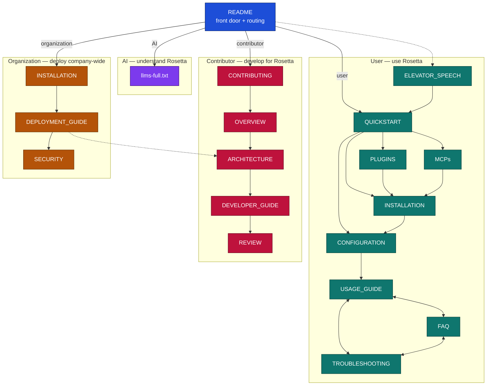

# Documentation Structure Plan

Each doc answers one question for one reader at one moment. If a file answers two questions, the reader has to skim past half of it.

## Reader profiles

Four reader types. Every doc serves one primary profile. README is the shared front door that routes all four.

- **User** — wants to use Rosetta on their own project. The primary audience. Path: README → QUICKSTART → install (PLUGINS / MCPs / INSTALLATION) → CONFIGURATION → USAGE_GUIDE, with FAQ and TROUBLESHOOTING for support.
- **AI** — a coding agent reading the repo to learn Rosetta. Path: README points it to `llms-full.txt`, one dense machine-readable source.
- **Contributor** — develops for Rosetta. Path: CONTRIBUTING → OVERVIEW → ARCHITECTURE → DEVELOPER_GUIDE → REVIEW.
- **Organization** — wants to deploy Rosetta company-wide. Path: INSTALLATION → DEPLOYMENT_GUIDE → SECURITY, reusing ARCHITECTURE.

| File | One-line job | Serves | Profile |
|---|---|---|---|
| `README.md` | Orientation + route to the right doc. | Anyone landing on the repo. | Front door (all) |
| `ELEVATOR_SPEECH.md` | 30-second pitch for the unconvinced. | Someone asked "what is Rosetta?" in a hallway. | User |
| `QUICKSTART.md` | Fastest path to a working setup. | A user who decided to try it. | User |
| `INSTALLATION.md` | Complete setup reference, all modes and transports. | A user or org with a non-default setup. | User + Organization |
| `PLUGINS.md` | Plugin install path, per IDE. | Users on the plugin install route. | User |
| `MCPs.md` | MCP install path. | Users on the MCP install route. | User |
| `CONFIGURATION.md` | Post-install workspace setup (includes refsrc examples). | A user asking "now what?". | User |
| `USAGE_GUIDE.md` | How to run the workflows day to day. | A configured user doing real work. | User |
| `FAQ.md` | Fast answers to recurring real questions. | Anyone scanning before a full guide. | User |
| `TROUBLESHOOTING.md` | Recover when setup or runtime breaks. | A user who hit an error. | User |
| `CHANGELOG.md` | Release history. | Existing users checking what moved. | User |
| `llms-full.txt` | Dense, machine-readable source of the whole project. | An AI agent reading the repo. | AI |
| `OVERVIEW.md` | Mental model. How to think about Rosetta. | A contributor getting oriented. | Contributor |
| `ARCHITECTURE.md` | System structure, components, data flow. | Contributors and org deployers. | Contributor + Organization |
| `CONTRIBUTING.md` | How to make a correct contribution. | A first-time contributor. | Contributor |
| `DEVELOPER_GUIDE.md` | Navigate and build the codebase. | Contributors writing code. | Contributor |
| `REVIEW.md` | Standards for evaluating a change. | Reviewers and PR authors. | Contributor |
| `SECURITY.md` | Report vulnerabilities + security posture. | Security-conscious users and orgs. | Organization |
| `DEPLOYMENT_GUIDE.md` | Deploy Rosetta server org-wide. | Platform / infra owners. | Organization |

`refsrc-examples.md` is removed — its content now lives in `CONFIGURATION.md` as a collapsible section.

## 2. Per-document contract

### README.md
- **Profile:** Front door (all).
- **Audience:** anyone landing on the repo for the first time.
- **Answers:** "What is this, and where do I go next?"
- **Owns:** one-paragraph what-it-is, the value proposition in brief, the routing table ("I want to… → read X"), community/license pointers.
- **Structure:** badges/hero → one-line what-it-is → value proposition → Quick Start teaser (links out) → "I want to… → read X" routing table → who-it's-for → community/license.
- **Excludes:** full install steps (→ QUICKSTART/INSTALLATION), mental model and concepts (→ OVERVIEW), workflow how-tos (→ USAGE_GUIDE).
- **Sources:** ELEVATOR_SPEECH + OVERVIEW (value prop), the live doc set (routing table), PyPI badges (`ims-mcp`, `rosetta-cli`).

### OVERVIEW.md
- **Profile:** Contributor.
- **Audience:** someone deciding whether/how to adopt, before touching a terminal.
- **Answers:** "How should I think about Rosetta? What does it do and not do?"
- **Owns:** problem statement, core mental model, key concepts/terminology, session lifecycle, the "what Rosetta does not do" boundary.
- **Structure:** problem statement → core mental model → key concepts/terminology → session lifecycle → "what Rosetta does not do".
- **Excludes:** install/setup steps (→ INSTALLATION/QUICKSTART), per-workflow how-tos (→ USAGE_GUIDE), code-level internals (→ ARCHITECTURE/DEVELOPER_GUIDE).
- **Sources:** ELEVATOR_SPEECH (why), `workflows/` + `skills/` (concepts/terminology), ARCHITECTURE (session lifecycle).

### ELEVATOR_SPEECH.md
- **Profile:** User.
- **Audience:** an unconvinced colleague who asked in passing.
- **Answers:** "Why does this exist, in 30 seconds?"
- **Owns:** the pitch — problem, solution, one-line core idea, proof.
- **Structure:** hook/problem → solution in one line → how it helps → proof/outcome.
- **Excludes:** setup/how-to (→ QUICKSTART), conceptual depth (→ OVERVIEW), feature reference (→ USAGE_GUIDE).
- **Sources:** the value-proposition deck/slide, README intro, real proof points/metrics.

### QUICKSTART.md
- **Profile:** User.
- **Audience:** a user who decided to try it and wants it working now.
- **Answers:** "Minimum steps to a working setup?"
- **Owns:** install one-liner, initialize-once step, a short "next steps" pointing into the workflows. Happy path only.
- **Structure:** prerequisites → install one-liner → initialize once → run your first workflow → next steps (links into CONFIGURATION/USAGE_GUIDE).
- **Excludes:** exhaustive install modes/transports (→ INSTALLATION), workspace configuration (→ CONFIGURATION), per-workflow detail (→ USAGE_GUIDE).
- **Sources:** INSTALLATION (canonical steps), PLUGINS/MCPs (install routes), the actual init prompt/command.

### INSTALLATION.md
- **Profile:** User + Organization.
- **Audience:** a user whose setup is non-default (HTTP/STDIO, offline, specific IDE).
- **Answers:** "Every supported way to install, in full."
- **Owns:** all transports, bootstrap rule, verify, initialize, upgrade, uninstall, env vars. The canonical install reference.
- **Structure:** modes overview → plugin vs MCP → transports (HTTP/STDIO/offline) → bootstrap rule → verify → initialize → upgrade → uninstall → env vars.
- **Excludes:** post-install workspace setup (→ CONFIGURATION), per-IDE plugin walkthrough (→ PLUGINS), MCP-connect specifics (→ MCPs), org server deploy (→ DEPLOYMENT_GUIDE).
- **Sources:** PyPI packages (`ims-mcp`, `rosetta-mcp`, `rosetta-cli`), CLI `--help`, server transport config + env vars in code.

### PLUGINS.md
- **Profile:** User.
- **Audience:** a user installing via plugin, per IDE (Claude Code, Cursor, Copilot, Codex).
- **Answers:** "Plugin install for my IDE?"
- **Owns:** per-IDE plugin steps, verify, upgrade.
- **Structure:** prerequisites → per-IDE install steps (Claude Code, Cursor, Copilot, Codex) → verify → upgrade.
- **Excludes:** MCP install route (→ MCPs), transport/env reference (→ INSTALLATION), workspace config (→ CONFIGURATION).
- **Sources:** each IDE's plugin registry/config, the plugin manifest, INSTALLATION (shared verify/upgrade steps).

### MCPs.md
- **Profile:** User.
- **Audience:** a user connecting the Rosetta MCP.
- **Answers:** "Connect the MCP and confirm it works?"
- **Owns:** MCP connect, bootstrap rule, verify, common MCP issues.
- **Structure:** prerequisites → connect the MCP → bootstrap rule → verify → common MCP issues.
- **Excludes:** plugin install route (→ PLUGINS), full transport/env reference (→ INSTALLATION), general runtime errors (→ TROUBLESHOOTING).
- **Sources:** MCP server endpoints/transports, the `.mcp.json` examples, INSTALLATION.

### CONFIGURATION.md
- **Profile:** User.
- **Audience:** a user who installed and asks "now what?".
- **Answers:** "How do I set up my workspace so Rosetta works well here?"
- **Owns:** capturing CONTEXT.md / ARCHITECTURE.md, providing refsrc, defining patterns, choosing a workspace layout, ecosystem config.
- **Structure:** capture CONTEXT.md / ARCHITECTURE.md → provide refsrc → define patterns → choose a workspace layout → ecosystem (MCPs/CLIs) config.
- **Excludes:** install steps (→ INSTALLATION), first-run happy path (→ QUICKSTART), running workflows (→ USAGE_GUIDE).
- **Sources:** `gain.json` schema, the Rosetta file set (CONTEXT.md / ARCHITECTURE.md / refsrc), pattern templates.

### USAGE_GUIDE.md
- **Profile:** User.
- **Audience:** a configured user doing real work.
- **Answers:** "How do I run each workflow (coding, requirements, QA, modernization, research)?"
- **Owns:** workflow catalog, greenfield/brownfield paths, customization, recommended MCP servers, best practices.
- **Structure:** how to invoke a workflow (slash-command) → when to use each → workflow catalog table (links into each workflow doc) → greenfield vs brownfield → recommended MCP servers → best practices.
- **Excludes:** install/config steps (→ INSTALLATION/CONFIGURATION), the full internal definition of each workflow (→ its own workflow doc), contributor/dev process (→ CONTRIBUTING/DEVELOPER_GUIDE).
- **Sources:** `workflows/` (slash-commands + the actual workflow list), the recommended-MCP list.

### FAQ.md
- **Profile:** User.
- **Audience:** anyone scanning for a fast answer.
- **Answers:** "Quick answer to a real recurring question."
- **Owns:** short Q&A grouped by theme (install/detection, tokens/perf, behavior, concepts, contributing). Each answer ≤ a few lines + a link to the owning doc.
- **Structure:** one-line intro → Q&A grouped by theme (install/detection → tokens/perf → behavior → concepts → contributing), each answer ≤ a few lines + link to the owning doc.
- **Excludes:** step-by-step break fixes (→ TROUBLESHOOTING), full setup procedures (→ INSTALLATION/CONFIGURATION), conceptual explainers (→ OVERVIEW).
- **Sources:** recurring questions from support channels/GitHub issues, the owning doc each answer links to.

### TROUBLESHOOTING.md
- **Profile:** User.
- **Audience:** a user who hit an error.
- **Answers:** "It broke — how do I fix it?"
- **Owns:** symptom → cause → fix, grouped by area (connection/auth, agent not using Rosetta, model selection, slow responses), plus contributor-side dev setup issues.
- **Structure:** how to use this page → issues by area (connection/auth → agent not using Rosetta → model selection → slow responses) as symptom → cause → fix → contributor-side dev setup issues.
- **Excludes:** "is this expected?" Q&A (→ FAQ), normal setup steps (→ INSTALLATION/CONFIGURATION), feature usage (→ USAGE_GUIDE).
- **Sources:** real error strings in code/logs, common support issues, DEVELOPER_GUIDE (dev-setup issues).

### CONTRIBUTING.md
- **Profile:** Contributor.
- **Audience:** a first-time contributor.
- **Answers:** "How do I make a correct contribution, fast?"
- **Owns:** what's welcome, the workflow, prompt-change rules, PR checklist, legal/CLA.
- **Structure:** what's welcome → contribution workflow → prompt-change rules → PR checklist → legal/CLA.
- **Excludes:** local build/run detail (→ DEVELOPER_GUIDE), review criteria (→ REVIEW), product concepts (→ OVERVIEW).
- **Sources:** CI/PR workflow, CODEOWNERS, the CLA, prompt-change rules in REVIEW.

### DEVELOPER_GUIDE.md
- **Profile:** Contributor.
- **Audience:** a contributor writing code.
- **Answers:** "Where do I change what, and how do I run it locally?"
- **Owns:** repo layout, local dev (MCP/CLI), validation, tests, type checking, integration testing.
- **Structure:** repo layout → local dev setup (MCP/CLI) → run/validate → tests → type checking → integration testing.
- **Excludes:** contribution policy/PR process (→ CONTRIBUTING), review standards (→ REVIEW), system design rationale (→ ARCHITECTURE).
- **Sources:** top-level repo layout, build/test scripts (Makefile/CI), `pyproject.toml`.

### REVIEW.md
- **Profile:** Contributor.
- **Audience:** reviewers and authors prepping a PR.
- **Answers:** "What makes a change acceptable?"
- **Owns:** review criteria, code + instruction standards, AI-assisted change review, approval rules.
- **Structure:** review criteria → code standards → instruction standards → AI-assisted change review → approval rules.
- **Excludes:** how to contribute/PR mechanics (→ CONTRIBUTING), local dev setup (→ DEVELOPER_GUIDE).
- **Sources:** review rules in `rules/`, prompt best-practices, CI approval gates.

### SECURITY.md
- **Profile:** Organization.
- **Audience:** security-conscious users and reporters.
- **Answers:** "How do I report a vuln, and what's the security posture?"
- **Owns:** reporting process, safe harbor, supported versions, security architecture, guardrails, shared responsibility.
- **Structure:** how to report a vulnerability (+ contact) → safe harbor → supported versions → security architecture/posture → guardrails → shared-responsibility model.
- **Excludes:** general deploy/ops (→ DEPLOYMENT_GUIDE), architecture internals (→ ARCHITECTURE), user troubleshooting (→ TROUBLESHOOTING).
- **Sources:** security contact `rosetta-support@griddynamics.com`, PyPI packages, disclosure SLAs, telemetry env vars (`POSTHOG_API_KEY`), DEPLOYMENT_GUIDE (hardening).

### DEPLOYMENT_GUIDE.md
- **Profile:** Organization.
- **Audience:** platform/infra owner rolling Rosetta out org-wide.
- **Answers:** "How do I deploy and operate the Rosetta server?"
- **Owns:** server (RAGFlow) + MCP deploy, Docker/Helm, Redis, env management, images.
- **Structure:** architecture overview → prerequisites → server (RAGFlow) + MCP deploy → Docker/Helm → Redis → env management → images → operate/upgrade.
- **Excludes:** single-user install (→ INSTALLATION), security reporting/posture (→ SECURITY), system internals (→ ARCHITECTURE).
- **Sources:** Docker/Helm charts, RAGFlow + Redis config, deploy env vars/images in the infra manifests.

### CHANGELOG.md
- **Profile:** User.
- **Audience:** existing users tracking releases.
- **Answers:** "What changed between releases?"
- **Owns:** the only place for change history, version-by-version.
- **Structure:** latest release first → per-version entries (Added / Changed / Fixed / Removed) under version + date headers.
- **Excludes:** upgrade instructions (→ INSTALLATION), feature how-tos (→ USAGE_GUIDE), roadmap/planning.
- **Sources:** git tags + GitHub Releases, merged PRs since the last release.

### ARCHITECTURE.md
- **Profile:** Contributor + Organization.
- **Audience:** a contributor or org deployer who needs system internals.
- **Answers:** "How is Rosetta built — components, data flow, boundaries?"
- **Owns:** system structure, components, data flow. Reused by the Organization profile.
- **Structure:** system overview → components → data flow → boundaries/integration points.
- **Excludes:** how to build/run locally (→ DEVELOPER_GUIDE), deploy/ops steps (→ DEPLOYMENT_GUIDE), product concepts/mental model (→ OVERVIEW).
- **Sources:** codebase structure (server/CLI/instructions), MCP server data-flow in code, existing diagrams.

### llms-full.txt
- **Profile:** AI.
- **Audience:** an AI coding agent reading the repo.
- **Answers:** "Everything about Rosetta, in one machine-readable pass."
- **Owns:** dense, full-text project knowledge for AI. README links here for the AI profile.
- **Structure:** generated flat full-text of all docs in reading order; machine-optimized, no human navigation chrome.
- **Excludes:** human-oriented navigation/routing (→ README), per-task how-tos written for humans (→ USAGE_GUIDE).
- **Sources:** generated by the build pipeline from all human docs (no manual facts).

refsrc examples now live in `CONFIGURATION.md`.

---

## 3. Core rules

Cross-cutting rules every doc follows, on top of its §2 contract. These are the checks to apply when generating a doc with AI or reviewing a change.

1. **One job per doc.** Each file serves one primary `Profile` and answers its one `Answers` question. Anything that belongs to another doc's `Owns` lives there instead — see that doc's `Excludes`.
2. **The name states the job.** A reader should know from the filename alone who it's for and what it does. Reject generic names that hide the audience — e.g. a single "guide" that mixes *using* Rosetta with *developing* it.
3. **Right-sized.** Long enough to fully answer its one question, no longer. Split it or link out when a doc starts answering a second question, or grows past what its reader will skim in one sitting.
4. **Link, don't duplicate.** Every fact has one owning doc; others link to it rather than copy it. Duplicated setup/verify text is the most common offender (see §5).
5. **Follow the contract.** A doc's sections match its §2 `Structure`; content that matches its `Excludes` is a red flag to move, not keep.
6. **Generatable from the contract.** Each doc should be reconstructable from its §2 entry alone. If AI can't produce the right shape, the contract is missing a rule — fix the contract first, then regenerate the doc.

---

## 4. User Reading Journey

README is the single front door. It routes each of the four reader profiles into its own flow. INSTALLATION serves both the User and Organization profiles, so it appears in each flow; ARCHITECTURE is shared (the dotted link shows the Organization reusing it).

---

## 5. Known overlaps to clarify at the sync

Observed today, stated as boundary questions — not deletion proposals. These are the concrete "who owns this fact" decisions to make with Igor.

1. **Setup steps** appear in QUICKSTART, INSTALLATION, CONFIGURATION, and USAGE_GUIDE. Decide the owner per step: install → INSTALLATION, first-run init → QUICKSTART, workspace setup → CONFIGURATION. Others link.
2. **Bootstrap rule + verify** are spelled out in INSTALLATION, PLUGINS, and MCPs. Decide whether INSTALLATION owns the canonical version and the two children link to it.
3. **FAQ vs TROUBLESHOOTING** boundary: FAQ = "is this expected?", TROUBLESHOOTING = "fix this break". Sort each existing entry into one.
4. **README length:** README currently carries a Quick Start section *and* links to QUICKSTART. Decide whether README keeps a 3-line teaser that links out, or the inline steps. (This is the exact Yuriy↔Igor disagreement — resolving #1 resolves it.)
5. **Video tutorial + links blocks** are repeated across QUICKSTART, MCPs, USAGE_GUIDE. Decide one owner (likely USAGE_GUIDE) and link from the rest.

Resolving overlap #1 dissolves most of the others, because nearly all of them are the same setup facts written in more than one place.
