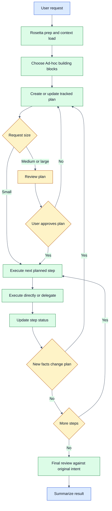
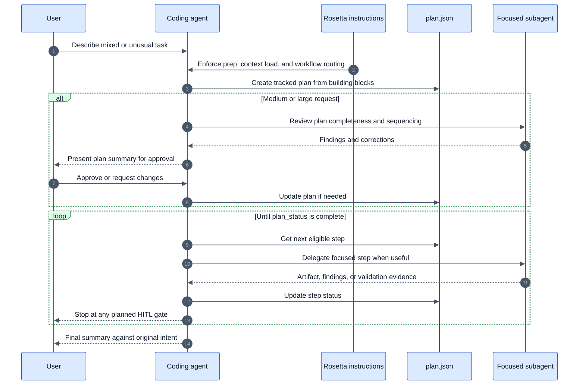

# Ad-hoc Flow

## Availability

OSS

## TL;DR

Use Ad-hoc Flow when no fixed Rosetta workflow matches the task cleanly.
The coding agent builds a custom plan from Rosetta building blocks, tracks it through plan-manager, and executes that plan step by step.
Use it for small mixed tasks, unusual requests, or work that needs a custom sequence of discovery, planning, execution, review, and validation.
The constant artifact is the tracked plan. Other artifacts depend on the chosen building blocks.
For medium and large requests, plan review and explicit user approval happen before execution.
The final gate is a review against the original intent, not only against the latest edited plan.

## When To Use This Workflow

- The request does not fit a dedicated workflow such as [Coding Flow](/rosetta/docs/coding-flow/), [Requirements Authoring Flow](/rosetta/docs/requirements-authoring-flow/), or [Code Analysis Flow](/rosetta/docs/code-analysis-flow/).
- The task needs a custom mix of phases such as discovery, requirements capture, technical specs, execution, review, validation, or simulation.
- The task is small enough that a heavyweight fixed workflow would be wasteful, but still benefits from tracked execution.
- The task may change shape as new facts appear and you want the plan updated instead of the agent silently drifting.
- You want one workflow that can extend, adapt, or restart across later user turns.

## When Not To Use This Workflow

- Do not use it when a specialized workflow already matches the request clearly.
- Do not use it for straightforward implementation work when the main job is coding. Use [Coding Flow](/rosetta/docs/coding-flow/).
- Do not use it when the main job is authoring or refining requirements. Use [Requirements Authoring Flow](/rosetta/docs/requirements-authoring-flow/).
- Do not use it when the main job is reverse-engineering an existing codebase into architecture documentation. Use [Code Analysis Flow](/rosetta/docs/code-analysis-flow/).
- Do not use it when you only need guidance on Rosetta capabilities. Use [Usage Guide](/rosetta/docs/usage-guide/) or Self Help.

## Before You Start

- Prepare a clear target outcome. State what you want done, not only the topic area.
- State the hard boundaries up front: affected systems, files, deadlines, non-goals, approval points, and required validation.
- State what is already known and what must still be discovered.
- If the request depends on external or private references the coding agent cannot inspect directly, provide them up front.
- Keep shared workspace context current. For the common Rosetta setup and project context files, use [Usage Guide](/rosetta/docs/usage-guide/) and [Overview](/rosetta/docs/overview/).

## How To Start

```text
Ad-hoc: write a quick script to parse these CSV files, flag malformed rows, and save a compact summary
```

```text
Ad-hoc: investigate this flaky local toolchain issue, produce a short fix plan, then wait for my approval before changing anything
```

```text
Ad-hoc: refactor logging across three services without changing log semantics, then review the result
```

```text
Ad-hoc: do discovery on this repo cleanup task, create a tracked plan, and execute only the approved steps
```

## How Rosetta Shapes This Workflow

Rosetta provides instructions. Coding agents act on them. Rosetta itself does not see user requests, code, or project data.

For Ad-hoc Flow, that changes the user experience in a few visible ways:

- The coding agent does not start blind. It loads workspace context first, then decides whether Ad-hoc Flow is the right match.
- The coding agent does not improvise a one-shot answer. It builds a tracked plan from named Rosetta building blocks.
- The plan stays live during execution. If new facts change the task, the coding agent updates the plan instead of silently changing direction.
- Review and HITL gates still apply. Medium and large requests stop for plan review and explicit approval before execution.
- Context stays lean because the workflow is expected to use focused subagents and existing skills instead of keeping the full task in one overloaded context.

## Workflow At A Glance

| Phase | What you provide | What agents do | What artifacts appear | Review gate |
|---|---|---|---|---|
| Build plan | Desired outcome, boundaries, expected checks | Sequence building blocks into a tracked execution plan and upsert it as needed | Tracked execution plan managed by plan-manager | No user gate defined here for small work |
| Review plan | Feedback and approval decision | Review completeness, sequencing, dependencies, and prompt clarity | Reviewed plan summary and plan fixes | Required for medium and large requests |
| Execute plan | Answers to questions, approvals, newly discovered facts | Pull next step, execute or delegate, update status, adapt the plan | Task-specific artifacts defined by the chosen building blocks | Any HITL gate included in the plan |
| Review and summarize | Final comments if needed | Validate against original intent and summarize completion | Final summary, optional memory update after failures | Final user review of results |

## Mermaid Flowchart



## Mermaid Sequence Diagram



## Phases

### Build plan

**Goal**

Create a custom execution plan instead of forcing the task into a fixed phase template.

**Required user input**

- Confirmation of what success looks like
- Boundaries for scope, validation, and artifacts when they matter

**Agent actions**

- Use the chosen building blocks to define phases and steps
- Use `plan-manager` as the main planner
- Create or update a tracked `plan.json`
- Use reasoning for larger or more complex work when needed

**Produced artifacts**

- A tracked execution plan managed by plan-manager
- Plan phases and steps with dependencies, assigned roles, and expected prompts

**Review and approval expectations**

- Small tasks can move on directly after plan creation
- Watch for missing validation, unclear step ownership, or hidden scope expansion

### Review plan

**Goal**

Catch sequencing errors, missing work, weak prompts, and dependency problems before execution starts.

**Required user input**

- Approval decision or requested corrections

**Agent actions**

- For medium and large requests, run a plan review
- Check completeness, sequencing, dependency correctness, and prompt clarity
- Apply plan fixes by updating the tracked plan
- Present a summary at a HITL gate

**Produced artifacts**

- Reviewed plan summary
- Updated `plan.json` if the review finds gaps

**Review and approval expectations**

- This gate is required for medium and large requests
- Approve only if the plan solves the right problem, names the real artifacts, and stops where you expect approval

### Execute plan

**Goal**

Run the approved custom plan step by step until all planned work is complete.

**Required user input**

- Answers to blocking questions
- Approvals at any HITL gates included in the plan
- Decisions when new discoveries would expand or change scope

**Agent actions**

- Pull the next eligible step from the tracked plan
- Execute directly or delegate to a focused subagent
- Update step status after each completed step
- Upsert plan changes when discoveries change the work
- Continue until the plan reports completion

**Produced artifacts**

- Whatever the selected building blocks define, such as discovery notes, requirements notes, technical specs, implementation changes, review findings, or validation evidence
- Updated `plan.json` showing current step and phase status

**Review and approval expectations**

- Watch for silent plan drift
- Watch for steps completed without matching artifacts or evidence
- Watch for parallel work collisions if the plan delegates independent tasks

### Review and summarize

**Goal**

Check final completion against the original request, not only against the latest edited plan.

**Required user input**

- Final review comments if something still looks off

**Agent actions**

- Validate results against the original intent
- Summarize completed work
- Update agent memory with reusable preventive rules when failures exposed root causes

**Produced artifacts**

- Final user-facing summary
- Optional memory update when the workflow learned from a failure or mismatch

**Review and approval expectations**

- Confirm that the final result solves the original problem
- Confirm that any plan changes were justified and visible

## How To Review Results

Review Ad-hoc Flow in the same order the workflow uses it.

1. Review `plan.json` first.
   Check that the selected building blocks fit the actual task.
   Check that phases and steps have clear boundaries, dependencies, and expected artifacts.
   Check that approval gates appear before risky or scope-shaping work.

2. Review the main intermediate artifacts named by the plan.
   If the plan includes discovery, verify the findings answer the real question.
   If the plan includes requirements notes or technical specs, verify them before execution continues.
   If the plan includes implementation, verify that the code change scope still matches the approved plan.

3. Review the final summary against the original intent.
   Check that completed work matches the first request, not only the latest internal plan state.
   Check that any plan adaptations were explicit and justified.

Failure modes to challenge immediately:

- A plan that names generic steps but not concrete artifacts
- Missing review or validation work for risky steps
- Status marked complete in `plan.json` without matching evidence
- Scope expansion caused only by agent initiative
- Parallel delegated work that collides on the same files or responsibilities

## Workflow-Specific Customization

- Match the plan to the real cognitive load. The workflow explicitly supports different model sizes, so complex requests benefit from a stronger model while simple requests should stay lean.
- Be explicit about which building blocks you want. For example, say whether you want discovery only, plan then stop, plan plus execution, or plan plus review plus validation.
- Use Ad-hoc Flow to combine Rosetta capabilities intentionally. Strong combinations for this workflow are discovery plus tech specs, requirements capture plus review, or execution plus validation.
- Keep workspace context current so the coding agent chooses the right building blocks early. Stale context weakens the custom plan more in Ad-hoc Flow than in fixed workflows.
- For medium and large work, encourage subagent use for focused steps. The workflow treats subagents as a way to keep context lean and reduce overload.
- Provide external references up front when the task depends on systems or code outside the current workspace.

## Artifacts You Will Get

Always:

- A tracked plan file named `plan.json`
- A final summary checked against the original intent

When the selected building blocks require them:

- Discovery notes or summarized references
- Requirements notes
- Technical specs
- Review findings
- Validation evidence
- Implementation changes
- Memory updates after failures

Ad-hoc Flow does not define one fixed artifact set beyond the tracked plan. The approved plan defines the rest.

## Common Mistakes

- Using Ad-hoc Flow when a dedicated workflow already fits
- Starting with a vague outcome and expecting the workflow to invent the missing intent
- Approving the plan without checking whether the chosen building blocks match the job
- Treating the workflow as permission for silent scope creep
- Ignoring plan updates after discoveries change the task
- Marking work complete without matching artifacts or validation evidence
- Delegating parallel work without separating file ownership or responsibilities

## Source Files

- [adhoc-flow.md](https://github.com/griddynamics/rosetta/blob/main/instructions/r2/core/workflows/adhoc-flow.md)
- [plan-manager SKILL.md](https://github.com/griddynamics/rosetta/blob/main/instructions/r2/core/skills/plan-manager/SKILL.md)
- [plan-manager pm-schema.md](https://github.com/griddynamics/rosetta/blob/main/instructions/r2/core/skills/plan-manager/assets/pm-schema.md)

This workflow does not define separate phase files. The authoritative phase definitions live in the main workflow file above.
