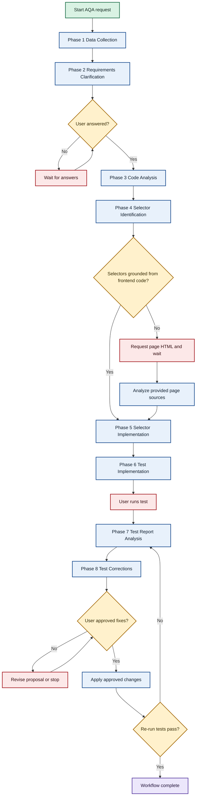
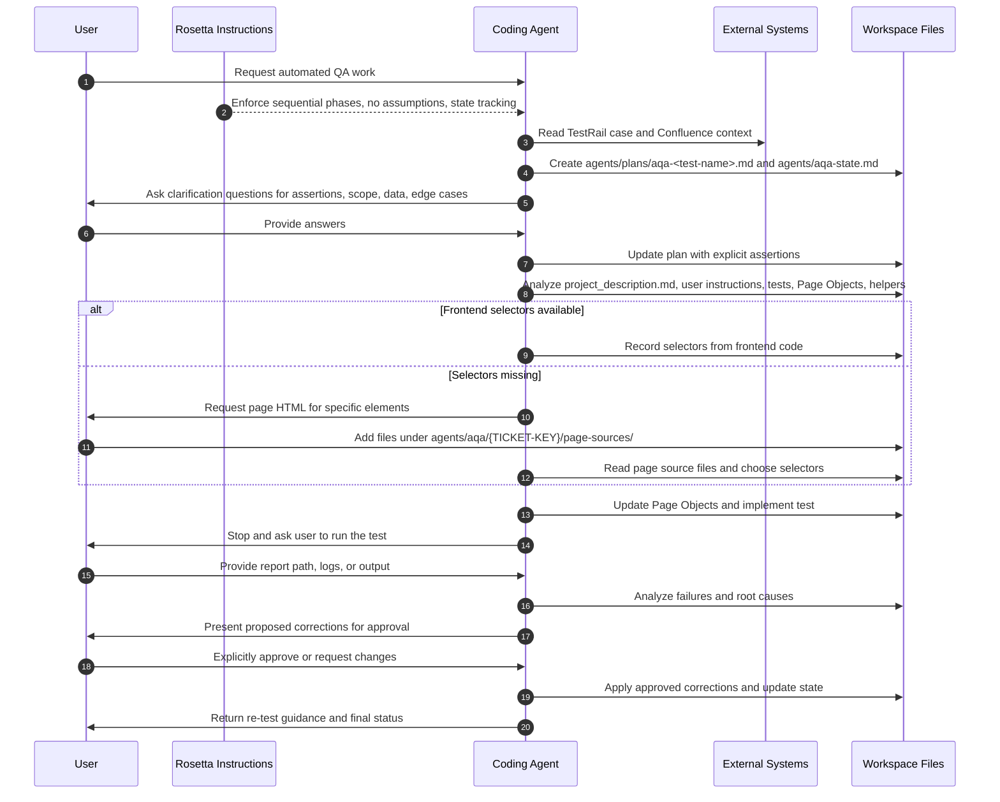

# AQA Flow

<span class="badge-pro">PRO</span>

## TL;DR

Use AQA Flow when you need Rosetta-guided automated UI test work tied to a real TestRail case or QA scenario. The workflow gathers TestRail and Confluence context, clarifies assertions, analyzes existing test architecture, identifies selectors without guessing, implements the test, then stops so you can run it and return the report.

This is a strict sequential workflow. Phases build on each other, `agents/aqa-state.md` is updated after each phase, and the coding agent must not skip ahead. Mandatory user interaction happens in Phase 2, Phase 6, Phase 7, and Phase 8. Phase 4 asks for page HTML only when frontend code or stable selectors are not available.

## When To Use This Workflow

- Automate a TestRail case against an existing UI.
- Add or update UI automation while reusing existing Page Objects and helpers.
- Build a test from TestRail steps plus Confluence context instead of starting from code guesses.
- Diagnose failing automated test output and prepare grounded fixes.
- Add selectors to Page Objects before test implementation when the current test layer is incomplete.

## When Not To Use This Workflow

- Do not use it for manual test case authoring. Use [Test Case Generation](/rosetta/docs/testgen-flow/) when the goal is to generate scenarios or export them to TestRail.
- Do not use it for general product requirements work. Use [Requirements Documentation Authoring](/rosetta/docs/requirements-authoring-flow/).
- Do not use it for backend or non-test implementation. Use [Coding](/rosetta/docs/coding-flow/).
- Do not use it when you only need a quick explanation of the test architecture. Use [Code Analysis](/rosetta/docs/code-analysis-flow/).

## Before You Start

Prepare the inputs this workflow explicitly depends on:

- A TestRail case ID or another precise QA target.
- Confluence page IDs, URLs, or search terms for the feature under test.
- Access to the target repository test code.
- Access to existing Page Objects, similar tests, helper utilities, and project test conventions.
- `agents/user-app/project_description.md` if the project uses it as the coding-standards source.
- Any files under `agents/user-instructions/` that define test creation rules, test report locations, or team-specific conventions.

You also get better results when the project already has strong shared Rosetta context. Keep shared setup in [Usage Guide](/rosetta/docs/usage-guide/#customization), especially `docs/CONTEXT.md`, `docs/ARCHITECTURE.md`, and `docs/TECHSTACK.md`.

## How To Start

Typical prompts:

```text
Automate TestRail case C12345 for the checkout confirmation flow.
```

```text
Create UI automation for the registration success scenario using TestRail case 5678 and Confluence page https://...
```

```text
Analyze this failing automated test report for case C9012 and prepare corrections.
```

```text
Extend the existing checkout automation with a new TestRail scenario and reuse current Page Objects.
```

## How Rosetta Shapes This Workflow

Rosetta provides the instructions. The coding agent executes them. Rosetta itself does not read your source code or test data.

For this workflow, the always-active Rosetta behavior changes the user experience in these ways:

- The coding agent is expected to work one phase at a time. It should not compress phases into one jump.
- If required inputs are missing, the agent must ask instead of guessing selectors, flows, test data, or expected results.
- Human review is built into the workflow, not added later. The agent must stop for answers, test execution, report handoff, and approval before corrections.
- The workflow is state-driven. After each phase, the agent updates `agents/aqa-state.md` so the work can resume cleanly after interruptions.
- Existing project architecture wins over convenience. The agent must inspect existing tests, Page Objects, utilities, and coding standards before writing new automation.

## Workflow At A Glance

| Phase | What you provide | What the coding agent does | What you get | Review gate |
|---|---|---|---|---|
| 1. Data Collection | TestRail case, Confluence reference | Reads external QA/business context and creates the test plan | `agents/plans/aqa-<test-name>.md`, initial `agents/aqa-state.md` | No mandatory workflow gate |
| 2. Requirements Clarification | Answers about assertions, data, edge cases, scope | Turns vague steps into explicit, measurable assertions | Updated test plan with assertions, edge cases, test data rules | Mandatory user answers before Phase 3 |
| 3. Code Analysis | Repository test code, project docs, user instruction files | Analyzes framework, conventions, Page Objects, similar tests, helpers, optional frontend code | Updated test plan with architecture findings and target test location | No mandatory workflow gate |
| 4. Selector Identification | Frontend code if available, otherwise page HTML when requested | Maps test steps to UI elements and identifies missing selectors without guessing | Selector map, page-source request if needed, updated plan/state | Mandatory user input only if selectors cannot be grounded from code |
| 5. Selector Implementation | Approved selector set | Adds selectors or Page Object methods using current project conventions | Updated Page Objects and test plan | No mandatory workflow gate |
| 6. Test Implementation | Approved assertions and reusable test architecture | Implements the automated test and stops before execution analysis | Test file plus updated plan/state | Mandatory user execution before Phase 7 |
| 7. Test Report Analysis | Test report path, logs, or output | Reads report, classifies failures, analyzes root causes, inspects page source for selector errors | Failure analysis and recommended actions | Mandatory user handoff of report/output |
| 8. Test Corrections | Explicit approval for proposed fixes | Prepares fixes, waits for approval, applies approved changes, updates state | Corrected test/Page Objects and re-test guidance | Explicit approval required before changes |

## Mermaid Flowchart



## Mermaid Sequence Diagram



## Phases

### Phase 1: Data Collection

Goal:
- Gather the external requirement sources before any code analysis starts.

What you provide:
- TestRail case ID if it was not already in the request.
- Confluence page ID, URL, or search terms if they were not already in the request.

What the coding agent does:
- Reads the TestRail case through TestRail MCP.
- Reads Confluence documentation through Atlassian Confluence MCP.
- Extracts test steps, expected results, business context, user flow, and technical details.
- Creates `agents/plans/aqa-<test-name>.md` as the main working test plan.
- Starts `agents/aqa-state.md`.

Artifacts:
- `agents/plans/aqa-<test-name>.md`
- `agents/aqa-state.md`

What to review:
- Check that the right TestRail case and Confluence sources were used.
- Check that the test goal and expected result summary reflect the real scenario.

### Phase 2: Requirements Clarification

Goal:
- Turn collected test steps into explicit, measurable assertions before implementation starts.

What you provide:
- Answers about success criteria, exact assertions, test data, timing constraints, edge cases, and out-of-scope cases.

What the coding agent does:
- Reviews Phase 1 for gaps and ambiguities.
- Defines assertion types for each step: presence, state, content, and behavior.
- Prepares targeted clarification questions.
- Stops and waits for your answers.
- Updates the plan with clarified assertions, edge cases, and test data requirements.

Artifacts:
- Updated `agents/plans/aqa-<test-name>.md`
- Updated `agents/aqa-state.md`

What to review:
- Every expected result should become something measurable.
- Confirm the agent did not silently invent expected behavior.
- Confirm test data and edge cases are accurate enough to drive implementation.

### Phase 3: Code Analysis

Goal:
- Understand the existing automation architecture before adding selectors or tests.

What you provide:
- Access to the repository test code.
- `agents/user-app/project_description.md` if the project uses it.
- Any files under `agents/user-instructions/`.

What the coding agent does:
- Reads `agents/user-app/project_description.md` for framework, language, project structure, naming conventions, assertion style, setup patterns, and dependencies.
- Reads all files in `agents/user-instructions/` if they exist and categorizes them into must-follow, should-follow, and nice-to-have.
- Checks whether frontend code is available and, if so, analyzes relevant components and existing test IDs.
- Inventories existing Page Objects.
- Finds similar tests and decides whether the new test belongs in an existing file or a new one.
- Identifies reusable utilities and helper functions.
- Records all of this in the test plan and state file.

Artifacts:
- Updated `agents/plans/aqa-<test-name>.md`
- Updated `agents/aqa-state.md`

What to review:
- The chosen test location should fit the current test organization.
- Reuse should be real. Shared Page Objects and helpers should not be ignored.
- Team-specific instructions from `agents/user-instructions/` should be carried forward into implementation.

### Phase 4: Selector Identification

Goal:
- Identify every selector needed by the test without guessing DOM structure.

What you provide:
- Nothing extra if selectors can be grounded from frontend code.
- If they cannot, page HTML saved under `agents/aqa/{TICKET-KEY}/page-sources/` using the requested naming convention.

What the coding agent does:
- Maps each test step to required UI interactions and assertions.
- Checks existing Page Objects for selector coverage.
- Searches frontend source code first for `data-testid`, `data-test`, IDs, classes, ARIA labels, and related component clues.
- Requests page HTML only when frontend code is unavailable or selectors still cannot be grounded.
- Analyzes provided page sources and chooses the selector strategy, preferring `data-testid` and other stable identifiers.
- Documents where each selector came from: frontend code, page source, or existing Page Object.

Artifacts:
- Updated `agents/plans/aqa-<test-name>.md`
- Updated `agents/aqa-state.md`
- Optional `agents/aqa/{TICKET-KEY}/page-sources/*.html`

What to review:
- Verify the source of truth for each selector.
- Reject fragile selectors when a more stable identifier exists.
- If HTML was requested, check that the request named exact elements and pages instead of asking vaguely.

### Phase 5: Selector Implementation

Goal:
- Put newly identified selectors into the right Page Objects without disturbing existing structure.

What you provide:
- Usually no new input unless the agent hits a selector or ownership ambiguity.

What the coding agent does:
- Reads the Phase 4 selector plan and Phase 3 Page Object analysis.
- Extends existing Page Objects or creates new ones only when necessary.
- Follows the exact local Page Object patterns for naming, structure, access modifiers, comments, and helper methods.
- Adds helper methods when the current project pattern expects them.
- Updates the plan and state file.

Artifacts:
- Modified or new Page Object files
- Updated `agents/plans/aqa-<test-name>.md`
- Updated `agents/aqa-state.md`

What to review:
- Shared test infrastructure must still match local conventions.
- The agent should preserve file structure and avoid opportunistic refactors.
- New helper methods should exist only when they support actual test use.

### Phase 6: Test Implementation

Goal:
- Implement the automated test using the approved assertions, Page Objects, and local project conventions.

What you provide:
- Usually no new business input if earlier phases were complete.
- Later in the phase, you must execute the test yourself.

What the coding agent does:
- Reviews the full test plan.
- Chooses the target test file or confirms the planned location.
- Sets up imports, suite structure, hooks, setup steps, actions, assertions, and cleanup using the current project style.
- Uses Page Objects and reusable utilities from earlier phases.
- Validates the test implementation and updates plan/state.
- Stops and waits for you to run the test.

Artifacts:
- New or modified automated test file
- Updated `agents/plans/aqa-<test-name>.md`
- Updated `agents/aqa-state.md`

What to review:
- Every assertion from Phase 2 should appear in the test.
- The test should reuse Page Objects instead of reaching directly into raw selectors unless the project pattern explicitly allows it.
- The execution command and next-step handoff should be clear enough for a QA engineer to run without guesswork.

### Phase 7: Test Report Analysis

Goal:
- Turn raw execution output into categorized failures and root-cause analysis.

What you provide:
- Test report path, console logs, or another execution output source if the location is not already defined in `agents/user-instructions/`.

What the coding agent does:
- Checks `agents/user-instructions/` first for report location hints.
- Reads the report or logs.
- Extracts pass/fail status, counts, error messages, stack traces, duration, and artifacts.
- Categorizes failures into selector issues, timing issues, assertion failures, setup issues, application issues, or test-code issues.
- For selector or locator failures, reads the stored page-source files and compares the failing locator to actual DOM structure.
- Writes recommended actions and updates plan/state.

Artifacts:
- Updated `agents/plans/aqa-<test-name>.md`
- Updated `agents/aqa-state.md`

What to review:
- Root causes should be evidence-based, not generic guesses.
- Selector failures should reference actual page-source analysis when page sources exist.
- Distinguish test bugs from application bugs before approving corrections.

### Phase 8: Test Corrections

Goal:
- Prepare and apply only approved fixes to the failing automation.

What you provide:
- Explicit approval for the proposed changes, or explicit feedback modifying or rejecting parts of the proposal.

What the coding agent does:
- Builds a prioritized correction plan from Phase 7 findings.
- Prepares a change proposal with file paths, before/after snippets, rationale, and impact.
- Presents the proposal and waits for explicit approval.
- Applies only approved changes.
- Validates that the implemented changes match the approved fixes.
- Updates the plan/state and tells you to re-run the test.
- If tests still fail after re-run, the workflow loops back to Phase 7.

Artifacts:
- Corrected test or Page Object files
- Updated `agents/plans/aqa-<test-name>.md`
- Updated `agents/aqa-state.md`

What to review:
- The applied changes must match the approved proposal.
- Fixes should address root causes without changing test intent.
- If the failure is an application defect, the workflow should surface that instead of masking it with test changes.

## How To Review Results

Review each handoff like a QA and test-automation lead, not like a passive approver.

- After Phase 1, verify the workflow is anchored to the right TestRail case and the right Confluence context.
- After Phase 2, verify assertions are measurable and complete. Weak assertions or missing edge cases here will corrupt every later phase.
- After Phase 3, verify the agent found the right Page Objects, similar tests, helpers, and coding standards.
- After Phase 4, verify selectors came from real frontend code or supplied HTML. Reject any invented locator strategy.
- After Phase 5, verify shared test infrastructure changes are minimal and convention-matching.
- After Phase 6, verify the test covers the approved assertions before you run it.
- After Phase 7, verify the failure analysis separates selector problems, timing problems, assertion problems, and application bugs.
- After Phase 8, verify the proposed fix list before approving and verify the applied changes after approval.

If the page-source request, test plan, or correction proposal is vague, stop the workflow and ask for a more explicit version. This workflow is only reliable when the review loop is used seriously.

## Workflow-Specific Customization

These customizations materially improve AQA Flow:

- Keep `agents/user-app/project_description.md` accurate. This workflow treats it as the single source of truth for coding standards.
- Use `agents/user-instructions/` for team-specific automation rules, report locations, naming conventions, setup rules, and assertion preferences.
- Keep DDL, config, and API/interface details discoverable in the repo when test data setup or environment behavior matters.
- If the UI lives in a separate frontend repository, make that code accessible or provide the minimum page HTML needed under `agents/aqa/{TICKET-KEY}/page-sources/`.
- Prefer stable UI test hooks such as `data-testid` in the frontend. This workflow explicitly prefers them over fragile structural selectors.
- Keep Page Objects and helper utilities clean and current. This workflow is designed to extend them, not bypass them.

## Artifacts You Will Get

Common artifacts from this workflow:

- `agents/aqa-state.md`
- `agents/plans/aqa-<test-name>.md`
- Updated test file or new test file
- Modified or new Page Object files
- Optional `agents/aqa/{TICKET-KEY}/page-sources/*.html`

Common artifact content:

- external requirement capture from TestRail and Confluence
- explicit assertions and edge cases
- framework and project-structure analysis
- selector inventory and source tracking
- failure categorization and root-cause analysis
- proposed corrections and approval record

Conditional outputs:

- page-source request only when selectors cannot be grounded from frontend code
- correction proposal only after test execution results exist
- Phase 7 to Phase 8 loop only when the test does not pass cleanly

## Common Mistakes

- Starting without a real TestRail case or equivalent QA source.
- Letting Phase 2 stay vague and then expecting correct assertions later.
- Skipping `agents/user-instructions/` even though it may define report locations or team-specific rules.
- Guessing selectors instead of grounding them from frontend code or provided HTML.
- Writing a new test outside the existing project structure because it feels faster.
- Approving corrections before checking whether the failure is a real product bug.
- Treating user comments as approval in Phase 8. This workflow requires explicit approval before fixes are applied.
- Forgetting that Phase 6 stops until the user runs the test and returns results.

## Source Files

Authoritative source workflow and phases:

- [aqa-flow.md](https://github.com/griddynamics/cto-ims-kb/blob/main/instructions/r2/grid/workflows/aqa-flow.md)
- [aqa-flow-data-collection.md](https://github.com/griddynamics/cto-ims-kb/blob/main/instructions/r2/grid/workflows/aqa-flow-data-collection.md)
- [aqa-flow-requirements-clarification.md](https://github.com/griddynamics/cto-ims-kb/blob/main/instructions/r2/grid/workflows/aqa-flow-requirements-clarification.md)
- [aqa-flow-code-analysis.md](https://github.com/griddynamics/cto-ims-kb/blob/main/instructions/r2/grid/workflows/aqa-flow-code-analysis.md)
- [aqa-flow-selector-identification.md](https://github.com/griddynamics/cto-ims-kb/blob/main/instructions/r2/grid/workflows/aqa-flow-selector-identification.md)
- [aqa-flow-selector-implementation.md](https://github.com/griddynamics/cto-ims-kb/blob/main/instructions/r2/grid/workflows/aqa-flow-selector-implementation.md)
- [aqa-flow-test-implementation.md](https://github.com/griddynamics/cto-ims-kb/blob/main/instructions/r2/grid/workflows/aqa-flow-test-implementation.md)
- [aqa-flow-test-report-analysis.md](https://github.com/griddynamics/cto-ims-kb/blob/main/instructions/r2/grid/workflows/aqa-flow-test-report-analysis.md)
- [aqa-flow-test-correction.md](https://github.com/griddynamics/cto-ims-kb/blob/main/instructions/r2/grid/workflows/aqa-flow-test-correction.md)
