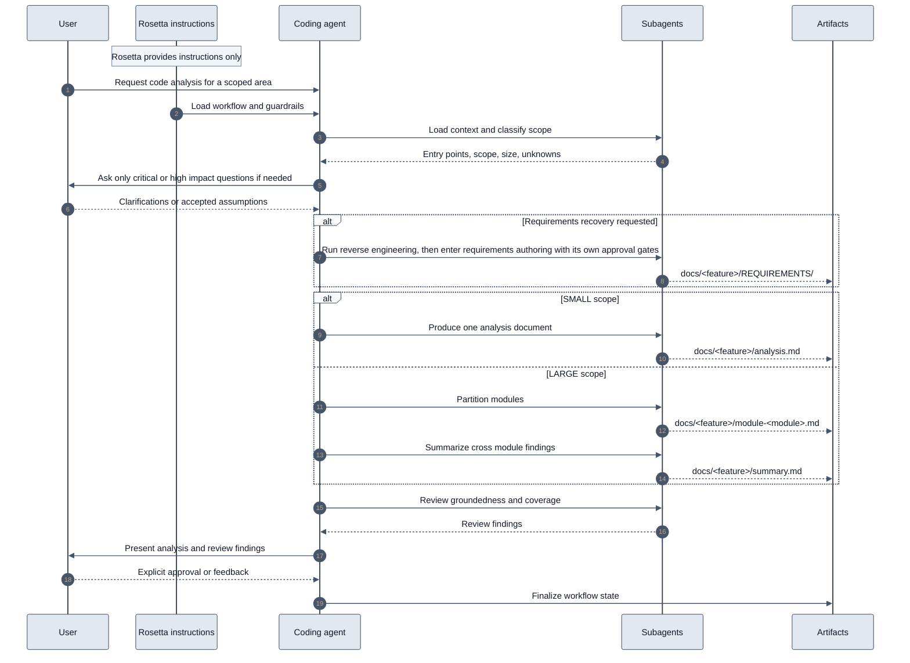

# Code Analysis Flow

## Availability

OSS

## TL;DR

- Use this workflow to reverse engineer an existing codebase into grounded architecture documentation.
- Use it when you need to understand a repository, module, feature, or API before refactoring, onboarding, testing, modernization, or requirements recovery.
- It produces either `docs/<feature>/analysis.md` for `SMALL` scope or `docs/<feature>/module-<module>.md` plus `docs/<feature>/summary.md` for `LARGE` scope.
- It asks only critical or high impact questions, records assumptions, and keeps every claim tied to code or docs.
- Requirements extraction is optional and runs only when you explicitly ask for it.
- Review gates happen at critical unknowns, inside the optional requirements branch, and again before final approval of the analysis.

## When To Use This Workflow

- Analyze a repository, module, feature, API surface, or service boundary.
- Explain how a system works without proposing implementation changes.
- Build an architecture baseline before modernization or large refactoring.
- Document components, data models, dependencies, logic flow, and edge cases.
- Recover requirements from code when the original requirements are missing and you explicitly want requirements artifacts.

## When Not To Use This Workflow

- Do not use it for implementation work. Use [Coding Flow](/rosetta/docs/coding-flow/).
- Do not use it for greenfield requirements from business intent. Use [Requirements Documentation Authoring Flow](/rosetta/docs/requirements-authoring-flow/).
- Do not use it for broad external research. Use [Research Flow](/rosetta/docs/research-flow/).
- Do not use it when your main goal is redesign, migration planning, or refactor proposals. This workflow documents current behavior first.

## Before You Start

Prepare only the workflow specific inputs:

- a precise target such as repository, module, feature, or path glob
- the question you want answered
- explicit non goals
- whether you want requirements reverse engineering
- known entry points if the behavior crosses APIs, webhooks, CLIs, jobs, or schedulers

Results improve when these Rosetta context files already describe the project well:

- `docs/CONTEXT.md`
- `docs/ARCHITECTURE.md`
- `docs/CODEMAP.md`
- `docs/TECHSTACK.md`
- `docs/DEPENDENCIES.md`

For shared setup and general Rosetta usage, use [Usage Guide](/rosetta/docs/usage-guide/) and [Overview](/rosetta/docs/overview/).

## How To Start

```text
"Explain how the authentication system works."
"Analyze the payment module and document its components, data flow, and external dependencies."
"Reverse engineer the billing API into architecture docs without proposing changes."
"Extract requirements from the reporting module and document the current behavior first."
```

## How Rosetta Shapes This Workflow

Rosetta changes the experience in ways you can see from the outside:

- The coding agent loads project context before it starts summarizing code.
- The coding agent classifies the scope as `SMALL` or `LARGE` before choosing the output shape.
- Only critical or high impact questions should interrupt the flow.
- Large analysis is partitioned across modules instead of forcing one overloaded summary.
- The workflow is documentation only. It forbids generated implementation, refactor proposals, and speculation.
- Requirements recovery is opt in. It must not run unless you asked for it.
- Rosetta provides the workflow rules and guardrails. The coding agent reads the code and produces the artifacts. Rosetta itself does not see user requests, code, or project data.

## Workflow At A Glance

| Phase | What you provide | What agents do | What artifacts appear | Review gate |
|---|---|---|---|---|
| 1. Context load | Analysis request | Load project context and identify entry points | Workflow state update | No |
| 2. Scope and classify | Scope boundaries and non goals when needed | Classify `SMALL` or `LARGE` and define module list for large work | Workflow state update | No |
| 3. Clarify unknowns | Answers to high impact questions | Resolve critical or high unknowns and record assumptions | Workflow state update and documented assumptions | Yes |
| 4. Requirements branch | Explicit request for requirements recovery | Extract intent from code and author requirements artifacts | `docs/<feature>/REQUIREMENTS/` | Yes |
| 5. Analyze small | Small scoped target | Produce one grounded analysis document | `docs/<feature>/analysis.md` | No |
| 6. Analyze large parallel | Large scoped target | Partition modules and analyze each one in parallel | `docs/<feature>/module-<module>.md` | No |
| 7. Summarize | Module analysis documents | Produce one cross module summary | `docs/<feature>/summary.md` | No |
| 8. Review | Analysis artifacts | Check groundedness, accuracy, scope coverage, and diagram readability | Review findings | No |
| 9. User review | Feedback or explicit approval | Present artifacts and iterate if needed | Approved analysis or revision request | Yes |
| 10. Finalize | Explicit approval | Close workflow state and record artifact pointers | Completed state and implementation pointer | No |

## Mermaid Flowchart

```mermaid
%%{init: {'theme':'base','themeVariables': {
  'primaryColor':'#DBEAFE',
  'primaryTextColor':'#111827',
  'primaryBorderColor':'#1D4ED8',
  'secondaryColor':'#DCFCE7',
  'secondaryTextColor':'#111827',
  'secondaryBorderColor':'#15803D',
  'tertiaryColor':'#FEF3C7',
  'tertiaryTextColor':'#111827',
  'tertiaryBorderColor':'#D97706',
  'lineColor':'#475569',
  'textColor':'#111827'
}}}%%
flowchart TD
    A["User requests code analysis"] --> B["Load context and entry points"]
    B --> C["Classify scope as SMALL or LARGE"]
    C --> D{"Critical or high unknowns"}
    D -- "Yes" --> E["Ask targeted questions and record assumptions"]
    D -- "No" --> F{"Requirements recovery requested"}
    E --> F
    F -- "Yes" --> G["Create docs/<feature>/REQUIREMENTS/"]
    F -- "No" --> H{"Scope size"}
    G --> H
    H -- "SMALL" --> I["Create docs/<feature>/analysis.md"]
    H -- "LARGE" --> J["Partition modules and analyze in parallel"]
    J --> K["Create docs/<feature>/module-<module>.md"]
    K --> L["Create docs/<feature>/summary.md"]
    I --> M["Review groundedness, coverage, and diagrams"]
    L --> M
    M --> N{"User review"}
    N -- "Feedback" --> O["Return to owning analysis phase"]
    O --> M
    N -- "Approve" --> P["Finalize workflow state"]

    classDef work fill:#DBEAFE,stroke:#1D4ED8,color:#111827,stroke-width:1.5px;
    classDef decision fill:#FEF3C7,stroke:#D97706,color:#111827,stroke-width:1.5px;
    classDef output fill:#DCFCE7,stroke:#15803D,color:#111827,stroke-width:1.5px;
    class A,B,C,E,J,M,O,P work;
    class D,F,H,N decision;
    class G,I,K,L output;
    linkStyle default stroke:#475569,stroke-width:1.5px,color:#111827;
```

## Mermaid Sequence Diagram



## Phases

### 1. Context load

Goal: start from project reality instead of isolated files.

- Required user input: the analysis request.
- Agent actions: read `docs/CONTEXT.md`, `docs/ARCHITECTURE.md`, and `agents/IMPLEMENTATION.md`; grep headers of `docs/CODEMAP.md`, `docs/TECHSTACK.md`, and `docs/DEPENDENCIES.md` when present; identify entry points such as APIs, webhooks, CLIs, and cron jobs.
- Produced artifacts: updated `agents/code-analysis-flow-state.md`.
- Review expectation: no formal gate, but bad entry point discovery will distort all later phases.
- What to watch: cross cutting behavior that spans more than one entry point.

### 2. Scope and classify

Goal: choose the correct analysis shape.

- Required user input: scope boundaries and non goals when the request is ambiguous.
- Agent actions: classify the target as `LARGE` if it spans `100+` files recursively or `4+` modules; otherwise `SMALL`. Record scope boundaries and `module-list` for large analysis.
- Produced artifacts: updated `agents/code-analysis-flow-state.md` with `scope`, `size`, and `module-list` when applicable.
- Review expectation: no formal gate, but this is the point where a wrong size decision starts.
- What to watch: a broad feature being forced into `SMALL` and losing module boundaries.

### 3. Clarify unknowns

Goal: resolve only the unknowns that materially affect analysis accuracy.

- Required user input: answers to targeted scope, terminology, and intent questions.
- Agent actions: ask up to 10 MECE questions, one decision per question, only for critical or high impact unknowns; record resolved answers and unresolved assumptions.
- Produced artifacts: updated `agents/code-analysis-flow-state.md` and documented assumptions in the final output.
- Review expectation: yes. If this phase stops for your input, answer directly or accept the safe default knowingly.
- What to watch: vague nouns such as "billing system" or "auth flow" that hide multiple distinct scopes.

### 4. Requirements branch

Goal: recover requirements from code only when you explicitly asked for that outcome.

- Required user input: an explicit request to extract requirements, SRS style artifacts, or EARS and NFR requirements from code.
- Agent actions: use reverse engineering to recover intent, then use requirements authoring to produce atomic, testable functional and non functional requirements with its own approval gates.
- Produced artifacts: `docs/<feature>/REQUIREMENTS/`.
- Review expectation: yes. This branch inherits the requirements workflow review model.
- What to watch: accidental scope expansion from "document this module" into "generate requirements."

### 5. Analyze small

Goal: produce one grounded document for a contained scope.

- Required user input: small scoped target.
- Agent actions: create `docs/<feature>/analysis.md` covering components, data models, patterns, logic flow as a conceptual algorithm, boundary and edge cases, unhandled edges, Mermaid diagrams, and external dependencies with purpose.
- Produced artifacts: `docs/<feature>/analysis.md`.
- Review expectation: no formal gate before review, but the document must stay grounded in files and line references.
- What to watch: code transcription instead of recovered system intent.

### 6. Analyze large parallel

Goal: keep large analysis reliable by partitioning the workspace.

- Required user input: large scoped target.
- Agent actions: partition the workspace so every file belongs to exactly one module scope, then analyze modules in parallel. Each module document should cover business logic overview, architecture overview, component analysis, interfaces, data contracts, integration patterns, quality observations, and engineering insights.
- Produced artifacts: `docs/<feature>/module-<module>.md`.
- Review expectation: no formal gate before review, but overlapping module scopes will create contradictions.
- What to watch: duplicated files across module scopes or module documents that drift into generic summaries.

### 7. Summarize

Goal: turn module analysis into one cross module explanation.

- Required user input: none unless module outputs expose major gaps.
- Agent actions: read every module document in full, decompose them into canonical sections, and combine them into `docs/<feature>/summary.md`.
- Produced artifacts: `docs/<feature>/summary.md`.
- Review expectation: no formal gate before review, but this phase must preserve cross module contracts and missing information.
- What to watch: a summary that compresses modules so hard that dependencies and boundaries disappear.

### 8. Review

Goal: inspect the analysis artifacts before handoff.

- Required user input: none unless the review exposes blocking problems.
- Agent actions: check groundedness, accuracy, scope coverage, absence of generated or suggested code, assumption tracking, and Mermaid readability in light and dark themes.
- Produced artifacts: review findings and recommendations.
- Review expectation: this is the internal quality gate before user approval.
- What to watch: polished language that is not traceable to code or docs.

### 9. User review

Goal: let the human owner confirm the analysis matches real system intent.

- Required user input: either explicit approval or concrete feedback.
- Agent actions: present final artifacts and review findings. Any response other than explicit approval is treated as feedback and returns work to the owning phase.
- Produced artifacts: approved analysis or revision requests.
- Review expectation: yes. The workflow requires `Yes, I reviewed the analysis` or `Approve, the analysis was reviewed`.
- What to watch: approving a document before checking scope, assumptions, and missing components.

### 10. Finalize

Goal: close the workflow with traceable state.

- Required user input: explicit approval from phase 9.
- Agent actions: update `IMPLEMENTATION.md` with a brief pointer to produced artifacts and mark `agents/code-analysis-flow-state.md` complete with phase evidence and artifact paths.
- Produced artifacts: completed workflow state and implementation pointer.
- Review expectation: no new gate. This phase records closure after approval.
- What to watch: missing artifact paths or incomplete phase evidence in the state file.

## How To Review Results

Check these items before you approve:

- Scope coverage. The artifacts should cover the exact area you requested and should not quietly expand into adjacent systems.
- Groundedness. Claims should trace to concrete files and line references, not to generic architectural language.
- Intent recovery. The analysis should explain what the system does and why it exists, not retell source code line by line.
- Assumptions and unknowns. Resolved answers and unresolved gaps should be visible, not hidden.
- Diagram usefulness. Mermaid diagrams should clarify sequencing, dependencies, and boundaries, and remain readable in light and dark themes.
- Output shape. `SMALL` scope should produce one `analysis.md`. `LARGE` scope should produce `module-<module>.md` files plus `summary.md`.
- Optional branch discipline. `docs/<feature>/REQUIREMENTS/` should appear only if you explicitly requested requirements recovery.

Reject or send feedback when you see:

- the wrong scope analyzed
- missing components, contracts, or dependencies
- requirements inferred when you asked only for analysis
- dead code, bugs, or plumbing described as intended business behavior
- diagrams that look complete but do not explain real boundaries or flow

For general review expectations, see [Review Standards](/rosetta/docs/review/).

## Workflow-Specific Customization

These customizations materially improve this workflow:

- Keep `docs/CONTEXT.md` current so the coding agent can separate intended behavior from implementation accidents.
- Keep `docs/ARCHITECTURE.md` current on module boundaries, major integrations, and technical constraints.
- Maintain `docs/CODEMAP.md`, `docs/TECHSTACK.md`, and `docs/DEPENDENCIES.md` so the coding agent can find entry points and cross cutting dependencies faster.
- If private or external libraries matter to the analyzed behavior, onboard them into `refsrc/` and document them before running analysis. That gives the coding agent a grounded place to learn those contracts.
- Say upfront whether you want requirements recovery. The workflow should stay documentation only unless you asked for that branch.
- Name tricky boundaries early, especially auth, background jobs, cross repo contracts, or shared domain models. That improves classification and reduces late scope resets.

## Artifacts You Will Get

Always:

- `agents/code-analysis-flow-state.md`
- review findings from phase 8

For `SMALL` scope:

- `docs/<feature>/analysis.md`

For `LARGE` scope:

- `docs/<feature>/module-<module>.md`
- `docs/<feature>/summary.md`

Only when you explicitly request requirements recovery:

- `docs/<feature>/REQUIREMENTS/`

At workflow close:

- a brief pointer in `IMPLEMENTATION.md` to the produced analysis artifacts

## Common Mistakes

- Asking for analysis when the real need is implementation, redesign, or modernization planning.
- Giving a scope that is too broad to classify cleanly, then approving the first partitioning without checking the module boundaries.
- Letting the coding agent transcribe code instead of recovering domain intent and architecture.
- Forgetting to say whether requirements recovery is wanted and then expecting requirements artifacts to appear.
- Treating bugs, dead code, or infrastructure plumbing as intended behavior.
- Approving diagrams that look polished but do not explain dependencies, sequencing, or boundaries.

## Source Files

Authoritative workflow sources used for this page:

- [code-analysis-flow.md](https://github.com/griddynamics/rosetta/blob/main/instructions/r2/core/workflows/code-analysis-flow.md)
- [reverse-engineering/SKILL.md](https://github.com/griddynamics/rosetta/blob/main/instructions/r2/core/skills/reverse-engineering/SKILL.md)
- [large-workspace-handling/SKILL.md](https://github.com/griddynamics/rosetta/blob/main/instructions/r2/core/skills/large-workspace-handling/SKILL.md)
- [requirements-authoring/SKILL.md](https://github.com/griddynamics/rosetta/blob/main/instructions/r2/core/skills/requirements-authoring/SKILL.md)
- [questioning/SKILL.md](https://github.com/griddynamics/rosetta/blob/main/instructions/r2/core/skills/questioning/SKILL.md)

Shared public docs consulted to avoid duplication and keep wording aligned:

- [usage-guide.md](https://github.com/griddynamics/rosetta/blob/main/docs/web/docs/usage-guide.md)
- [overview.md](https://github.com/griddynamics/rosetta/blob/main/docs/web/docs/overview.md)
- [review.md](https://github.com/griddynamics/rosetta/blob/main/docs/web/docs/review.md)
- [developer-guide.md](https://github.com/griddynamics/rosetta/blob/main/docs/web/docs/developer-guide.md)

The workflow defines its phases inline. No separate phase files are referenced by this workflow source.
