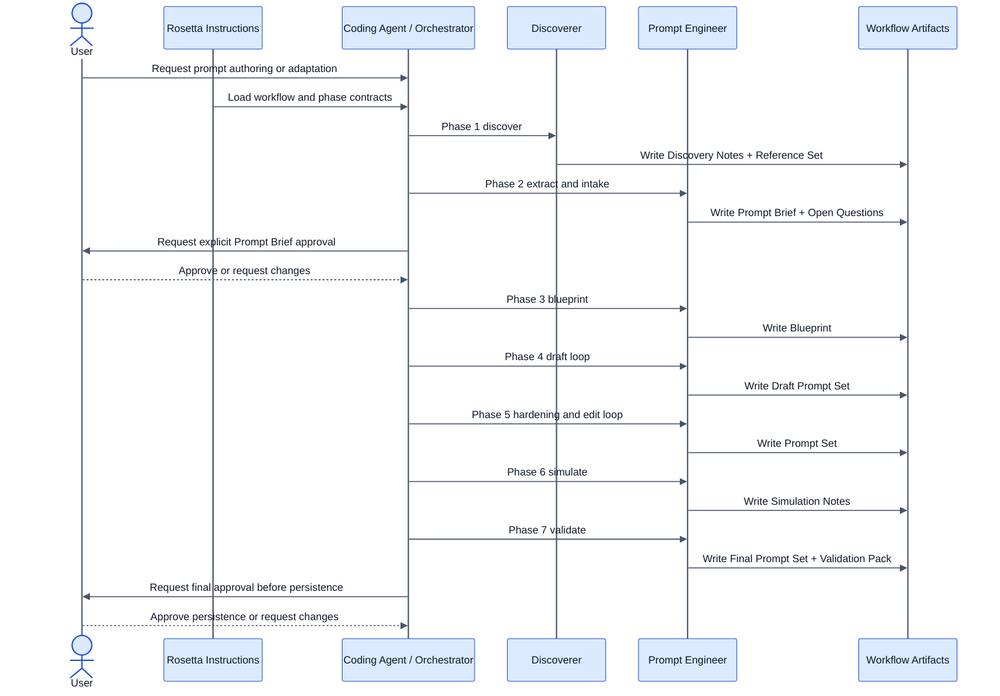

# Coding Agents Prompting Flow

<span class="badge-pro">PRO</span>

## Availability

Available in the Pro instructions repository. This workflow is not part of the OSS instruction set.

## TL;DR

Use Coding Agents Prompting Flow to author or adapt prompts for AI coding agents under explicit phase contracts and approval gates.
The workflow stays thin on purpose: it discovers context, approves a `Prompt Brief`, designs a `Blueprint`, runs draft and hardening loops, simulates realistic usage, then validates the final prompt set against the original intent.
It produces state plus prompt-authoring artifacts such as `Discovery Notes`, `Reference Set`, `Prompt Brief`, `Blueprint`, `Draft Prompt Set`, `Prompt Set`, `Simulation Notes`, and a `Validation Pack`.
The hard approvals are the `Prompt Brief` gate and the final approval before persistence.

## When To Use This Workflow

- Create prompts, rules, or instruction sets for coding agents.
- Adapt an existing prompt from one agent, IDE, or platform to another.
- Standardize a prompt family before storing it in a repo or prompt catalog.
- Validate that a prompt set still matches the original operating intent after edits.

## When Not To Use This Workflow

- Do not use it for implementation work. Use [Coding Flow](/rosetta/docs/coding-flow/).
- Do not use it for product or system requirements authoring. Use [Requirements Documentation Authoring Flow](/rosetta/docs/requirements-authoring-flow/).
- Do not use it for general Rosetta capability questions. Use [Self Help Workflow](/rosetta/docs/self-help-flow/) or [Usage Guide](/rosetta/docs/usage-guide/).
- Do not use it to onboard an external codebase for later reuse. Use [External Library Flow](/rosetta/docs/external-lib-flow/).

## Before You Start

- Provide the target outcome: create new prompts, adapt an existing prompt, or validate a prompt family.
- Provide the source prompt when one already exists.
- Name the target agent, IDE, or framework the prompt set must serve.
- Point the agent at any required prompt-family references, operating rules, schemas, or examples.
- Plan to review the `Prompt Brief`, blueprint tradeoffs, simulation findings, and final validation pack carefully.
- For shared Rosetta setup and global customization, keep [Usage Guide](/rosetta/docs/usage-guide/) current. This page only covers workflow-specific preparation.

## How To Start

```text
Create a coding workflow prompt for our internal AI agent.
```

```text
Adapt this Claude coding-agent prompt for Cursor and preserve the approval model.
```

```text
Write prompts for our onboarding automation agent and include validation artifacts before persistence.
```

```text
Review this prompt family, harden it, simulate realistic runs, and return a final prompt set plus validation pack.
```

## How Rosetta Shapes This Workflow

Rosetta provides instructions. Coding agents act on them. Rosetta itself does not see your prompt files, source code, or project data.

For this workflow, the always-active Rosetta behavior changes the UX in visible ways:

- The workflow stays sequential. It does not skip from a rough idea straight to final prompts.
- Approval is tied to artifacts, not vague conversation. The `Prompt Brief` must be approved before blueprinting, and final approval is required before persistence.
- Prompt authoring and prompt review stay inside the workflow contract. Drafting, hardening, editing, simulation, and validation are separate phases with separate artifacts.
- Reference loading is phase-scoped. The workflow explicitly tells the agent to load only what the current phase needs.
- State is persistent. Each phase records status and evidence in `coding-agents-prompting-flow-state.md`.

## Workflow At A Glance

| Phase | What you provide | What agents do | What you get | Review gate |
|---|---|---|---|---|
| 1. Discover | Request, optional source prompt, local references | Discover prompt-family context and required references | `Discovery Notes`, `Reference Set`, updated state | HITL only if context conflicts with intent or critical references are missing |
| 2. Extract and Intake | Request, optional source prompt, discovery artifacts, clarifications | Extract requirements and create the operating contract for the rest of the flow | `Prompt Brief`, `Open Questions`, updated state | Explicit approval of `Prompt Brief` |
| 3. Blueprint | Approved `Prompt Brief` | Design structure, actors, contracts, and boundaries for the target prompt set | `Blueprint`, updated state | HITL if blueprint tradeoffs stay ambiguous |
| 4. Draft Loop | Approved `Prompt Brief`, `Blueprint` | Draft target prompts | `Draft Prompt Set`, optional `change-log.md`, updated state | HITL only if intent becomes unclear or the loop stalls |
| 5. Hardening and Edit Loop | Approved brief, blueprint, draft prompt set, prompt-family info | Review and harden each prompt until pass criteria or a HITL stop | `Prompt Set`, optional `change-log.md`, updated state | HITL if conflicts appear or the loop stalls |
| 6. Simulate | `Prompt Brief`, `Prompt Set` | Simulate realistic runs and inspect context and cognitive load | `Simulation Notes`, updated state | HITL if simulation exposes major behavioral risk |
| 7. Validate | `Prompt Brief`, `Blueprint`, candidate prompt set, simulation notes | Validate against intent, contracts, failure modes, and traceability | `Final Prompt Set`, `Validation Pack`, completed state | Final approval before persistence |

## Mermaid Flowchart

```mermaid
%%{init: {'theme':'base','themeVariables':{
  'background':'#ffffff',
  'primaryColor':'#dbeafe',
  'primaryTextColor':'#0f172a',
  'primaryBorderColor':'#1d4ed8',
  'secondaryColor':'#dcfce7',
  'secondaryTextColor':'#14532d',
  'secondaryBorderColor':'#16a34a',
  'tertiaryColor':'#fef3c7',
  'tertiaryTextColor':'#78350f',
  'tertiaryBorderColor':'#d97706',
  'lineColor':'#475569',
  'textColor':'#0f172a'
}}}%%
flowchart TD
    A["Start prompt authoring request"] --> B["Phase 1<br/>Discover"]
    B --> C["Discovery Notes + Reference Set"]
    C --> D["Phase 2<br/>Extract and Intake"]
    D --> E{"Prompt Brief approved?"}
    E -- "No" --> D
    E -- "Yes" --> F["Phase 3<br/>Blueprint"]
    F --> G{"Blueprint ambiguity or tradeoff stop?"}
    G -- "Yes" --> F
    G -- "No" --> H["Phase 4<br/>Draft Loop"]
    H --> I["Phase 5<br/>Hardening and Edit Loop"]
    I --> J{"Loop stalled or conflicts unresolved?"}
    J -- "Yes" --> I
    J -- "No" --> K["Phase 6<br/>Simulate"]
    K --> L{"Major behavior risk?"}
    L -- "Yes" --> I
    L -- "No" --> M["Phase 7<br/>Validate"]
    M --> N{"Final approval before persistence?"}
    N -- "No" --> I
    N -- "Yes" --> O["Persist final prompt set"]

    style A fill:#dbeafe,stroke:#1d4ed8,color:#0f172a
    style B fill:#dcfce7,stroke:#16a34a,color:#14532d
    style C fill:#dcfce7,stroke:#16a34a,color:#14532d
    style D fill:#dbeafe,stroke:#1d4ed8,color:#0f172a
    style E fill:#fef3c7,stroke:#d97706,color:#78350f
    style F fill:#dbeafe,stroke:#1d4ed8,color:#0f172a
    style G fill:#fef3c7,stroke:#d97706,color:#78350f
    style H fill:#dcfce7,stroke:#16a34a,color:#14532d
    style I fill:#dcfce7,stroke:#16a34a,color:#14532d
    style J fill:#fef3c7,stroke:#d97706,color:#78350f
    style K fill:#dbeafe,stroke:#1d4ed8,color:#0f172a
    style L fill:#fef3c7,stroke:#d97706,color:#78350f
    style M fill:#dbeafe,stroke:#1d4ed8,color:#0f172a
    style N fill:#fef3c7,stroke:#d97706,color:#78350f
    style O fill:#dcfce7,stroke:#16a34a,color:#14532d
```



## Mermaid Sequence Diagram



## Phases

### Phase 1. Discover

**Goal**

Collect prompt-family context and only the references the rest of the workflow will actually need.

**What you provide**

- Request intent
- Optional source prompt
- Local prompt artifacts, schemas, or standards when they already exist

**What the agent does**

- Uses the `discoverer` subagent
- Finds project-local prompt-family artifacts and required references
- Stops for HITL if discovered context conflicts with intent or critical references are missing
- Updates `coding-agents-prompting-flow-state.md`

**Artifacts**

- `Discovery Notes`
- `Reference Set`

### Phase 2. Extract and Intake

**Goal**

Turn the request into an explicit operating contract for the rest of the workflow.

**What you provide**

- Clarifications on goals, constraints, target platform, and success criteria

**What the agent does**

- Uses the `prompt-engineer` subagent
- Extracts requirements from the source prompt when present
- Produces `Prompt Brief` and `Open Questions`
- Waits for explicit approval of `Prompt Brief`
- Updates `coding-agents-prompting-flow-state.md`

**Artifacts**

- `Prompt Brief`
- `Open Questions`

### Phase 3. Blueprint

**Goal**

Define the structure, actors, contracts, and boundaries of the target prompt set before drafting begins.

**What you provide**

- Approved `Prompt Brief`
- Feedback on tradeoffs if the blueprint exposes ambiguity

**What the agent does**

- Designs the blueprint from the approved brief
- Uses HITL if architecture or tradeoffs remain ambiguous
- Updates `coding-agents-prompting-flow-state.md`

**Artifacts**

- `Blueprint`

### Phase 4. Draft Loop

**Goal**

Produce the first draft of each target prompt from the approved brief and blueprint.

**What you provide**

- Approved brief and blueprint

**What the agent does**

- Drafts the target prompts
- Keeps the loop phase-specific instead of mixing in validation claims early
- Records progress in `coding-agents-prompting-flow-state.md`

**Artifacts**

- `Draft Prompt Set`
- Optional `change-log.md`

### Phase 5. Hardening and Edit Loop

**Goal**

Review and refine each draft prompt until it either passes or hits an explicit stop condition.

**What you provide**

- Clarifications only if the loop stalls or exposes conflicts

**What the agent does**

- Runs the `hardening -> edit` loop for each target prompt
- Keeps this as automated subagent review, not a substitute for human approval
- Stops for HITL if the loop stalls, conflicts appear, or intent becomes unclear
- Updates `coding-agents-prompting-flow-state.md`

**Artifacts**

- `Prompt Set`
- Optional `change-log.md`

### Phase 6. Simulate

**Goal**

Test the prompt chain under realistic execution traces before final validation.

**What you provide**

- Any final scenario emphasis if certain runs matter more than others

**What the agent does**

- Simulates realistic runs
- Traces context and cognitive load across the prompt chain
- Stops for HITL when simulation exposes major behavioral risk
- Updates `coding-agents-prompting-flow-state.md`

**Artifacts**

- `Simulation Notes`

### Phase 7. Validate

**Goal**

Prove that the final prompt set matches the original intent and carries explicit failure-mode and traceability evidence.

**What you provide**

- Final approval or requested changes before persistence

**What the agent does**

- Validates against intent, contracts, failure modes, and traceability
- Produces the `Validation Pack`
- Marks `coding-agents-prompting-flow-state.md` complete
- Requires final approval before persistence

**Artifacts**

- `Final Prompt Set`
- `Validation Pack`
- Optional `validation-report.md`

## How To Review Results

Review this workflow like a prompt-systems owner, not like a casual editor.

- After Phase 1, check whether `Discovery Notes` and `Reference Set` include the real prompt-family artifacts and ignore irrelevant noise.
- After Phase 2, read the `Prompt Brief` line by line. If the brief is wrong, every later phase will optimize the wrong target.
- After Phase 3, verify the blueprint names the right actors, contracts, and scope boundaries for the target prompt set.
- After Phase 5, inspect whether the hardened prompt set still preserves the approved brief instead of drifting into a different operating model.
- After Phase 6, read `Simulation Notes` for context overload, missing handoffs, approval gaps, or brittle prompt chaining.
- After Phase 7, verify the `Validation Pack` contains checklist results, tests, failure modes, and traceability back to the original intent before you approve persistence.

## Workflow-Specific Customization

- If the target prompt set belongs to a framework such as Rosetta, state the artifact families up front: skills, rules, workflows, commands, agents, and subagents. Discovery and blueprint quality improve when that inventory is explicit.
- If you are adapting from one agent or IDE to another, name the source platform, target platform, and the behavior that must stay unchanged.
- Provide existing prompt-family artifacts, schemas, examples, and review standards early instead of expecting the workflow to rediscover them from fragments.
- Keep the prompt-family reference set lean. The workflow explicitly says to load only references needed by the current phase.
- If the prompt set depends on project context files such as `CONTEXT.md`, `ARCHITECTURE.md`, or `TECHSTACK.md`, say exactly how those files are supposed to affect the prompt behavior.

## Artifacts You Will Get

- `coding-agents-prompting-flow-state.md` in the feature temp folder
- `Discovery Notes`
- `Reference Set`
- `Prompt Brief`
- `Open Questions`
- `Blueprint`
- `Draft Prompt Set`
- `Prompt Set`
- `Simulation Notes`
- `Final Prompt Set`
- `Validation Pack`
- Optional `change-log.md`
- Optional `validation-report.md`

## Common Mistakes

- Starting drafting before the `Prompt Brief` is approved.
- Treating `Prompt Brief` as optional after phase 2 even though every downstream phase depends on it.
- Collapsing draft, hardening, edit, simulation, and validation into one polished pass.
- Loading every reference file at once instead of keeping reference loading phase-scoped.
- Approving a prompt set before checking failure modes, traceability, and simulation findings.
- Adapting wording between tools without checking whether the approval model or role contracts changed.

## Source Files

- [coding-agents-prompting-flow.md](https://github.com/griddynamics/cto-ims-kb/blob/main/instructions/r2/grid/workflows/coding-agents-prompting-flow.md)
- [coding-agents-prompt-authoring/SKILL.md](https://github.com/griddynamics/cto-ims-kb/blob/main/instructions/r2/grid/skills/coding-agents-prompt-authoring/SKILL.md)
- [pa-prompt-brief.md](https://github.com/griddynamics/cto-ims-kb/blob/main/instructions/r2/grid/skills/coding-agents-prompt-authoring/assets/pa-prompt-brief.md)
- [pa-validation-report.md](https://github.com/griddynamics/cto-ims-kb/blob/main/instructions/r2/grid/skills/coding-agents-prompt-authoring/assets/pa-validation-report.md)
- [pa-change-log.md](https://github.com/griddynamics/cto-ims-kb/blob/main/instructions/r2/grid/skills/coding-agents-prompt-authoring/assets/pa-change-log.md)
