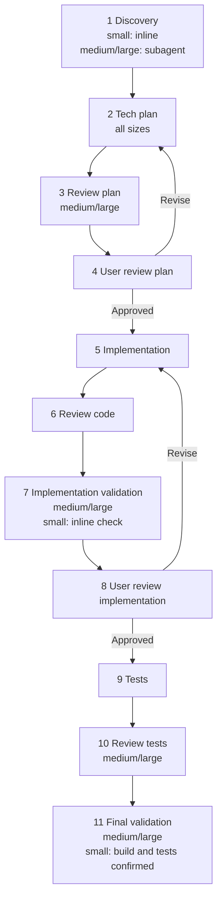
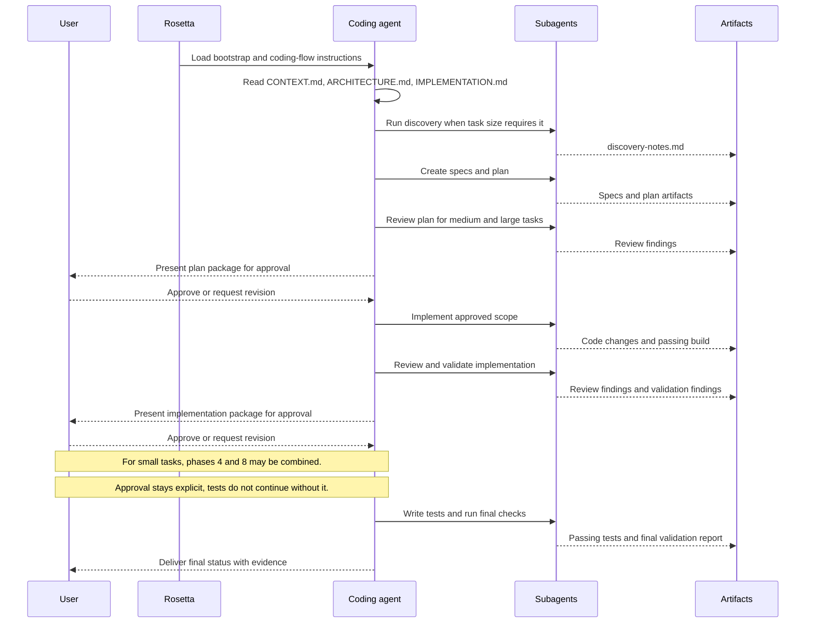

# Coding Flow

## Availability

OSS. This workflow lives in the core Rosetta instruction set.

## TL;DR

Use Coding Flow for implementation work when coding is the main job, including feature work, changes, and bug fixes.
Rosetta structures that work through specs, a plan, review gates, validation, and tests.
It is the workflow Rosetta uses for adding, changing, or fixing code when coding is the main job.
It produces a plan package first, then code, review findings, validation findings, tests, and final validation evidence.
You must explicitly approve the plan before implementation starts.
You must explicitly approve the implementation before tests continue.
The workflow applies at all request sizes. What changes by size is phase scaling, not whether the workflow should be used.
Medium and large tasks add separate discovery, review, and validator work where the source marks those phases as `MEDIUM,LARGE`.
For small tasks, the source says the plan-review and implementation-review checkpoints may be combined. This page keeps that conservative: approval is still explicit and tests still do not continue without it, but the source does not define a more detailed small-task checkpoint shape than that.

## When To Use This Workflow

- Add, change, or fix application code.
- Implement work that needs an explicit spec and plan before coding.
- Use reviewer and validator gates to catch drift before you approve work.
- Handle code changes of any size when coding is the main job.
- Expect the workflow to scale by request size instead of switching to a different coding workflow.

## When Not To Use This Workflow

- Use [Requirements Documentation Authoring Flow](/rosetta/docs/requirements-authoring-flow/) when expected behavior is still unclear and you need requirements before planning code.
- Use [Code Analysis Flow](/rosetta/docs/code-analysis-flow/) when the goal is to understand existing code, not change it.
- Use [Ad-hoc Flow](/rosetta/docs/adhoc-flow/) when no fixed workflow fits the task and you need a lighter custom sequence.
- Use [Research Flow](/rosetta/docs/research-flow/) when the main deliverable is grounded investigation rather than implementation.

## Before You Start

- Prepare a concrete change request with scope and acceptance criteria.
- Make sure `docs/CONTEXT.md` and `docs/ARCHITECTURE.md` are current enough to guide implementation.
- Point the agent to existing requirements, API contracts, design notes, or issue links if they define non-negotiable behavior.
- Provide workflow-specific implementation context that materially changes the result, especially business rules, edge cases, auth behavior, schema and DDL constraints, config switches, and internal library references under `refsrc/`.
- For shared setup and general Rosetta customization, use [Usage Guide](/rosetta/docs/usage-guide/) instead of repeating that setup here.

## How To Start

```text
Add password reset support for the customer portal. I want to review the plan before implementation starts.
```

```text
Fix the race condition in payment processing. Stay inside the current service boundary and show me the plan first.
```

```text
Implement notification delivery using the existing queue abstraction. The auth rules in ARCHITECTURE.md are mandatory.
```

```text
Change the billing retry logic to match the approved requirements in docs/REQUIREMENTS. Stop for approval before coding.
```

## How Rosetta Shapes This Workflow

Rosetta changes the user experience before any code is touched. The coding agent must load Rosetta bootstrap rules, then read project context files, then load the coding workflow. That means the session starts with context loading, classification, and planning instead of immediate edits.

Rosetta also forces explicit approvals and role separation. The workflow stays active for all request sizes, but medium and large tasks route more phases through specialized subagents for discovery, review, validation, build, and test work, so the same agent is not trusted to invent, implement, and approve in one pass. Questions are supposed to appear early when requirements, scope, or constraints are unclear.

Rosetta provides instructions. Coding agents act on them. Rosetta itself does not see user requests, code, or project data.

## Workflow At A Glance

| Phase | Size scaling from source | What you provide | What agents do | Artifacts | Review gate |
|---|---|---|---|---|---|
| 1. Discovery | `MEDIUM,LARGE`; small stays inline with the orchestrating agent | Request, project context, existing constraints | Gather affected areas, dependencies, constraints, requirements | `discovery-notes.md` for medium and large tasks; inline discovery for small tasks; state update | None |
| 2. Tech plan | `ALL`; small may keep output in chat instead of files | Request, discovery notes when present, architecture context | Write specs and execution plan | `<FEATURE>-SPECS.md`, `<FEATURE>-PLAN.md` for medium and large tasks; small tasks may get this in chat; state update | None |
| 3. Review plan | `MEDIUM,LARGE` | Specs, plan, request, discovery notes | Inspect plan and spec quality against intent | Review findings and recommendations; state update | Reviewer for medium and large tasks |
| 4. User review plan | `ALL`; small may later combine this checkpoint with phase 8 | Specs, plan, review findings | Present the plan package and collect approval or revision feedback | Approved plan or revised draft | User approval required |
| 5. Implementation | `ALL` | Approved specs and plan | Implement approved scope, make build pass, update affected docs briefly | Code changes, passing build, brief doc updates, state update | None |
| 6. Review code | `ALL` | Diff, specs, plan | Inspect implementation and required doc updates | Review findings and recommendations; state update | Reviewer |
| 7. Implementation validation | `MEDIUM,LARGE`; small uses a lighter inline check | Diff, specs, plan, review findings | Verify spec coverage, gaps, and factual consistency | Validation findings; state update | Validator for medium and large tasks |
| 8. User review implementation | `ALL`; small may combine this checkpoint with phase 4 | Implementation summary, review findings, validation findings | Present implementation package and collect approval or revision feedback | Approved implementation or revision request | User approval required |
| 9. Tests | `ALL` | Approved implementation, specs | Write and run isolated, idempotent tests | Passing tests with coverage evidence; state update | None |
| 10. Review tests | `MEDIUM,LARGE` | Tests, specs, implementation | Inspect scenario coverage, edge cases, and mocking correctness | Review findings and recommendations; state update | Reviewer for medium and large tasks |
| 11. Final validation | `MEDIUM,LARGE`; small confirms build and tests passed | Full delivery set | Perform final by-dependency verification and cleanup checks | Final validation report; state update | Validator for medium and large tasks |

## Best Practices

- **Switch sessions at 65% context.** Monitor context usage. If it goes above 65%, queue the message or wait for the earliest ability to switch over to a new session:

  `Please save execution state, workflow state, findings, original intent with clarifications, and tasks left to do as concise "agents/TEMP/execution-state.md" so that I can start a fresh new session and continue execution where you left it off.`

  Once file saved, start the new session with the same original slash command:

  `/coding-flow Please resume execution saved in "agents/TEMP/execution-state.md" according to flow instructions`

## Workflow Overview



## Interaction Flow



## Phases

### 1. Discovery

**Goal**  
Ground the task in the real repository before planning.

**Required user input**  
The request itself plus any constraints or source requirements the agent must not miss.

**Agent actions**  
For medium and large tasks, a `discoverer` subagent gathers project context, affected areas, dependencies, constraints, and requirements from the request, `CONTEXT.md`, `ARCHITECTURE.md`, and `IMPLEMENTATION.md`. Small tasks keep this inline with the orchestrating agent.

**Produced artifacts**  
`discovery-notes.md` in the feature plan folder for medium and large tasks. The workflow also updates `coding-flow-state.md`.

**Review and approval expectations**  
No user gate here, but bad discovery leaks into every later phase. Watch for missing constraints, missing affected systems, or a request that still sounds ambiguous.

### 2. Tech plan

**Goal**  
Turn intent into an explicit target state and an execution path.

**Required user input**  
The request, discovery notes when they exist, and architecture constraints that define what is allowed.

**Agent actions**  
An `architect` subagent uses the `tech-specs` and `planning` skills together. The specs own what must be built. The plan owns how the work will be executed.

**Produced artifacts**  
`<FEATURE>-SPECS.md` and `<FEATURE>-PLAN.md` in the feature plan folder for medium and large tasks. For small tasks, the workflow says the result may stay in chat instead of files. The workflow also updates `coding-flow-state.md`.

**Review and approval expectations**  
No user approval yet, but this phase defines the package you will later approve. If the spec does not state boundaries, acceptance logic, and constraints clearly, do not approve phase 4.

### 3. Review plan

**Goal**  
Catch weak specs or plan drift before implementation starts.

**Required user input**  
None beyond the existing request and artifacts.

**Agent actions**  
For medium and large tasks, a `reviewer` subagent checks the specs and plan against the request and discovery notes.

**Produced artifacts**  
Review findings and recommendations. The workflow also updates `coding-flow-state.md`.

**Review and approval expectations**  
This is a reviewer gate, not a user gate. You should expect findings that call out missing constraints, unclear sequencing, or scope drift before the package reaches you.

### 4. User review plan

**Goal**  
Freeze the approved plan before implementation.

**Required user input**  
An explicit approval or revision decision on the plan package.

**Agent actions**  
The coding agent presents the specs, plan, and any review findings. It must not treat comments or questions as approval.

**Produced artifacts**  
Approved plan or a revised draft after feedback.

**Review and approval expectations**  
This is the first mandatory HITL gate on all task sizes. The workflow requires approval text such as `Yes, I reviewed the plan` or `Approve, the plan and specs were reviewed`.

For small tasks, the source also says this checkpoint may be combined with phase 8. Treat that as one explicit approval path, not as permission to skip approval. The source does not define a more detailed combined-checkpoint sequence, so this page does not invent one. Tests still do not proceed without explicit approval.

### 5. Implementation

**Goal**  
Execute the approved scope without drifting.

**Required user input**  
Approved specs and plan.

**Agent actions**  
An `engineer` subagent implements the plan. Build must succeed in this phase. Tests are excluded here. The workflow says the agent must update relevant documentation briefly when the change affects those docs.

**Produced artifacts**  
Working code, successful build, brief updates to relevant documentation, and an update to `coding-flow-state.md`.

**Review and approval expectations**  
No user gate yet. If the work hits a blocker or needs extra scope, the agent is supposed to stop and escalate instead of improvising.

### 6. Review code

**Goal**  
Inspect implementation against the approved plan before it reaches you.

**Required user input**  
None beyond the approved artifacts.

**Agent actions**  
A `reviewer` subagent checks the implementation diff against the approved specs and plan. The workflow also tells the reviewer to check whether documentation updates are present, brief, and aligned with each file's purpose.

**Produced artifacts**  
Review findings and recommendations. The workflow also updates `coding-flow-state.md`.

**Review and approval expectations**  
This is a reviewer gate. If findings show hidden scope growth, unresolved mismatches, or missing doc updates, phase 8 should not be approved unchanged.

### 7. Implementation validation

**Goal**  
Verify that the implementation really covers the approved spec.

**Required user input**  
None beyond the approved artifacts and current diff.

**Agent actions**  
For medium and large tasks, a `validator` subagent checks git changes, spec coverage, gaps, and performs search and MCP fact-checking. Small tasks use a lighter inline check by the orchestrating agent.

**Produced artifacts**  
Validation findings and an update to `coding-flow-state.md`.

**Review and approval expectations**  
This is a validator gate. Watch for uncovered spec items, implementation gaps, or claims that have no supporting evidence.

### 8. User review implementation

**Goal**  
Approve the implementation before tests continue.

**Required user input**  
An explicit approval or revision decision on the implementation package.

**Agent actions**  
The coding agent presents the implementation, review findings, and validation findings. It must not continue to testing without explicit approval.

**Produced artifacts**  
Approved implementation or a revision request.

**Review and approval expectations**  
This is the second mandatory HITL gate on all task sizes. The workflow requires approval text such as `Yes, I approve the implementation`. Small tasks may combine this with phase 4, but approval before testing is still mandatory, and this page keeps that wording conservative because the source does not define the exact combined checkpoint flow.

### 9. Tests

**Goal**  
Add execution evidence after implementation is approved.

**Required user input**  
Approved implementation and the specs that define expected behavior.

**Agent actions**  
An `engineer` subagent writes and runs tests. The workflow requires them to be isolated, idempotent, and passing.

**Produced artifacts**  
Passing tests with coverage evidence and an update to `coding-flow-state.md`.

**Review and approval expectations**  
No direct user gate here. If tests are broad but weak, phase 10 should expose that before final validation.

### 10. Review tests

**Goal**  
Check that the tests prove the approved behavior.

**Required user input**  
None beyond the approved artifacts.

**Agent actions**  
For medium and large tasks, a `reviewer` subagent checks coverage, scenarios, edge cases, and mocking correctness against the specs.

**Produced artifacts**  
Review findings and recommendations. The workflow also updates `coding-flow-state.md`.

**Review and approval expectations**  
This is a reviewer gate. Watch for missing edge cases, shallow assertions, or mocks that bypass the real behavior the workflow was meant to prove.

### 11. Final validation

**Goal**  
Do the last systematic check before the workflow closes.

**Required user input**  
None beyond the full delivery set.

**Agent actions**  
For medium and large tasks, a `validator` subagent performs by-dependency validation across relevant surfaces such as databases, APIs, web, or mobile, then checks logs and cleanup. Small tasks use a lighter final confirmation that build and tests passed.

**Produced artifacts**  
Final validation report and an update to `coding-flow-state.md`.

**Review and approval expectations**  
This is the last validator gate. If the report does not match the real dependency surface of the change, the workflow is not done.

## How To Review Results

- Review the plan package before approving phase 4: `<FEATURE>-SPECS.md`, `<FEATURE>-PLAN.md`, and review findings when phase 3 exists.
- Check that the plan names the actual scope, constraints, affected systems, dependencies, and non-goals. Reject it if those are implied but not written.
- Review the implementation package before approving phase 8: code changes, review findings from phase 6, and validation findings from phase 7 when that phase exists.
- Check that implementation matches the approved spec, does not expand scope silently, and includes brief doc updates when business or architecture truth changed.
- Review the test and final validation package before treating the workflow as complete: passing tests and their coverage evidence, review findings from phase 10 when that phase exists, and the final validation report from phase 11 when that phase exists.
- Watch for these failure modes: discovery missed an affected dependency, the plan left acceptance logic vague, implementation solved a nearby problem that was never approved, tests prove the happy path only, or final validation claims coverage that the artifacts do not support.

## Workflow-Specific Customization

- Keep `CONTEXT.md` and `ARCHITECTURE.md` current. This workflow reads them before it plans, so stale context directly degrades plan quality.
- Provide exact service boundaries when a task could spread across repos, services, or layers. That reduces plan drift and review churn.
- Document auth, permission, and identity rules before starting. They change both implementation and validation.
- For data-touching work, provide schema, DDL, migrations, and invariants up front. That improves the spec, validation, and test phases.
- For configuration-sensitive work, point the workflow at the real config files and runtime switches that change behavior.
- For internal libraries outside the repo, add grounded reference material under `refsrc/`. The workflow explicitly allows MCP fact-checking and dependency validation, so better references improve later phases.
- If the change needs debugging rather than straight implementation, the workflow explicitly says to invoke the `engineer` subagent separately for debugging to isolate that context from implementation work.
- If the task needs builds, test runs, or package installation during execution, the workflow explicitly calls out the `executor` subagent for those mechanical actions.

## Artifacts You Will Get

- `discovery-notes.md` for medium and large tasks.
- `<FEATURE>-SPECS.md`.
- `<FEATURE>-PLAN.md`.
- `coding-flow-state.md`.
- Review findings and recommendations from plan, code, and test review phases when those phases run.
- Validation findings from implementation validation when that phase runs.
- Passing tests with coverage evidence.
- Final validation report when that phase runs.
- Brief updates to relevant project docs when the approved change modifies business or architectural truth.

## Common Mistakes

- Starting Coding Flow before behavior is clear enough to write a spec.
- Approving phase 4 without checking that the plan really freezes scope.
- Treating comments or questions as approval when the workflow requires explicit approval text.
- Letting implementation expand beyond the approved plan instead of reopening review.
- Ignoring required doc updates after changing business or architecture truth.
- Treating tests as part of implementation even though this workflow gates them after implementation approval.

## Source Files

- [coding-flow.md](https://github.com/griddynamics/rosetta/blob/main/instructions/r2/core/workflows/coding-flow.md)
- [usage-guide.md](https://github.com/griddynamics/rosetta/blob/main/docs/web/docs/usage-guide.md)
- [overview.md](https://github.com/griddynamics/rosetta/blob/main/docs/web/docs/overview.md)
- [review.md](https://github.com/griddynamics/rosetta/blob/main/docs/web/docs/review.md)
- [developer-guide.md](https://github.com/griddynamics/rosetta/blob/main/docs/web/docs/developer-guide.md)
- No separate `coding-flow` phase files exist under `instructions/r2/core/workflows/` in this repo.
