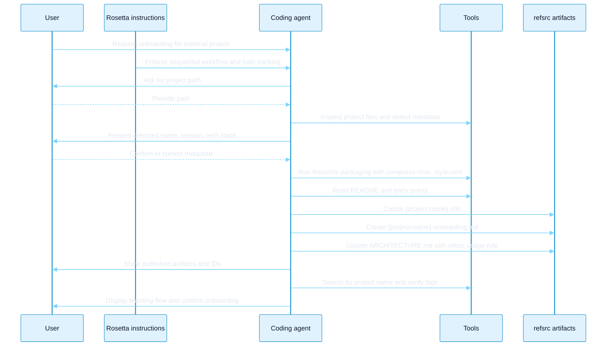

# External Library Flow

<span class="badge-pro">PRO</span>

## Availability

Available in the Pro instructions repository. This workflow is not part of the OSS instruction set.

## TL;DR

Use External Library Flow when AI agents need to work with a private or external codebase that is not inside the current workspace. The workflow asks for one thing up front: the project path. After that, the coding agent detects metadata, packages the codebase into compressed Repomix XML, writes a short onboarding document, updates architecture guidance so later agents know where to look, and verifies that the reference material can be found again. You should review detected metadata before packaging continues and review the published onboarding artifacts plus architecture update before treating onboarding as complete.

## When To Use This Workflow

- Onboard an internal SDK, shared library, service client, or external codebase for later AI-assisted work
- Give future coding tasks a searchable reference source without copying the external project into the current repository
- Document a private dependency that agents must understand before implementation or analysis
- Add stable reference artifacts under `refsrc/` so later workflows can ground themselves in the external dependency

## When Not To Use This Workflow

- Do not use it for code changes inside the current repository. Use [Coding Flow](/rosetta/docs/coding-flow/).
- Do not use it when the main goal is understanding the current repository. Use [Code Analysis Flow](/rosetta/docs/code-analysis-flow/).
- Do not use it for general Rosetta capability questions. Use [Usage Guide](/rosetta/docs/usage-guide/).
- Do not use it if the external project is already onboarded and the `refsrc` artifacts plus architecture rule are current.

## Before You Start

- Know the exact filesystem path to the external project
- Make sure the coding agent can read that path from the current environment
- Expect the workflow to auto-detect project name, version, and tech stack from project files; be ready to correct bad detection
- Keep the target project's `docs/ARCHITECTURE.md` current enough to accept an added rule for external references
- For shared Rosetta setup and workspace context, see [Usage Guide - Customization](/rosetta/docs/usage-guide/#customization)

## How To Start

```text
Teach AI about our internal authentication library at ../auth-sdk.
```

```text
Onboard the shared billing client from /opt/repos/billing-client so later coding tasks can use it.
```

```text
Document the external utilities package for AI use in this workspace. The project path is ../shared-utils.
```

## How Rosetta Shapes This Workflow

- The coding agent must execute the workflow sequentially and track every step with todo tasks; this is not a free-form analysis pass
- Rosetta keeps discovery narrow: the workflow asks only for project path, then auto-detects metadata instead of turning setup into a long interview
- The agent uses tooling for packaging, then converts the result into durable workspace references that later workflows can search
- Rosetta turns common context guidance into an architecture rule so later agents know to use `refsrc/{project-name}.xml` and `refsrc/{project-name}-onboarding.md` with search tools instead of trying to read large files blindly
- Rosetta itself does not read the external project. It provides instructions; the coding agent executes them in your environment with available tools and file access

## Workflow At A Glance

| Phase | What you provide | What agents do | What you get | Review gate |
|---|---|---|---|---|
| 1. Discovery | External project path | Validate access, detect project name, version, and tech stack | Detected metadata | Confirm or correct detected metadata |
| 2. Analysis | Confirmed project path and metadata | Package the codebase as compressed XML, read README, find entry points, draft the learning flow | Repomix package output plus onboarding draft content | No explicit gate in source |
| 3. Publishing | Confirmed metadata and generated artifacts | Publish `{project-name}.xml` and `{project-name}-onboarding.md`, confirm both IDs, clean temp files, update architecture guidance | Durable `refsrc` artifacts and architecture rule | Review published artifacts and architecture update |
| 4. Verification | Published artifacts | Search by project name, verify tags, display learning flow, confirm onboarding succeeded | Proof that later agents can find and use the reference set | Review verification evidence |

## Mermaid Flowchart

```mermaid
%%{init: {'theme':'base','themeVariables':{
  'background':'#0f172a',
  'primaryColor':'#dbeafe',
  'primaryTextColor':'#0f172a',
  'primaryBorderColor':'#1d4ed8',
  'lineColor':'#94a3b8',
  'secondaryColor':'#dcfce7',
  'secondaryTextColor':'#14532d',
  'secondaryBorderColor':'#16a34a',
  'tertiaryColor':'#fef3c7',
  'tertiaryTextColor':'#78350f',
  'tertiaryBorderColor':'#d97706'
}}}%%
flowchart TD
  A["Start: user requests external onboarding"] --> B["Phase 1: ask for project path"]
  B --> C["Validate path and auto-detect<br/>name, version, tech stack"]
  C --> D{"Metadata correct?"}
  D -- "No" --> C
  D -- "Yes" --> E["Phase 2: package codebase<br/>with compressed Repomix XML"]
  E --> F["Read README and entry points"]
  F --> G["Draft short learning flow"]
  G --> H["Phase 3: publish refsrc/<project>.xml"]
  H --> I["Publish refsrc/<project>-onboarding.md"]
  I --> J["Update ARCHITECTURE.md rule"]
  J --> K["Confirm document IDs and cleanup"]
  K --> L["Phase 4: search by project name"]
  L --> M["Verify tags and display learning flow"]
  M --> N["Confirm AI can use onboarded reference"]

  style A fill:#dbeafe,stroke:#1d4ed8,color:#0f172a
  style B fill:#fef3c7,stroke:#d97706,color:#78350f
  style C fill:#dcfce7,stroke:#16a34a,color:#14532d
  style D fill:#fef3c7,stroke:#d97706,color:#78350f
  style E fill:#dbeafe,stroke:#1d4ed8,color:#0f172a
  style F fill:#dcfce7,stroke:#16a34a,color:#14532d
  style G fill:#dcfce7,stroke:#16a34a,color:#14532d
  style H fill:#dbeafe,stroke:#1d4ed8,color:#0f172a
  style I fill:#dbeafe,stroke:#1d4ed8,color:#0f172a
  style J fill:#fef3c7,stroke:#d97706,color:#78350f
  style K fill:#dcfce7,stroke:#16a34a,color:#14532d
  style L fill:#dbeafe,stroke:#1d4ed8,color:#0f172a
  style M fill:#dcfce7,stroke:#16a34a,color:#14532d
  style N fill:#dcfce7,stroke:#16a34a,color:#14532d
```



## Mermaid Sequence Diagram



## Phases

### Phase 1. Discovery

**Goal**

Find the external project and reduce user questions to a single required input: the project path.

**What you provide**

- The filesystem path to the project that should be onboarded
- Corrections if auto-detected metadata is wrong

**What the agent does**

- Asks `What project path to onboard?`
- Suggests current directory, parent directory, or known shared-project paths if needed
- Validates that the path exists and is accessible
- Detects project name from files such as `package.json`, `pyproject.toml`, `pom.xml`, `Cargo.toml`, or other project descriptors
- Detects version from the same family of files and skips version if none is available
- Detects tech stack from package files and file extensions
- Falls back to the directory name for project name if metadata files do not provide one
- Presents the detected metadata back to you as `{project-name} v{version}, tech: {tags}`

**What you get**

- A confirmed external project path
- Detected metadata that will drive file naming and tags in later phases

**What to watch for**

- Wrong project root, especially when repos contain samples, demos, or multiple packages
- Bad auto-detection caused by monorepos or umbrella build files
- Missing version information, which the workflow explicitly allows

### Phase 2. Analysis

**Goal**

Turn the external codebase into a compact AI-readable reference and extract the minimum onboarding guidance needed for later work.

**What you provide**

- Confirmed project path and corrected metadata if phase 1 needed adjustments

**What the agent does**

- Packages the codebase with `mcp_repomix_pack_codebase` using `compress: true` and `style: "xml"`
- Keeps the package focused on the target project and excludes tests or demo projects where possible
- Stores the packaging output identifier for later publishing and verification
- Reads the project README when it exists, looking for installation, setup, usage, and getting-started instructions
- Identifies main entry points such as package scripts, `main.py`, `__main__.py`, `Main` classes, `main.rs`, or equivalent language-specific entry files
- Generates a short learning flow with three sections: setup, usage, and key components
- Keeps each learning-flow step to 3-5 words and the whole outline under 20 lines
- Falls back to a tech-stack-based generic learning flow when README extraction is not possible

**What you get**

- A compressed XML package intended for AI consumption, not human reading
- Draft content for `{project-name}-onboarding.md`

**What to watch for**

- The workflow is for signatures and structure, not a full human-written architecture document
- Large or noisy repos need careful packaging boundaries so the XML stays useful
- The learning flow should stay brief; if it starts reading like prose documentation, it is off-spec

### Phase 3. Publishing

**Goal**

Publish durable workspace artifacts that later agents can search and use.

**What you provide**

- Corrections if file naming, project identity, or onboarding content is wrong

**What the agent does**

- Publishes the compressed XML as `{project-name}.xml` without modifying the Repomix output
- Creates `{project-name}-onboarding.md` as a short learning-flow document
- Makes the onboarding document specify the Rosetta title and search instructions required by the workflow
- Confirms both published document IDs
- Cleans up temporary files used during packaging
- Updates `docs/ARCHITECTURE.md` with the required rule telling later agents to use `refsrc/{project-name}.xml` and `refsrc/{project-name}-onboarding.md` with grep or search because the files are large
- Combines that architecture rule cleanly when multiple external dependencies already exist

**What you get**

- `refsrc/{project-name}.xml`
- `refsrc/{project-name}-onboarding.md`
- An architecture update that tells later workflows how to use those files

**What to watch for**

- The source names the publishing outcomes and required architecture rule, but does not define an exact temporary-file pattern or exact placement mechanics beyond the `refsrc` targets
- The onboarding document must stay brief and operational, not become a long narrative

### Phase 4. Verification

**Goal**

Prove that the newly published reference set is searchable and usable by later AI tasks.

**What you provide**

- Final review of the published artifacts and verification evidence

**What the agent does**

- Searches by project name
- Verifies that the expected tags are present
- Displays the learning flow back to you
- Confirms that AI onboarding succeeded

**What you get**

- Evidence that the reference package can be found again by project name
- Final confirmation that later workflows can use the onboarded external dependency

**What to watch for**

- The workflow source defines the verification checklist, but does not prescribe a separate report file
- If search does not find the artifacts cleanly, onboarding is not complete

## How To Review Results

Review the workflow at two levels: metadata correctness early, then artifact usefulness at the end.

For phase 1, verify:

- The chosen path points to the real project root
- Project name matches the dependency your team actually uses
- Version, if detected, is correct enough to distinguish the dependency
- Tech-stack tags are not misleading

For phase 3 and 4, verify:

- `{project-name}.xml` exists and looks like raw compressed Repomix output rather than a hand-edited file
- `{project-name}-onboarding.md` is short, searchable, and explains setup, usage, and key components clearly
- The onboarding document includes the required Rosetta title and search guidance
- `docs/ARCHITECTURE.md` now tells future agents to use the `refsrc` artifacts with search tools because the files are large
- Searching by project name actually finds the onboarded reference set

If any of those checks fail, later workflows will either miss the dependency entirely or use it badly.

## Workflow-Specific Customization

- Keep external dependencies under a predictable `refsrc/` naming scheme so later agents can search them reliably
- Add enough architecture context around the external dependency that later coding or modernization work can understand why it exists and where it is used
- When a dependency is large or multi-package, onboard only the part later workflows truly need; the source explicitly pushes for compressed, focused output
- For internal libraries with weak README coverage, provide extra usage context during review so the onboarding document stays operational instead of generic
- When several private dependencies exist, make `docs/ARCHITECTURE.md` describe how to choose among multiple `refsrc` references rather than appending disconnected rules

## Artifacts You Will Get

- `refsrc/{project-name}.xml`
- `refsrc/{project-name}-onboarding.md`
- Updated `docs/ARCHITECTURE.md` rule for external-reference usage
- Detected metadata summary for project name, version, and tech stack
- Confirmation of published document IDs

## Common Mistakes

- Giving the path to a monorepo root instead of the actual library or service folder
- Accepting wrong auto-detected metadata without correction
- Letting tests, demos, or sample apps dominate the packaged XML
- Writing a long onboarding document instead of the required short learning flow
- Forgetting to update architecture guidance, which leaves later agents unaware of the new reference source
- Treating verification as optional instead of proving that search can find the artifacts

## Source Files

- [external-lib-flow.md](https://github.com/griddynamics/cto-ims-kb/blob/main/instructions/r2/grid/workflows/external-lib-flow.md)
