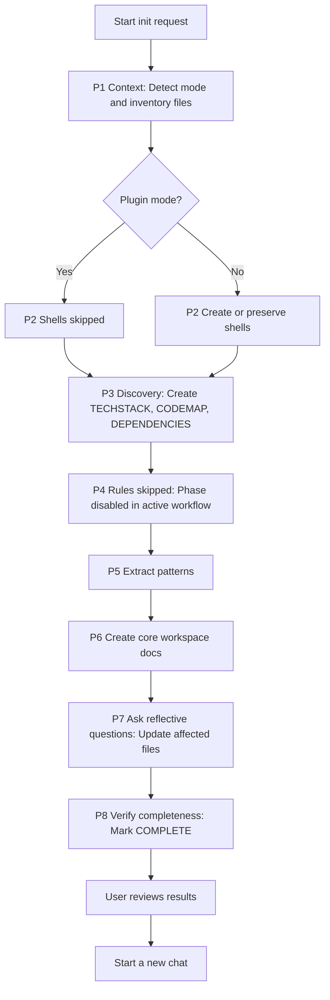
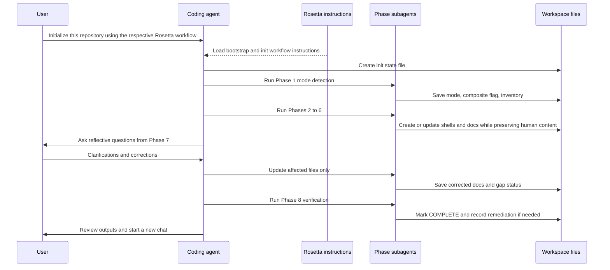

# Init Workspace Flow

## Availability

OSS

## TL;DR

Use this workflow to initialize Rosetta in a repository, upgrade an existing Rosetta workspace, or prepare a composite workspace before feature work starts.

The coding agent detects mode, optionally creates shells, analyzes the repository, extracts patterns, writes the core workspace docs, asks gap-filling questions, and verifies completeness.

The main artifacts are `agents/init-workspace-flow-state.md`, discovery docs, pattern docs, and the core workspace docs used by later workflows.

Phase 7 is the main question-and-correction checkpoint, where you answer reflective questions and correct gaps. Phase 8 then verifies completeness and tells you to start a new chat before normal work.

## When To Use This Workflow

- Initialize a repository that does not yet have Rosetta workspace files
- Upgrade an older Rosetta workspace, including R1 to R2
- Generate shells for skills, agents, and workflows in non-plugin setups
- Build the first `docs/TECHSTACK.md`, `docs/CODEMAP.md`, `docs/DEPENDENCIES.md`, `docs/CONTEXT.md`, and `docs/ARCHITECTURE.md`
- Extract reusable patterns into `docs/PATTERNS/`
- Initialize a composite workspace that needs top-level registry docs pointing to sub-repositories

## When Not To Use This Workflow

- Do not use it for feature implementation, bug fixes, or refactoring. Use the [Coding Flow](/rosetta/docs/coding-flow/).
- Do not use it to learn what Rosetta can do. Use the [Usage Guide](/rosetta/docs/usage-guide/) or the self-help workflow.
- Do not use it to analyze one feature or one module after the workspace is already initialized. Use the code-analysis workflow instead.
- Do not use it as a replacement for ongoing documentation maintenance. After init, later workflows should update the workspace docs incrementally.

## Before You Start

- Make sure the coding agent can read the target repository.
- Be ready to answer questions about business purpose, architecture boundaries, module ownership, and conventions.
- If this is an upgrade, identify any human-curated docs or rules that must be preserved.
- If this is a composite workspace, know which repositories belong to the workspace and which docs must stay repo-local.
- Do not expect local rules generation from this workflow. The active top-level workflow keeps Phase 4 disabled and continues directly to Patterns.

For shared setup and installation details, use the [Usage Guide](/rosetta/docs/usage-guide/) and [Overview](/rosetta/docs/overview/).

## How To Start

```text
# Greenfield (new repository)
Initialize this repository using the respective Rosetta workflow, this is a new repository, target tech stack: ..., target architecture: ..., business context: ...

# Brownfield (existing repository)
Initialize this repository using the respective Rosetta workflow[, this is a composite workspace][, additional information]

Upgrade this repository from Rosetta R1 to R2
Initialize subagents and workflows
```

## How Rosetta Shapes This Workflow

Rosetta provides the instructions for this workflow. The coding agent acts on those instructions. Rosetta itself does not see user requests, code, or project data.

In practice, that changes the user experience in four ways:

- The workflow is state-driven. Each phase reads and updates `agents/init-workspace-flow-state.md` instead of improvising phase order.
- The workflow is mode-aware. Plugin sessions skip shell generation. Upgrade sessions preserve existing content. Composite workspaces produce registry-style top-level docs.
- Missing facts are surfaced instead of guessed. Gaps accumulate through earlier phases and are resolved in Phase 7 through targeted questions and file updates.
- The workflow ends with a forced reset. You must start a new chat so the coding agent reloads the newly created shells and workspace docs.

## Workflow At A Glance

| Phase | What you provide | What agents do | What artifacts appear | Review gate |
|---|---|---|---|---|
| 1. Context | Repository access and current session context | Detect install, upgrade, or plugin mode, detect composite status, inventory existing Rosetta files | `agents/init-workspace-flow-state.md` updated with mode, flags, and inventory | No |
| 2. Shells | Nothing extra unless upgrade context matters | Generate or preserve shells, bootstrap rule, and load-context shell, or skip in plugin mode | Shell configs, bootstrap rule, load-context shell, state update | No |
| 3. Discovery | Codebase access | Analyze tech stack, structure, dependencies, file count, and composite layout | `docs/TECHSTACK.md`, `docs/CODEMAP.md`, `docs/DEPENDENCIES.md`, state update | No |
| 4. Rules | Nothing. This phase is disabled in the active workflow. | Record disabled or skipped status and continue | Explicit disabled or skipped status in state | No. Disabled in the active workflow |
| 5. Patterns | Source code and module structure | Extract recurring coding and architecture patterns, often with module-scoped subagents | `docs/PATTERNS/INDEX.md`, pattern files, `docs/PATTERNS/CHANGES.md`, state update | No |
| 6. Documentation | Source code plus outputs from Phases 3 and 5 | Build the core workspace docs and agent memory files | `docs/CONTEXT.md`, `docs/ARCHITECTURE.md`, `agents/IMPLEMENTATION.md`, `docs/ASSUMPTIONS.md`, `agents/MEMORY.md`, state update | No |
| 7. Questions | Answers to reflective questions | Review docs for gaps, ask targeted questions, update affected files through subagents | Updated docs, resolved or deferred gaps in state | Yes |
| 8. Verification | Review attention and approval to move on | Run completeness checks, catch up failed checkpoints, suggest next steps, mark state complete | Verification results, remediation actions, final state | Yes. Review results, then start a new chat |

## Workflow Overview



## Interaction Flow



## Phases

### Phase 1. Context

**Goal:** detect install, upgrade, or plugin mode before any content changes.

**Required user input:** repository access and the existing session mode. No extra approval gate here.

**Agent actions:**
- Read `agents/init-workspace-flow-state.md`
- Run workspace mode detection
- Set `state.mode`, `state.plugin_active`, `state.composite`, and `state.existing_files`
- Report detected mode and inventory summary

**Produced artifacts:** updated `agents/init-workspace-flow-state.md`

**Review expectation:** verify that the detected mode is correct if the agent reports something unexpected.

**Watch for:** plugin mode is a context marker, not a filesystem guess. A fresh state file does not prove a fresh install.

### Phase 2. Shells

**Goal:** create local shells so later sessions can load context and invoke Rosetta-native capabilities.

**Required user input:** nothing in normal install mode. In upgrade mode, existing local customizations matter because the phase must preserve them.

**Agent actions:**
- Read state
- Skip the phase if `state.plugin_active == true`
- Generate shells, bootstrap rule, and load-context shell in install mode
- Create only missing shells in upgrade mode
- Record created, updated, or skipped status in state

**Produced artifacts:** shell configs, bootstrap rule, load-context shell, updated state

**Review expectation:** if you are upgrading, verify that existing shells were preserved instead of overwritten.

**Watch for:** shell changes do not affect the current session. They only matter after a new chat starts.

### Phase 3. Discovery

**Goal:** create the technical baseline that later phases depend on.

**Required user input:** repository access. Composite workspaces may need you to confirm which repositories belong in the registry view.

**Agent actions:**
- Analyze workspace tech stack, structure, dependencies, and file count
- Create registry-style top-level docs for composite workspaces
- Set `state.file_count` for later large-workspace handling
- Record per-file status in state

**Produced artifacts:** `docs/TECHSTACK.md`, `docs/CODEMAP.md`, `docs/DEPENDENCIES.md`, updated state

**Review expectation:** confirm that the module map and dependency view reflect the real workspace shape.

**Watch for:** composite top-level docs should reference sub-repo docs, not duplicate their detail.

### Phase 4. Rules

**Goal:** carry the disabled phase forward transparently instead of implying local rules generation is available here.

**Required user input:** none.

**Agent actions:**
- Carry the phase as disabled and continue to Patterns without generating local rules
- Preserve state continuity and continue to Patterns

**Produced artifacts:** explicit disabled or skipped status in state

**Review expectation:** confirm the workflow did not generate unexpected local rules files and that Phase 4 was reported as disabled.

**Watch for:** requests to initialize rules should not make this page promise active rules generation when the active workflow source disables that phase.

### Phase 5. Patterns

**Goal:** extract recurring coding and architecture conventions into reusable patterns.

**Required user input:** no new input unless the workspace has unusual module boundaries that the agent cannot infer cleanly.

**Agent actions:**
- Read `docs/CODEMAP.md` and source code
- Partition work by module boundaries
- Use subagents for pattern extraction
- Merge and deduplicate results
- Record gaps and completion in state

**Produced artifacts:** `docs/PATTERNS/INDEX.md`, one or more pattern files, `docs/PATTERNS/CHANGES.md`, updated state

**Review expectation:** check that patterns describe real recurring structures and conventions.

**Watch for:** one-off implementation details should not be promoted into patterns.

### Phase 6. Documentation

**Goal:** create the shared workspace docs that later workflows read on every task.

**Required user input:** no new approval gate here, but earlier discovery quality directly affects this phase.

**Agent actions:**
- Read discovery outputs, patterns, source code, mode, composite flag, and file count
- Create or update the core workspace docs
- Preserve human-added content in upgrade mode
- Record gaps and per-file status in state

**Produced artifacts:** `docs/CONTEXT.md`, `docs/ARCHITECTURE.md`, `agents/IMPLEMENTATION.md`, `docs/ASSUMPTIONS.md`, `agents/MEMORY.md`, updated state

**Review expectation:** read these files carefully because later workflows will trust them as project context.

**Watch for:** `agents/MEMORY.md` is operational memory for agent behavior, not a second business-context document.

### Phase 7. Questions

**Goal:** resolve the gaps that automated analysis could not safely fill.

**Required user input:** answers to reflective questions about domain logic, architecture rationale, conventions, and missing facts.

**Agent actions:**
- Review all created docs and accumulated gaps
- Ask targeted questions
- Map each answer to the files that need updates
- Spawn one subagent per affected file
- Update those files while preserving human content
- Clear resolved gaps and keep unresolved ones explicit in state

**Produced artifacts:** updated docs, updated state with resolved and deferred gaps

**Review expectation:** this is the main HITL gate. Answer precisely and correct wrong assumptions directly.

**Watch for:** unanswered questions should stay explicit as deferred gaps. The workflow should not guess to make the docs look complete.

### Phase 8. Verification

**Goal:** confirm the workspace is actually ready for normal Rosetta work.

**Required user input:** review attention to the final outputs and remediation list.

**Agent actions:**
- Confirm Phases 1 through 7 are complete
- Run the verification checklist
- Run catch-up for failed checkpoints
- Revalidate `docs/ASSUMPTIONS.md`
- Suggest next steps
- Mark `agents/init-workspace-flow-state.md` as COMPLETE
- Tell you to start a new chat

**Produced artifacts:** verification results, remediation actions if needed, final state

**Review expectation:** confirm the generated files exist, are non-empty, and are safe to trust as baseline project context.

**Watch for:** the new-chat requirement is mandatory because the current session still carries init-specific context.

## How To Review Results

Review the outputs in two passes.

**After Phase 7**

- Check `docs/CONTEXT.md` for business purpose, domain terms, and scope boundaries
- Check `docs/ARCHITECTURE.md` for component boundaries, integrations, and major technical constraints
- Check `docs/ASSUMPTIONS.md` for gaps that should be resolved now versus deferred explicitly
- Confirm wrong assumptions were corrected in the actual files, not only in chat

**After Phase 8**

- Confirm `docs/TECHSTACK.md`, `docs/CODEMAP.md`, and `docs/DEPENDENCIES.md` are specific enough to guide future discovery
- Confirm `docs/PATTERNS/` covers major modules or gives explicit skip reasons
- In upgrade mode, confirm human-written content was preserved
- In composite workspaces, confirm top-level docs act as registries and sub-repo docs remain the detailed source
- Read `agents/init-workspace-flow-state.md` and verify the final status matches the files on disk
- Start a new chat only after you trust the generated baseline

## Workflow-Specific Customization

- Give precise domain corrections in Phase 7. This workflow is only as good as the facts that end up in `docs/CONTEXT.md` and `docs/ARCHITECTURE.md`.
- For composite workspaces, initialize each repository first, then initialize the top-level workspace so registry docs can point to real sub-repo docs.
- Call out human-curated files before upgrades. The workflow is designed to preserve them, but only if the agent can identify what must be treated conservatively.
- If the workspace is large and discovery sets `state.file_count >= 50`, expect later phases to partition work more aggressively.
- Do not plan around local rules generation in this workflow. The current active source keeps that phase disabled.

## Artifacts You Will Get

- `agents/init-workspace-flow-state.md`
- Shell configs, bootstrap rule, and load-context shell when not in plugin mode
- `docs/TECHSTACK.md`
- `docs/CODEMAP.md`
- `docs/DEPENDENCIES.md`
- `docs/PATTERNS/INDEX.md`
- `docs/PATTERNS/CHANGES.md`
- One or more pattern files under `docs/PATTERNS/`
- `docs/CONTEXT.md`
- `docs/ARCHITECTURE.md`
- `agents/IMPLEMENTATION.md`
- `docs/ASSUMPTIONS.md`
- `agents/MEMORY.md`
- Verification results and remediation actions from Phase 8

## Common Mistakes

- Starting feature work before Phase 8 finishes and before the new chat starts
- Treating plugin mode as a filesystem condition instead of a session condition
- Assuming a fresh state file means a fresh install
- Letting the agent guess missing domain facts instead of answering Phase 7 questions
- Expecting local rules to appear from a workflow whose active source keeps the Rules phase disabled
- Duplicating sub-repository detail in composite top-level docs instead of using registry-style references

## Source Files

- [init-workspace-flow.md](https://github.com/griddynamics/rosetta/blob/main/instructions/r2/core/workflows/init-workspace-flow.md)
- [init-workspace-flow-context.md](https://github.com/griddynamics/rosetta/blob/main/instructions/r2/core/workflows/init-workspace-flow-context.md)
- [init-workspace-flow-shells.md](https://github.com/griddynamics/rosetta/blob/main/instructions/r2/core/workflows/init-workspace-flow-shells.md)
- [init-workspace-flow-discovery.md](https://github.com/griddynamics/rosetta/blob/main/instructions/r2/core/workflows/init-workspace-flow-discovery.md)
- [init-workspace-flow-rules.md](https://github.com/griddynamics/rosetta/blob/main/instructions/r2/core/workflows/init-workspace-flow-rules.md)
- [init-workspace-flow-patterns.md](https://github.com/griddynamics/rosetta/blob/main/instructions/r2/core/workflows/init-workspace-flow-patterns.md)
- [init-workspace-flow-documentation.md](https://github.com/griddynamics/rosetta/blob/main/instructions/r2/core/workflows/init-workspace-flow-documentation.md)
- [init-workspace-flow-questions.md](https://github.com/griddynamics/rosetta/blob/main/instructions/r2/core/workflows/init-workspace-flow-questions.md)
- [init-workspace-flow-verification.md](https://github.com/griddynamics/rosetta/blob/main/instructions/r2/core/workflows/init-workspace-flow-verification.md)
