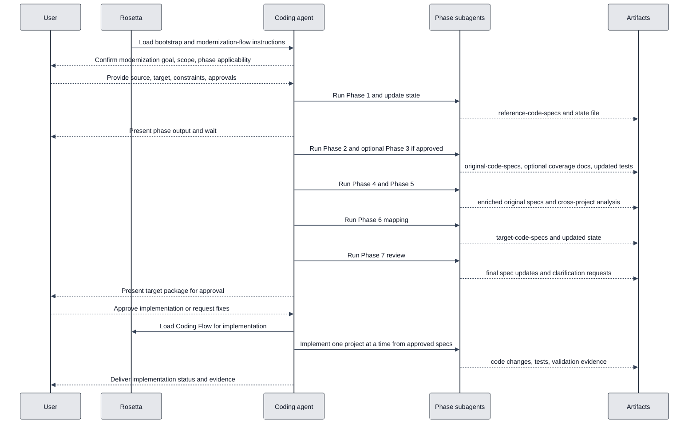

# Modernization Flow

## Availability

PRO. This workflow lives in the enterprise Rosetta instruction set.

## TL;DR

Use Modernization Flow for high-risk migrations where losing behavior, contracts, or cross-project dependencies is unacceptable.
It is built for code conversion, platform migration, framework upgrades, re-architecture, containerization, Linux enablement, and similar work where implementation must follow reviewed specs instead of ad hoc coding.
The workflow first documents reusable libraries, then existing behavior, then bounded contexts and cross-project flows, then target mappings, then final review, and only then hands implementation to Coding Flow.
You must confirm applicable phases, review every phase output, approve target specs before implementation, and resolve blocking unknowns instead of letting the agent guess.
Phase 3 test coverage is optional and runs only when you explicitly approve it.

## When To Use This Workflow

- Migrate between languages, runtimes, frameworks, or operating environments.
- Re-architect a monolith into multiple services or redesign service boundaries.
- Modernize code that depends on internal libraries, legacy interfaces, proxies, database objects, or cross-project call chains.
- Preserve public contracts and behavior while changing implementation technology.
- Build a reviewed target-state specification before any implementation starts.

## When Not To Use This Workflow

- Do not use this for ordinary feature work or bug fixes. Use [Coding Flow](/rosetta/docs/coding-flow/).
- Do not use this when the goal is only to understand existing code without planning migration. Use [Code Analysis Flow](/rosetta/docs/code-analysis-flow/).
- Do not use this when requirements are still unclear and the main deliverable is requirements clarification. Use [Requirements Documentation Authoring Flow](/rosetta/docs/requirements-authoring-flow/).
- Do not use this when there is no real modernization scope and the request is a one-off engineering task. Use [Ad-hoc Flow](/rosetta/docs/adhoc-flow/).

## Before You Start

- Provide the modernization goal in concrete terms: source stack, target stack, affected projects, and non-negotiable constraints.
- State compatibility expectations explicitly, especially public API stability, behavioral parity, deployment constraints, data constraints, and whether legacy callers must keep working.
- Provide or point to the strongest available evidence sources: source code, tests, DDL and schema files, configs, deployment descriptors, interface catalogs, and reference libraries under `refsrc/` when applicable.
- If the modernization spans multiple projects, confirm which projects are in scope and which are reference-only reusable libraries.
- Decide whether Phase 3 baseline test coverage should run. This phase is optional and requires explicit approval.
- For small in-place upgrades, confirm whether the reduced path is acceptable. The workflow allows Phase 2 plus Phase 6 only when the scope is truly small and later discovery does not expand it.
- Use [Usage Guide](/rosetta/docs/usage-guide/) for shared Rosetta setup and general customization. This page covers only modernization-specific preparation.

## How To Start

```text
Modernize this .NET Framework service to modern .NET. Preserve public contracts, document every dependency, and stop after target specs for approval.
```

```text
Re-architect this monolith into microservices. Analyze bounded contexts, cross-project flows, and proxy boundaries before proposing the target layout.
```

```text
Migrate this Windows-hosted application to Linux containers. Reuse existing internal libraries where possible and identify what must change for runtime, config, and deployment behavior.
```

```text
Upgrade this Java 8 codebase to Java 21. If the scope stays small, use only the applicable phases, but stop and ask before skipping anything.
```

## How Rosetta Shapes This Workflow

Rosetta makes this workflow slow on purpose. The coding agent must execute one phase at a time, update a state file after each phase, validate that required files exist, and wait for user confirmation before continuing. That changes the UX from "start coding" to "collect evidence, write specs, review, then implement."

Rosetta also pushes work to specialized subagents because this workflow is large. Expect phase-focused analysis, mapping, review, and implementation work rather than one agent holding the entire migration in a single context window. The workflow explicitly tells agents to use search and targeted reads on large files, especially large database files, instead of pretending they understood everything in one pass.

Always-active Rosetta behavior also matters here: the agent should ask targeted clarification questions when critical scope, compatibility, or dependency details are missing; surface assumptions instead of hiding them; and stop when unknowns block safe progress. Rosetta provides instructions. Coding agents act on them. Rosetta itself does not see your source code, requests, or project data.

## Workflow At A Glance

| Phase | What you provide | What agents do | Artifacts | Review gate |
|---|---|---|---|---|
| 1. Existing library analysis | Reusable target-state libraries, project scope | Document reusable libraries factually, including contracts, tests, usage, edge cases, and unknowns | `docs/reference-code-specs-<lib/project>.md`, `agents/modernization-flow-state.md` | User confirms phase completion before next phase |
| 2. Old code analysis | Legacy projects, tests, DB and service references | Document current behavior, dependencies, tests, DB objects, callers, contracts, and unknowns per project | `docs/original-code-specs-<lib/project>.md`, state update | User confirms phase completion before next phase |
| 3. Test coverage (optional) | Explicit approval to run it, coverage tooling, test environment | Measure coverage, add baseline tests for original behavior, and document the coverage approach | `docs/original-test-coverage-<lib/project>.md`, updated tests, state update | Explicit user approval required to run phase |
| 4. Class group analysis | Approved original specs | Identify tightly coupled class groups, bounded contexts, and cross-group flows inside each project | Updated `docs/original-code-specs-<lib/project>.md`, state update | User confirms phase completion before next phase |
| 5. Cross-project analysis | Class-group-enriched specs, reference specs, optional interface catalogs | Compare projects, map shared flows, identify inconsistencies, proxy patterns, and migration order | `docs/cross-project-analysis.md`, updated original specs, state update | User confirms phase completion before next phase |
| 6. Implementation mapping | Cross-project analysis, original specs, reusable library specs, target constraints | Compare alternatives, define selected target approach, map source to target, and define compatibility-preserving target specs | `docs/target-code-specs-<lib/project>.md`, state update | User confirms phase completion before next phase |
| 7. Final review | All specs and unresolved questions | Re-read the spec set together, clean up gaps, validate consistency, and request final clarifications | Updated spec set, updated cross-project analysis artifact, state update | User must resolve blocking unknowns and approve readiness |
| 8. Implementation | Explicit approval, approved target specs | Implement one project at a time via Coding Flow, preserve behavior and contracts, add tests, and verify coverage | Code changes, tests, validation results, implementation-state updates handled by Coding Flow | Explicit user approval required before implementation starts |

## Mermaid Flowchart

```mermaid
%%{init: {'theme':'base','themeVariables':{
'background':'#ffffff',
'primaryColor':'#dbeafe',
'primaryTextColor':'#111827',
'primaryBorderColor':'#1d4ed8',
'secondaryColor':'#fef3c7',
'secondaryTextColor':'#111827',
'secondaryBorderColor':'#b45309',
'tertiaryColor':'#dcfce7',
'tertiaryTextColor':'#052e16',
'tertiaryBorderColor':'#15803d',
'lineColor':'#334155',
'textColor':'#111827'
}}}%%
flowchart TD
  classDef work fill:#dbeafe,stroke:#1d4ed8,color:#111827,stroke-width:2px;
  classDef hitl fill:#fef3c7,stroke:#b45309,color:#111827,stroke-width:2px;
  classDef done fill:#dcfce7,stroke:#15803d,color:#052e16,stroke-width:2px;

  A[1 Reusable library analysis] --> B[2 Old code analysis]
  B --> C{3 Baseline test phase approved?}
  C -->|Yes| D[3 Test coverage]
  C -->|No| E[4 Class group analysis]
  D --> E
  E --> F[5 Cross-project analysis]
  F --> G[6 Implementation mapping]
  G --> H[7 Final review]
  H --> I{Ready and approved?}
  I -->|No| G
  I -->|Yes| J[8 Implementation via Coding Flow]
  J --> K[Validate contracts, behavior, tests, coverage]

  class A,B,D,E,F,G,H,J work;
  class C,I hitl;
  class K done;
  linkStyle default stroke:#334155,stroke-width:2px,color:#111827;
```

## Mermaid Sequence Diagram



## Phases

### 1. Existing Library Analysis for Reusing in Target State

**Goal**  
Create factual specs for reusable libraries that should survive the modernization and guide later target design.

**What you need to provide**  
Which projects are reusable reference libraries, where their code and tests live, and whether any of them are out of scope for modernization but still mandatory for compatibility.

**What agents do**  
Process each project separately, inspect code and tests, and create one `reference-code-specs` file per project. The analysis must document signatures, purpose, edge cases, usage, visibility, unknowns, assumptions, and links back to implementation and tests. This phase is factual only: no redesign recommendations.

**What you get**  
`docs/reference-code-specs-<lib/project>.md` files plus a brief update to `agents/modernization-flow-state.md`.

**What to review before approving**  
Check that every reusable library in scope is covered, public contracts are named exactly, tests were included in the analysis, and performance-sensitive or platform-sensitive behavior was not hand-waved away.

### 2. Old Code Analysis, Generating Original Specs

**Goal**  
Document how the current system actually behaves before any migration design starts.

**What you need to provide**  
Legacy projects in scope, relevant tests, service dependencies, schema and DDL locations, legacy interface references, and any known compatibility traps.

**What agents do**  
Process each project separately and write `docs/original-code-specs-<lib/project>.md`. The phase documents implementation facts, unit-test evidence, business purpose, callers, visibility, edge cases, service instantiation, framework usage, and used database objects. It must use targeted search on large database files and must list unknowns and assumptions instead of guessing.

**What you get**  
Per-project original-code specs and a state-file update.

**What to review before approving**  
Check that the specs describe public contracts, legacy service boundaries, actual DB objects used by the code, existing tests, uncovered unknowns, and any behavior that must survive the migration byte-for-byte or contract-for-contract.

### 3. Pre-Modernization Test Coverage (Optional)

**Goal**  
Create a behavioral safety net before modernization by raising baseline test coverage on the original code.

**What you need to provide**  
Explicit approval to run the phase, a working way to execute coverage tooling, and any environment constraints that affect test execution.

**What agents do**  
Measure coverage per project, identify gaps, add tests for uncovered behavior, prefer integration coverage where appropriate, and document the coverage approach in `docs/original-test-coverage-<lib/project>.md`. The phase targets at least 80% coverage per project and must validate real behavior rather than assumed behavior.

**What you get**  
Coverage docs per project, additional baseline tests, and a state-file update.

**What to review before approving**  
Check that the phase was actually approved, that new tests capture original behavior instead of rewritten intent, and that documented coverage gaps have explicit reasoning when they remain.

### 4. Class Group Analysis

**Goal**  
Turn raw code-level findings into bounded contexts and tightly coupled class groups inside each project.

**What you need to provide**  
Approved original-code specs and any architectural constraints that affect grouping boundaries.

**What agents do**  
Update the existing original-code specs in place. Each project gets documented class groups, their members, purpose, boundaries, internal cohesion, and the flows between groups. Dependencies must be traced at least two to three steps deep and supported with explicit evidence.

**What you get**  
Expanded `docs/original-code-specs-<lib/project>.md` files and a state-file update.

**What to review before approving**  
Check that the class groups represent real cohesive units, not arbitrary folders; that cross-group flows are backed by code references; and that bounded-context cuts are plausible enough to support later target mapping.

### 5. Cross-Project Analysis

**Goal**  
Understand how projects interact so the target design does not modernize one part while breaking another.

**What you need to provide**  
All reference specs, all original specs, and any existing legacy interface catalogs or TODO inventories if they exist.

**What agents do**  
Analyze all project specs together, create `docs/cross-project-analysis.md`, update the original specs with cross-project references, identify shared patterns and inconsistencies, map project-to-project flows, document proxy patterns and service boundaries, clean up resolved assumptions, and identify migration priority order.

**What you get**  
One cross-project analysis file, updated original-code specs, and a state-file update.

**What to review before approving**  
Check that cross-project calls, shared structures, proxy layers, and dependency directions are explicit; that the suggested migration order follows the actual dependency graph; and that unresolved ambiguities were not silently dropped.

### 6. Implementation Mapping, Generating Target Specs

**Goal**  
Define the approved target approach before any implementation begins.

**What you need to provide**  
Target architecture expectations, allowed frameworks or packages, compatibility requirements, deployment/runtime constraints, and any business rules that forbid certain redesign choices.

**What agents do**  
Re-read cross-project findings, original specs, and reusable-library specs; compare alternatives in memory; choose one target approach; and create `docs/target-code-specs-<lib/project>.md` per project. The output must map source files, classes, and method signatures to target equivalents, identify supporting libraries, address edge cases, and stress backward compatibility, file-by-file porting, and test-by-test porting. The target specs must guide implementation and must not contain implementation code.

**What you get**  
Per-project target-code specs and a state-file update.

**What to review before approving**  
Check that source-to-target traceability is explicit, compatibility rules are spelled out, file mappings are concrete, supporting libraries are named, and any intentional behavior or API changes are called out for approval instead of being buried.

### 7. Final Review

**Goal**  
Prove the spec set is consistent enough to implement without inventing missing decisions mid-flight.

**What you need to provide**  
Answers to any blocking questions, final confirmation of compatibility expectations, and approval to treat the target specs as the implementation contract.

**What agents do**  
Review the reference specs, the original/source specs, the target specs, and the cross-project analysis together; fix inconsistencies in place; clean up resolved assumptions and unknowns; verify cross-project handoffs; and request user clarification for anything still blocking safe implementation. This phase must not create new files.

**What you get**  
Updated spec documents, an updated cross-project analysis artifact, and a state-file update.

**What to review before approving**  
Check that unresolved unknowns are either answered or explicitly blocking, that similar problems are solved consistently across target specs, and that every project handoff, interface, and service replacement is defined clearly enough for implementation.

### 8. Implementation

**Goal**  
Implement the approved modernization safely and incrementally.

**What you need to provide**  
Explicit human approval to start implementation and confirmation that the approved target specs are the source of truth.

**What agents do**  
Load [Coding Flow](/rosetta/docs/coding-flow/) for the actual implementation work, implement one project at a time or follow the approved order, preserve public API compatibility unless changes were approved, write tests based on original behavior, validate against the original and target specs, and reach at least 80% coverage per project.

**What you get**  
Code changes, tests, and validation evidence delivered through Coding Flow rather than through new modernization-specific implementation documents.

**What to review before approving**  
Check that implementation only starts after explicit approval, that the agent is following approved target specs instead of improvising, and that contract and behavior validation is tied back to the source and target specs.

## How To Review Results

- Review every phase before allowing the next one. This workflow is designed to stop between phases because later documents depend on earlier ones being correct.
- Treat unknowns and assumptions as required review items, not footnotes. If a spec lists an assumption that affects compatibility, deployment, or behavior, resolve it before approving the next phase.
- Check evidence quality, not just document completeness. Findings about callers, DB usage, proxy boundaries, tests, and contracts should point back to real code or tests.
- During Phase 6 and Phase 7, review source-to-target mappings as a migration contract. If a class, file, interface, or service replacement is missing, implementation will drift.
- Before Phase 8, verify that target specs capture backward compatibility expectations, file-by-file and test-by-test porting expectations, and any approved API changes. If those are weak, the implementation handoff is unsafe.

## Workflow-Specific Customization

- Define the target architecture clearly when the end state is not obvious: target service layout, runtime model, hosting model, data model shifts, and which patterns are allowed or forbidden.
- Provide bounded-context expectations when business boundaries are known up front. This helps Phase 4 and Phase 5 avoid groupings that look technically plausible but are wrong for the domain.
- Provide cross-project flow knowledge when the code alone will not reveal ownership, sequencing, or operational contracts between systems.
- Call out transition strategy constraints when the migration must coexist with legacy behavior. The workflow explicitly supports documenting service boundaries, proxy patterns, replacement opportunities, and backward compatibility pressure; use that to state whether gateway, proxy, or strangler-style transitions are required where applicable.
- Put DDL, schema references, config files, deployment descriptors, and interface catalogs where the agent can inspect them directly. Phase 2 and Phase 5 depend on this evidence.
- Clone or publish internal private libraries into `refsrc/` or other accessible reference locations when the target design depends on them. Phase 1 and Phase 6 are stronger when reusable libraries are documented from real source instead of memory.
- For small in-place upgrades, explicitly authorize the reduced path and name the constraints that keep the scope small. If dependency discovery expands the problem, expect the workflow to resume the fuller phase set.

## Artifacts You Will Get

- `agents/modernization-flow-state.md` updated after each completed phase
- `docs/reference-code-specs-<lib/project>.md` for reusable target-state libraries
- `docs/original-code-specs-<lib/project>.md` for current projects in scope
- `docs/original-test-coverage-<lib/project>.md` when Phase 3 is approved
- `docs/cross-project-analysis.md`
- `docs/target-code-specs-<lib/project>.md`
- Updated spec files after final review
- Implementation artifacts produced through [Coding Flow](/rosetta/docs/coding-flow/) after explicit approval

## Common Mistakes

- Starting with implementation intent instead of evidence collection.
- Skipping reusable-library analysis even though target design depends on internal shared code.
- Letting the agent infer DB usage, service boundaries, or compatibility rules without source-backed evidence.
- Approving target specs that do not map source files and contracts explicitly enough to guide implementation.
- Treating the optional test-coverage phase as automatic. It is opt-in.
- Using the reduced small-upgrade path on a migration that actually has hidden cross-project or platform dependencies.
- Ignoring unresolved unknowns during final review and hoping Coding Flow will sort them out later.

## Source Files

- Workflow entry: [modernization-flow.md](https://github.com/griddynamics/cto-ims-kb/blob/main/instructions/r2/grid/workflows/modernization-flow.md)
- Phase 1: [modernization-flow-reuse.md](https://github.com/griddynamics/cto-ims-kb/blob/main/instructions/r2/grid/workflows/modernization-flow-reuse.md)
- Phase 2: [modernization-flow-analysis.md](https://github.com/griddynamics/cto-ims-kb/blob/main/instructions/r2/grid/workflows/modernization-flow-analysis.md)
- Phase 3: [modernization-flow-testing.md](https://github.com/griddynamics/cto-ims-kb/blob/main/instructions/r2/grid/workflows/modernization-flow-testing.md)
- Phase 4: [modernization-flow-grouping.md](https://github.com/griddynamics/cto-ims-kb/blob/main/instructions/r2/grid/workflows/modernization-flow-grouping.md)
- Phase 5: [modernization-flow-crossproject.md](https://github.com/griddynamics/cto-ims-kb/blob/main/instructions/r2/grid/workflows/modernization-flow-crossproject.md)
- Phase 6: [modernization-flow-mapping.md](https://github.com/griddynamics/cto-ims-kb/blob/main/instructions/r2/grid/workflows/modernization-flow-mapping.md)
- Phase 7: [modernization-flow-review.md](https://github.com/griddynamics/cto-ims-kb/blob/main/instructions/r2/grid/workflows/modernization-flow-review.md)
- Phase 8: [modernization-flow-implement.md](https://github.com/griddynamics/cto-ims-kb/blob/main/instructions/r2/grid/workflows/modernization-flow-implement.md)
