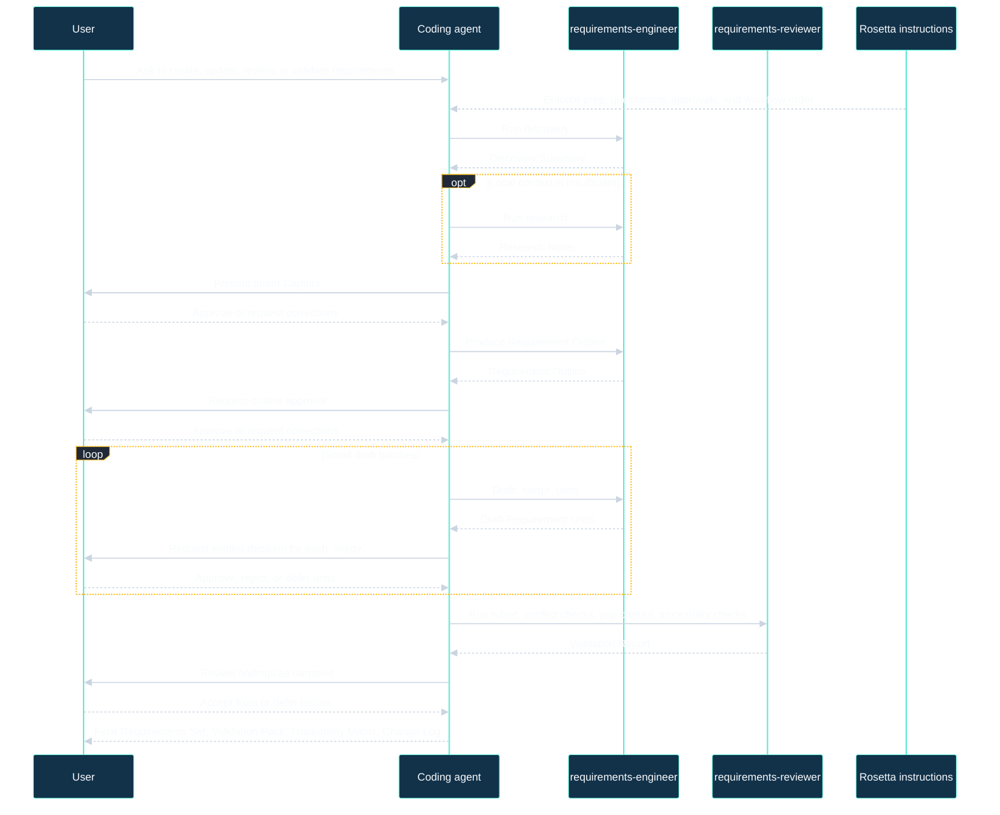

# Requirements Documentation Authoring

## Availability

OSS

## TL;DR

Use this workflow to create, update, improve, review, refactor, or validate requirements.
It is for cases where scope, behavior, or non-functional expectations need explicit approval and traceability.
The workflow moves through discovery, optional research, intent capture, outline, draft, validation, and finalization.
It produces a Discovery Summary, optional Research Notes, Intent Capture, Requirement Outline, Draft Requirement Units, Validation Report, Final Requirements Set, Validation Pack, Traceability Matrix, Change Log, and `requirements-authoring-flow-state.md`.
The main review gates are intent approval, outline approval, explicit approval for each `<req>` unit, and review of validation findings before final delivery.
If the request is implementation work, use the coding workflow instead.

## When To Use This Workflow

- You need new requirements for a feature, workflow, interface, or data boundary.
- Existing requirements are vague, contradictory, duplicated, or hard to test.
- A feature has important non-functional expectations such as latency, reliability, or security thresholds that must be made explicit.
- You need traceability from source and goals to requirements and later tests.
- You want a controlled review flow where every requirement unit gets an explicit user decision.

## When Not To Use This Workflow

- Do not use it for implementation. Use the coding workflow after requirements are approved.
- Do not use it to reverse engineer current system behavior from code. Use code analysis first if the current behavior is still unclear.
- Do not use it when the main task is broad research or comparison rather than authoring requirements. Use the research workflow.
- Do not use it to skip human review. This workflow is built around HITL gates and unit-level approval.

## Before You Start

- Prepare the exact feature, workflow, interface, or concern you want documented.
- Prepare actors, goals, non-goals, constraints, and any existing requirement files or glossary terms.
- Prepare measurable thresholds for NFRs if you already know them.
- Prepare any prior decisions or standards only if they materially constrain the wording.
- For shared Rosetta setup and workspace context files, use [Usage Guide](/rosetta/docs/usage-guide/#customization) and [Overview](/rosetta/docs/overview/). This page only covers workflow-specific preparation.

## How To Start

```text
"Define requirements for the checkout flow covering discount codes, tax, and retries"
"Write requirements for the user onboarding experience with explicit actors, non-goals, and measurable performance thresholds"
"Review these payment requirements for contradictions, missing traceability, and weak NFR wording"
"Refactor our reporting requirements into atomic requirement units with stable IDs and approval gates"
```

## How Rosetta Shapes This Workflow

Rosetta provides instructions. Coding agents act on them. Rosetta itself does not see user requests, code, or project data.

For this workflow, the always-active Rosetta behavior changes the experience in visible ways:

- The agent completes Rosetta prep before authoring, so it starts from workspace context instead of drafting from the prompt alone.
- The agent keeps asking focused clarification questions until intent is clear enough to draft safely.
- Intent, structure, and requirement units stay unapproved until you explicitly approve them.
- The agent drafts in small batches, not one large dump, because each `<req>` unit needs its own decision.
- Validation is a required phase, not optional cleanup. Conflicts, gaps, and traceability are checked before finalization.
- The workflow keeps a state file named `requirements-authoring-flow-state.md` in the feature temp area so phase status, artifacts, and open questions do not disappear into chat history.

## Workflow At A Glance

| Phase | What you provide | What agents do | What artifacts appear | Review gate |
| --- | --- | --- | --- | --- |
| Discovery | Request, scope hints, existing requirements, glossary, assumptions, constraints | Detect structure, read requirement context, identify FR/NFR/interface/data areas, record unknowns | Discovery Summary, state update | Questions if critical context is missing |
| Research | Supporting docs, standards, prior decisions, measurable thresholds when local context is not enough | Gather references, patterns, quality criteria, terminology constraints | Research Notes, state update | No approval gate; may be skipped with reason |
| Intent capture | Goals, scope boundaries, non-goals, priorities, answers to targeted questions | Restate intent, list assumptions, surface blockers | Intent Capture, state update | Explicit approval required |
| Outline | Structure constraints, naming rules, ID expectations if you have them | Propose MECE areas, file mapping, area abbreviations, ID strategy, traceability plan | Requirement Outline, state update | Explicit approval required |
| Draft | Unit-by-unit decisions and corrections | Draft atomic `<req>` units in small batches, use EARS for FRs, keep unresolved units as `Draft` | Draft Requirement Units, state update | Explicit decision for each `<req>` |
| Validate | Review comments and any deferred items | Run rubric, conflict checks, gap checks, source to goal to req to test traceability | Validation Report, state update | Review findings with user before finalization |
| Finalization | Final approval decisions | Deliver approved set, update index and links, update change log, complete state | Final Requirements Set, Validation Pack, Traceability Matrix, Change Log, final state update | Final review of delivered set |

## Mermaid Flowchart

```mermaid
%%{init: {'theme':'base','themeVariables': {
'background':'#0b1020',
'primaryColor':'#12324a',
'primaryBorderColor':'#5eead4',
'primaryTextColor':'#f8fafc',
'secondaryColor':'#1f2937',
'secondaryBorderColor':'#fbbf24',
'secondaryTextColor':'#f8fafc',
'tertiaryColor':'#1e293b',
'tertiaryBorderColor':'#93c5fd',
'tertiaryTextColor':'#f8fafc',
'lineColor':'#cbd5e1',
'fontSize':'14px'
}}}%%
flowchart TD
    A["Start request"] --> B["Discovery"]
    B --> C{"Need extra sources?"}
    C -->|Yes| D["Research"]
    C -->|No| E["Intent capture"]
    D --> E
    E --> F{"Intent approved?"}
    F -->|No| E
    F -->|Yes| G["Outline"]
    G --> H{"Outline approved?"}
    H -->|No| G
    H -->|Yes| I["Draft small req batches"]
    I --> J{"Each <req> decided?"}
    J -->|No| I
    J -->|Yes| K["Validate"]
    K --> L{"Findings accepted or deferred?"}
    L -->|No| I
    L -->|Yes| M["Finalization"]

    classDef phase fill:#12324a,stroke:#5eead4,color:#f8fafc,stroke-width:2px;
    classDef gate fill:#1f2937,stroke:#fbbf24,color:#f8fafc,stroke-width:2px;
    classDef end fill:#1e293b,stroke:#93c5fd,color:#f8fafc,stroke-width:2px;
    class A,B,D,E,G,I,K phase;
    class C,F,H,J,L gate;
    class M end;
    linkStyle default stroke:#cbd5e1,stroke-width:2px,color:#f8fafc;
```

## Mermaid Sequence Diagram



## Phases

### 1. Discovery

Goal: define the real scope before drafting starts.

- Required user input: the request itself, any existing requirements, glossary terms, assumptions, constraints, and known affected files.
- Agent actions: detect environment and project structure, read existing requirement context, identify requirement areas across FR, NFR, interfaces, data, and traceability, and record assumptions and unknowns.
- Produced artifacts: Discovery Summary and a state update in `requirements-authoring-flow-state.md`.
- Review and approval: no formal approval gate in the workflow, but critical gaps should trigger questions before moving on.
- Watch for: hidden scope, missing non-goals, and unknown actors.

### 2. Research

Goal: gather outside constraints only when local context is not enough.

- Required user input: supporting docs, prior decisions, standards, or measurable targets if they exist.
- Agent actions: gather references, reusable requirement patterns, quality criteria, and terminology constraints.
- Produced artifacts: Research Notes and a state update.
- Review and approval: this is a should phase, not a must phase. It may be skipped only when no extra sources are needed.
- Watch for: research replacing user decisions instead of supporting them.

### 3. Intent Capture

Goal: confirm what the workflow is trying to specify.

- Required user input: goals, scope boundaries, non-goals, priorities, and answers to targeted questions.
- Agent actions: restate intent, confirm goals and scope, list assumptions, and surface blockers that must be resolved before outline or draft.
- Produced artifacts: Intent Capture and a state update.
- Review and approval: explicit approval is required before the workflow may outline or draft.
- Watch for: unresolved assumptions being treated as settled requirements.

### 4. Outline

Goal: agree on structure before wording.

- Required user input: any required file layout, naming conventions, ID rules, or traceability expectations.
- Agent actions: propose MECE structure, area abbreviations, file mapping, ID strategy, and traceability plan without writing final requirement text.
- Produced artifacts: Requirement Outline and a state update.
- Review and approval: explicit approval is required before drafting begins.
- Watch for: overlapping sections, unstable ID strategy, and missing traceability planning.

### 5. Draft

Goal: produce atomic requirement units that can be reviewed one by one.

- Required user input: unit-level decisions, corrections, and explicit approval, rejection, or deferral for each batch.
- Agent actions: draft small batches using the canonical `<req>` schema, use EARS for FR statements, use measurable metrics for NFRs, and keep unresolved or deferred units in `Draft`.
- Produced artifacts: Draft Requirement Units and a state update.
- Review and approval: every in-scope `<req>` needs an explicit user decision before the workflow can treat it as approved.
- Watch for: one unit containing multiple behaviors, vague NFRs, or implementation details leaking into the statement.

The canonical `<req>` unit includes:

- `id`, `type`, `level`, `title`, `statement`, `rationale`, `source`, `priority`, `status`, `approved_by`, `verification`
- `acceptance` with `Given:<G> When:<W> Then:<T>.`
- optional `depends` and `notes`

### 6. Validate

Goal: prove the set is consistent, complete enough for the approved scope, and ready for downstream work.

- Required user input: review comments and decisions on whether to fix or explicitly defer issues.
- Agent actions: run the validation rubric, conflict checks, gap checks, and traceability verification from source to goal to req to test.
- Produced artifacts: Validation Report and a state update.
- Review and approval: findings must be reviewed with the user as a narrative before finalization.
- Watch for: skipped conflict checks, incomplete traceability, and unresolved findings silently carried into final delivery.

The validation rubric checks:

- structure and schema completeness
- atomicity, ambiguity, implementation-free wording, measurable NFRs, and no scope creep
- language rules such as `shall` usage and Given/When/Then acceptance
- verification coverage, boundaries, unhappy paths, and error handling
- traceability links, conflicts, gaps, and governance of per-req approval

### 7. Finalization

Goal: package only the approved requirement set and its supporting review evidence.

- Required user input: final approval decisions on the delivered set and any deferred issues.
- Agent actions: deliver the final approved requirement set, update index and links, update the change log using the referenced template, and mark the workflow state complete.
- Produced artifacts: Final Requirements Set, Validation Pack, Traceability Matrix, Change Log, and completed `requirements-authoring-flow-state.md`.
- Review and approval: final review checks that delivery matches what was actually approved.
- Watch for: approved and deferred material being mixed together or index and links left stale.

## How To Review Results

Check the artifacts in order.

- `Intent Capture`: confirm the goal, scope boundaries, non-goals, assumptions, and open questions match your intent.
- `Requirement Outline`: confirm areas do not overlap, missing areas are not hiding in later phases, and the ID strategy is stable enough to survive edits.
- `Draft Requirement Units`: check each `<req>` for one behavior only, correct actor and trigger, implementation-free wording, stable status, explicit priority, verification method, and Given/When/Then acceptance.
- `Validation Report`: check that false results have notes, conflict checks are concrete, gap checks are concrete, and traceability really reaches source, goal, requirement, and test.
- `Final Requirements Set`: confirm it contains only units you approved.
- `Traceability Matrix`: confirm every important goal and source is linked forward to requirements and later tests.
- `Change Log`: confirm it clearly separates what was kept, removed, added, clarified, and deferred through assumptions or HITL notes.

Main failure modes to catch before approval:

- scope creep added during drafting
- multiple behaviors packed into one `<req>`
- NFRs without metrics and thresholds
- wording that describes design or implementation rather than required outcome
- missing traceability or stale IDs
- units marked approved without an explicit user decision

## Workflow-Specific Customization

- Keep glossary terms, actor names, and domain terms current. This workflow depends on consistent terminology.
- Provide current constraints, assumptions, and prior decisions early. They directly improve discovery, intent capture, and validation quality.
- State your ID format, area abbreviations, and file placement rules before the outline phase if the project already has them.
- Provide measurable NFR thresholds up front when possible. The workflow explicitly prefers metrics and thresholds over vague quality words.
- If the target repository already uses a requirements tree, index, or change log conventions, say so before drafting. The skill is designed to keep folder structure stable, keep the index current, and preserve stable IDs.
- If a requirement must stay implementation-free, call that out early and reject any draft that slips into design detail.

## Artifacts You Will Get

- `Discovery Summary`
- `Research Notes` when the research phase is used
- `Intent Capture`
- `Requirement Outline`
- `Draft Requirement Units`
- `Validation Report`
- `Final Requirements Set`
- `Validation Pack`
- `Traceability Matrix`
- `Change Log`
- `requirements-authoring-flow-state.md`

## Common Mistakes

- Starting draft work before intent capture is approved.
- Approving the outline before checking file mapping, IDs, and traceability strategy.
- Reviewing large draft batches loosely instead of deciding each `<req>` explicitly.
- Letting `Draft` items be treated as approved requirements.
- Accepting vague words such as `fast`, `secure`, or `reliable` without metric, threshold, and measurement conditions.
- Leaving contradictions, duplicate statements, or circular dependencies for later phases.
- Mixing requirement text with implementation details, UI sketches, or design rationale.

## Source Files

- [workflows/requirements-authoring-flow.md](https://github.com/griddynamics/rosetta/blob/main/instructions/r2/core/workflows/requirements-authoring-flow.md)
- [skills/requirements-authoring/SKILL.md](https://github.com/griddynamics/rosetta/blob/main/instructions/r2/core/skills/requirements-authoring/SKILL.md)
- [rules/requirements-best-practices.md](https://github.com/griddynamics/rosetta/blob/main/instructions/r2/core/rules/requirements-best-practices.md)
- [requirements-authoring/assets/ra-requirement-unit.xml](https://github.com/griddynamics/rosetta/blob/main/instructions/r2/core/skills/requirements-authoring/assets/ra-requirement-unit.xml)
- [requirements-authoring/assets/ra-validation-rubric.md](https://github.com/griddynamics/rosetta/blob/main/instructions/r2/core/skills/requirements-authoring/assets/ra-validation-rubric.md)
- [requirements-authoring/assets/ra-change-log.md](https://github.com/griddynamics/rosetta/blob/main/instructions/r2/core/skills/requirements-authoring/assets/ra-change-log.md)
