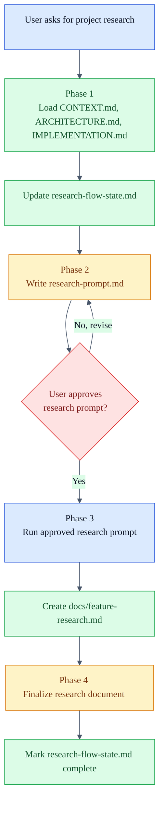
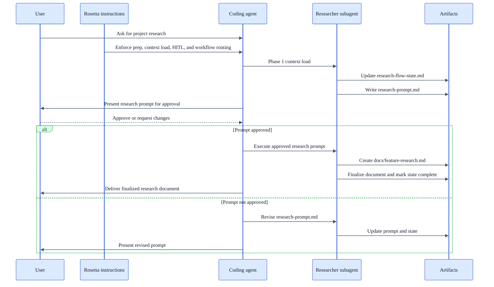

# Research Flow

<span class="badge-pro">PRO</span>

## Availability

Available in the Pro instructions repository. This workflow is not part of the OSS instruction set.

## TL;DR

Use Research Flow when you need grounded project research before making a technical decision. The workflow does four things in order. It loads project context, writes a focused research prompt, waits for you to approve that prompt, then runs the approved prompt and finalizes the research document. The prompt approval gate matters because it defines what the research will answer, what evidence it will seek, and what is out of scope.

## When To Use This Workflow

- Investigate architectural options tied to the current project.
- Compare implementation strategies before coding starts.
- Research standards, protocols, or platform choices in the context of your stack.
- Produce a documented answer with traceable references instead of a quick opinion.

## When Not To Use This Workflow

- Do not use it for implementation. Use [Coding Flow](/rosetta/docs/coding-flow/).
- Do not use it to author requirements from scratch. Use [Requirements Authoring Flow](/rosetta/docs/requirements-authoring-flow/).
- Do not use it for broad Rosetta capability questions. Use [Usage Guide](/rosetta/docs/usage-guide/) or Self Help.
- Do not use it when the answer is already known and you only need execution.

## Before You Start

- Prepare a clear research question or decision you need help with.
- Be ready to explain scope boundaries, non-goals, and what kind of answer you need.
- Point the agent at any existing project docs that already constrain the answer.
- Make sure shared Rosetta context is in good shape, especially `docs/CONTEXT.md` and `docs/ARCHITECTURE.md`. See [Usage Guide - Project Context Files](/rosetta/docs/usage-guide/#project-context-files).

## How To Start

```text
Research OAuth 2.0 implementation options for our stack and compare the tradeoffs.
```

```text
Investigate whether our order service should use event sourcing or stay CRUD based.
```

```text
Research authentication patterns for microservices in this project and recommend what fits our current architecture.
```

## How Rosetta Shapes This Workflow

- Rosetta forces context loading before research starts, so the answer is shaped by project context rather than generic advice.
- Rosetta requires an explicit approval gate on the research prompt before execution continues.
- Rosetta uses a dedicated researcher subagent for this workflow, which keeps research work isolated from coding work.
- Rosetta may ask for clarification when the request is too vague to research safely.
- Rosetta itself does not see your code or project data. It provides instructions that the coding agent follows inside your workspace.

## Workflow At A Glance

| Phase | What you provide | What agents do | What you get | Review gate |
|---|---|---|---|---|
| 1. Context load | Research request | Read `CONTEXT.md`, `ARCHITECTURE.md`, `IMPLEMENTATION.md`; load project context; update state | Loaded project context; updated `research-flow-state.md` | No |
| 2. Prompt craft | Research request plus project context | Write the optimized research prompt; save it to the feature plan folder; update state | `research-prompt.md` | Yes. You must approve the prompt before research runs |
| 3. Execute research | Approved `research-prompt.md` | Run the approved research pass in a dedicated researcher subagent; update state | `docs/feature-research.md` | No additional gate defined in the workflow |
| 4. Finalize | Completed research document | Finalize the research document; mark state complete | Finalized `docs/feature-research.md`; completed `research-flow-state.md` | No additional gate defined in the workflow |

## Workflow Overview



## Interaction Flow



## Phases

### Phase 1. Context load

**Goal**

Load the project context that should constrain the research.

**What you provide**

- The research request.

**What the agent does**

- Delegates to a researcher subagent.
- Reads all lines from `CONTEXT.md`, `ARCHITECTURE.md`, and `IMPLEMENTATION.md`.
- Loads project context before prompt writing starts.
- Updates `research-flow-state.md` in the feature temp folder.

**What you get**

- A grounded research starting point.
- State tracking for the workflow.

### Phase 2. Prompt craft

**Goal**

Turn the research request into an optimized prompt that is specific enough to drive useful research.

**What you provide**

- Clarifications if the original request is too vague.
- Approval or change requests for the draft research prompt.

**What the agent does**

- Uses the loaded project context and your request to write the research prompt.
- Saves the prompt as `research-prompt.md` in the feature plan folder.
- Updates `research-flow-state.md`.
- Stops for explicit approval before execution.

**What you get**

- A reviewable research prompt that defines scope, framing, and expected direction for the research pass.

**What to watch for**

- Missing scope boundaries.
- Generic framing that ignores project context.
- Research questions that are too broad to answer well.
- Missing non-goals, success criteria, or comparison dimensions.

### Phase 3. Execute research

**Goal**

Run the approved prompt as the basis for the research pass.

**What you provide**

- Approved `research-prompt.md`.

**What the agent does**

- Delegates research execution to a dedicated researcher subagent.
- Uses the approved prompt as the input.
- Produces `docs/feature-research.md`.
- Updates `research-flow-state.md`.

**What you get**

- The first complete research document for the feature.

### Phase 4. Finalize

**Goal**

Finish the research document and close the workflow state.

**What you provide**

- Completed research document.

**What the agent does**

- Finalizes `docs/feature-research.md`.
- Updates `research-flow-state.md` and marks the workflow complete.

**What you get**

- A finalized research document.
- A completed state file for traceability.

## How To Review Results

Review the research prompt before you approve it. That is the main control point in this workflow.

For `research-prompt.md`, verify:

- The question being answered is the question you actually care about.
- The scope is narrow enough to finish well.
- The prompt names the right project context and constraints.
- The prompt makes the needed comparison or investigation dimensions explicit.
- The prompt excludes known non-goals.
- The prompt will produce a useful artifact, not a generic essay.

For `docs/feature-research.md`, verify:

- The final answer follows the approved prompt.
- The reasoning stays within the approved scope.
- The output is useful for a real decision in your project.
- Gaps, tradeoffs, and limits are visible instead of hidden.
- Any recommended direction still fits your architecture and constraints.

If either artifact is wrong, respond with precise comments. Do not approve vague or misframed research prompts, because the rest of the workflow depends on that approved prompt.

## Workflow-Specific Customization

Research Flow improves sharply when you provide the evidence Rosetta needs to narrow the question.

- Keep `docs/CONTEXT.md` current so the workflow understands the business problem behind the research.
- Keep `docs/ARCHITECTURE.md` current so the workflow evaluates options against the real system shape.
- Keep `agents/IMPLEMENTATION.md` current so the workflow can see what already exists, what is partial, and what is blocked.
- Add links or references to existing internal standards, design docs, or prior decisions when they materially constrain the answer.
- For architecture research, name the decision you need to make and the options that must be compared.
- For standards or protocol research, name the stack, deployment model, security expectations, and interoperability constraints.

Shared Rosetta customization, IDE rules, and MCP guidance already live in [Usage Guide - Customization](/rosetta/docs/usage-guide/#customization). This page only covers what changes research quality for this workflow.

## Artifacts You Will Get

- `research-flow-state.md` in the feature temp folder
  - Tracks workflow progress from context load through finalization.
- `research-prompt.md` in the feature plan folder
  - The approved prompt for the research pass.
- `docs/feature-research.md`
  - The research result produced from the approved prompt and finalized in phase 4.

## Common Mistakes

- Starting with a vague request like "research auth" and approving a vague prompt.
- Using this workflow when the real need is implementation, requirements, or modernization.
- Skipping close review of `research-prompt.md`.
- Expecting the workflow to compensate for stale project context files.
- Treating the final document as automatically correct without checking whether it answered the approved question.

## Source Files

- [research-flow.md](https://github.com/griddynamics/cto-ims-kb/blob/main/instructions/r2/grid/workflows/research-flow.md)
