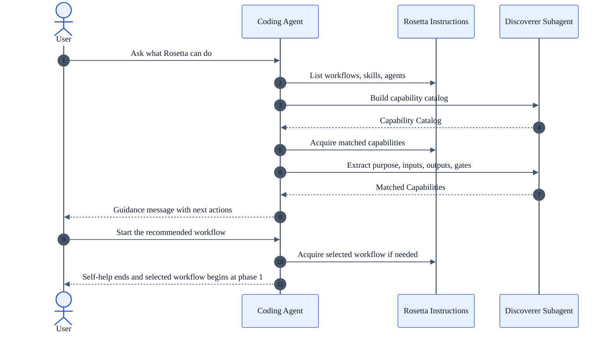

# Self Help Workflow

## Availability

Available in the core Rosetta workflow set. This page applies to OSS and Enterprise installations that include core workflows.

## TL;DR

Use `self-help-flow` when you need to understand what Rosetta can do before starting work.
It is for capability discovery, workflow selection, and usage guidance.
It produces a conversational guidance message, not files, plans, or persistent workflow state.
The main gates are the guide handoff point and your explicit decision to switch from help into execution.
If you only want to learn, the workflow stops after guidance.
If you want action, you must explicitly tell the coding agent to start the selected workflow.

## When To Use This Workflow

- You want a grounded answer to `what can Rosetta do here?`
- You need help choosing between workflows, skills, or subagents.
- You want a 101 explanation of how to use a specific Rosetta capability.
- You want to start with guidance and then switch into a real execution workflow in the same session.

## When Not To Use This Workflow

- Do not use it for implementation, testing, requirements writing, or research delivery. Start the matching execution workflow instead.
- Do not use it when you already know the workflow you need and want work to begin immediately. Ask for that workflow directly.
- Do not use it when you need persistent artifacts. This workflow is conversational and does not create files or state tracking.

## Before You Start

- Prepare a concrete question or target outcome such as `which workflow should I use to reverse-engineer this module?`
- If you may want a handoff, know what you want the next workflow to do.
- For shared setup, installation, and general Rosetta concepts, use the [Usage Guide](/rosetta/docs/usage-guide/), [Overview](/rosetta/docs/overview/), and [Developer Guide](/rosetta/docs/developer-guide/).

## How To Start

Example prompts:

- `What workflows are available in this workspace?`
- `How do I use the coding workflow to add a feature safely?`
- `I need to understand an existing module before refactoring it. Which workflow should I use?`
- `Use the workflow you just recommended and start from phase 1.`

## How Rosetta Shapes This Workflow

- You ask in plain language. The coding agent reads your request, loads Rosetta instructions, and uses this workflow to answer.
- Rosetta provides instructions only. It does not see your request, your code, or your project data. The coding agent sees those and acts on Rosetta guidance.
- The answer is grounded in live Rosetta capability listings and acquired instruction files, not only the model's built-in memory.
- Rosetta's progressive loading keeps this workflow narrow. The agent lists capabilities first, then loads only the matching workflow, skill, or agent definitions.
- Help can turn into action without restarting the session. If you explicitly ask to proceed, the coding agent adopts the selected workflow and `self-help-flow` stops.

## Workflow At A Glance

| Phase | What you provide | What agents do | Artifacts that appear | Review gate |
|---|---|---|---|---|
| List capabilities | Your question | List workflows, skills, and agents from Rosetta and build a capability catalog from frontmatter | Transient `Capability Catalog` | None |
| Match and acquire | Your question plus discovered catalog | Match your need to specific capabilities and acquire the selected instruction files | Transient `Matched Capabilities` set | None |
| Guide | Your question plus matched capabilities | Explain what matches, when to use it, what to expect, and how to invoke it | User-facing guidance message | You decide whether the answer is sufficient or whether you want a deeper drill-down |
| Handoff optional | Explicit request to act | Adopt the selected workflow and start that workflow from its phase 1 | Control transfers to the selected workflow | Explicit user request is required |

## Mermaid Flowchart

```mermaid
%%{init: {
  "theme": "base",
  "themeVariables": {
    "primaryColor": "#E8F1FF",
    "primaryBorderColor": "#1D4ED8",
    "primaryTextColor": "#0F172A",
    "secondaryColor": "#ECFDF5",
    "secondaryBorderColor": "#047857",
    "secondaryTextColor": "#0F172A",
    "tertiaryColor": "#FFF7ED",
    "tertiaryBorderColor": "#C2410C",
    "tertiaryTextColor": "#0F172A",
    "lineColor": "#475569",
    "textColor": "#0F172A",
    "fontFamily": "ui-sans-serif, Arial, sans-serif"
  }
}}%%
flowchart TD
    A["User asks a capability question"] --> B["Phase 1<br/>List capabilities"]
    B --> C["Capability Catalog"]
    C --> D["Phase 2<br/>Match and acquire"]
    D --> E["Matched capabilities"]
    E --> F["Phase 3<br/>Guide"]
    F --> G{"Need deeper help or action?"}
    G -->|No| H["Stop with guidance message"]
    G -->|Yes, explain more| I["Refine guidance in self-help"]
    G -->|Yes, start workflow| J["Phase 4<br/>Handoff"]
    J --> K["Selected workflow starts at phase 1"]

    classDef phase fill:#E8F1FF,stroke:#1D4ED8,color:#0F172A,stroke-width:2px;
    classDef artifact fill:#ECFDF5,stroke:#047857,color:#0F172A,stroke-width:2px;
    classDef gate fill:#FFF7ED,stroke:#C2410C,color:#0F172A,stroke-width:2px;

    class B,D,F,J phase;
    class C,E,H,I,K artifact;
    class G gate;

    linkStyle default stroke:#475569,stroke-width:2px,color:#0F172A;
```

## Mermaid Sequence Diagram



## Phases

### Phase 1. List capabilities

**Goal**

Build a live inventory of Rosetta capabilities available to the session.

**Required user input**

- A capability question or a request for guidance

**Agent actions**

- List `workflows` in Rosetta
- List `skills` in Rosetta, then list each skill folder
- List `agents` in Rosetta
- Build a `Capability Catalog` with name, type, and description from frontmatter

**Produced artifacts**

- Transient `Capability Catalog`
- No files are written

**Review and approval expectations**

- No approval gate here
- Watch for missing scope in your question. If you ask only `help me`, the catalog may be broad and less useful

### Phase 2. Match and acquire

**Goal**

Map your question to the most relevant Rosetta capabilities and load the exact instruction files behind them.

**Required user input**

- Your original question
- Any narrowing details that distinguish one workflow from another

**Agent actions**

- Match your request against the `Capability Catalog`
- Acquire each selected workflow, skill, or agent instruction
- Extract purpose, when to use it, what to expect, inputs, outputs, and HITL gates

**Produced artifacts**

- Transient `Matched Capabilities`
- No files are written

**Review and approval expectations**

- No formal gate
- Watch for wrong matches when your request mixes discovery and execution, for example `explain modernization and start it now`

### Phase 3. Guide

**Goal**

Turn the catalog and matched instructions into first-time-user guidance.

**Required user input**

- Your original question
- Follow-up clarification only if the first answer is still too broad

**Agent actions**

- Synthesize the catalog and matched capabilities into 101-level guidance
- Explain what each matched capability does, when to use it, what to expect, and how to invoke it
- Provide concrete next actions tied to your question
- Polish the final guidance before presenting it to the user

**Produced artifacts**

- Guidance message
- No files, plans, or state files

**Review and approval expectations**

- This is the first real review gate
- Review whether the answer names the right workflow, the right inputs, and the right next action
- If you want action, say so explicitly. Guidance alone does not start execution

### Phase 4. Handoff

**Goal**

Switch from explanation into the selected execution workflow without wrapping that workflow in more self-help steps.

**Required user input**

- An explicit request to proceed, such as `run that workflow` or `start coding-flow`

**Agent actions**

- Acquire the target workflow if it is not already loaded
- Adopt that workflow as the active flow
- Start the selected workflow from its own phase 1
- End `self-help-flow`

**Produced artifacts**

- No self-help artifacts beyond the prior guidance message
- Any new artifacts are created by the adopted workflow, not by `self-help-flow`

**Review and approval expectations**

- The handoff is the workflow-specific approval gate
- Approve only after checking that the selected workflow matches your real intent
- Common failure mode: approving a handoff to the wrong workflow because the original question mixed multiple goals

## How To Review Results

Check the guidance message before you approve a handoff.

- Confirm the recommended workflow matches your real job. `self-help-flow` is for discovery, not delivery.
- Confirm the message names the required inputs for the next workflow.
- Confirm the message describes the next workflow's artifacts and review gates, not just its title.
- If multiple workflows are listed, check that the tradeoff is explicit.
- Reject answers that are generic enough to fit any workflow.
- Reject answers that imply Rosetta itself reads your code or user request. The coding agent does that. Rosetta provides instructions.
- Before handoff, verify the phrase you use clearly asks to proceed. Ambiguous replies can keep the session in guidance mode.

## Workflow-Specific Customization

- Ask outcome-first questions. `Which workflow should I use to reverse-engineer a payment module before refactoring it?` works better than `what can you do?`
- State whether you want explanation only or explanation plus handoff.
- If you already know the candidate workflow, ask for comparison against one alternative. That keeps the guide compact and specific.
- Ask for invocation wording if you want reusable prompts for your team.
- Use this workflow to discover the right Rosetta workflow, then move immediately into that workflow instead of turning self-help into a long design discussion.

## Artifacts You Will Get

- A transient `Capability Catalog`
- A transient `Matched Capabilities` set
- A user-facing guidance message
- Optional control transfer into a selected workflow
- No files
- No plan state
- No persistent self-help report

## Common Mistakes

- Asking for execution and explanation in one vague prompt, then approving the wrong handoff
- Expecting files, plans, or specs from a workflow that is defined as conversational only
- Treating the guidance message as implementation approval for a later workflow
- Asking a generic capability question when you really need a workflow recommendation for one concrete job
- Forgetting that the selected workflow starts over at its own phase 1 after handoff

## Source Files

Authoritative workflow sources used for this page:

- [`instructions/r2/core/workflows/self-help-flow.md`](https://github.com/griddynamics/rosetta/blob/main/instructions/r2/core/workflows/self-help-flow.md)
- [`docs/web/docs/usage-guide.md`](https://github.com/griddynamics/rosetta/blob/main/docs/web/docs/usage-guide.md)
- [`docs/web/docs/overview.md`](https://github.com/griddynamics/rosetta/blob/main/docs/web/docs/overview.md)
- [`docs/web/docs/review.md`](https://github.com/griddynamics/rosetta/blob/main/docs/web/docs/review.md)
- [`docs/web/docs/developer-guide.md`](https://github.com/griddynamics/rosetta/blob/main/docs/web/docs/developer-guide.md)

This workflow is defined in a single workflow file. No separate phase files exist for `self-help-flow`.
