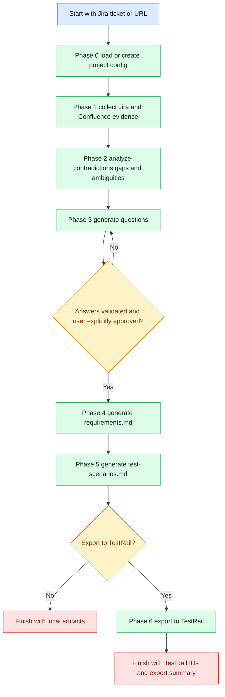
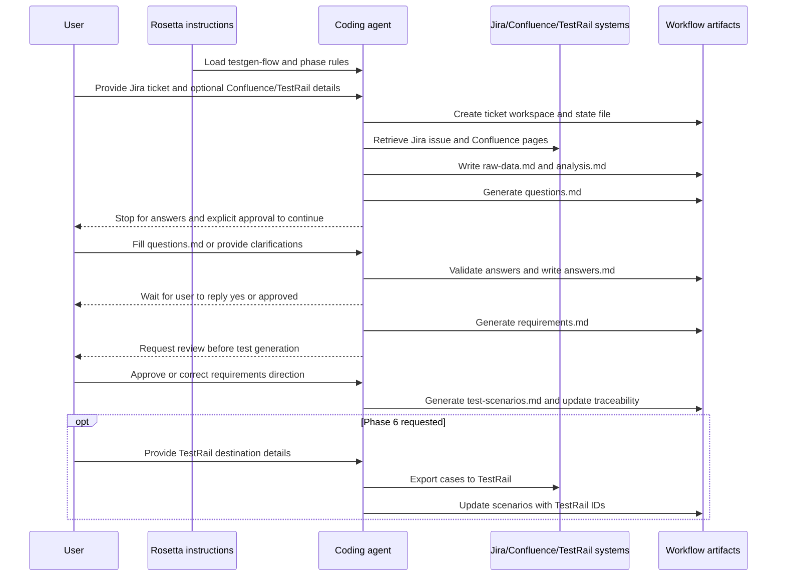

# Test Case Generation Flow

**Availability:** <span class="badge-pro">PRO</span>

## TL;DR

Use `testgen-flow` when a Jira ticket, epic, or story needs grounded requirements and structured QA scenarios before implementation or automation starts. The workflow runs sequentially: load project config, collect Jira and Confluence evidence, analyze contradictions and gaps, stop for human answers, generate a requirements document, generate TestRail-ready test cases, and optionally export them to TestRail.

Expect one phase at a time, a state file updated after each phase, and explicit confirmation before moving forward. For first-time use in a repo, Phase 0 creates `testgen-project-config.md`, asks the user to confirm or correct the default retrieval scheme, and saves that answer for future runs. The hard gate is Phase 3: the workflow does not continue to requirements generation until the user answers the generated clarification questions and then explicitly approves continuation.

## When To Use This Workflow

- Generate QA scenarios from a Jira ticket with traceability back to Jira and Confluence.
- Turn fragmented ticket and documentation inputs into a structured `requirements.md` before test design.
- Resolve contradictions, missing details, and ambiguities before automated QA work starts.
- Prepare TestRail-ready manual test cases or feed later automation work such as `aqa-flow`.
- Create a durable artifact set under `agents/testgen/{TICKET-KEY}/` for audit and reuse.

## When Not To Use This Workflow

- Do not use it for implementation. Use [Coding Flow](/rosetta/docs/coding-flow/) after requirements and test intent are clear.
- Do not use it for architecture reverse-engineering. Use [Code Analysis Flow](/rosetta/docs/code-analysis-flow/).
- Do not use it for broad technical investigation. Use [Research Flow](/rosetta/docs/research-flow/).
- Do not use it when you only need to improve requirements without producing test scenarios. Use [Requirements Authoring Flow](/rosetta/docs/requirements-authoring-flow/).

## Before You Start

Prepare the minimum inputs that materially affect output quality:

- A Jira ticket key or Jira ticket URL.
- Confluence page URLs if you already know the relevant pages. This lets the workflow skip weak auto-search results.
- Access to the Jira and Confluence retrieval path used in your project.
- If you want Phase 6, access to TestRail and the ability to provide or create the target section and share its `section_id`. Project and suite details may also be needed when your setup cannot detect them from the current ticket and user profile.
- Time to review every phase result, especially `questions.md`, `requirements.md`, and `test-scenarios.md`.

Workflow-specific preparation that improves results:

- Maintain a project-level `testgen-project-config.md` in the agent-specific directory so the workflow knows your expected retrieval process and any mandatory reference sources.
- If that config does not exist yet, expect Phase 0 to create it, ask a first-time setup question about whether the default Jira-plus-Confluence retrieval scheme is correct, and store your YES or NO answer plus any retrieval details for future runs.
- Point the agent to critical supporting material such as domain glossaries, compliance rules, API contracts, DDL, and configuration files when Jira and Confluence alone are incomplete.
- If your project relies on custom source systems beyond default Jira and Confluence retrieval, define that explicitly in the project config instead of expecting the agent to infer it.

For shared Rosetta setup and project-context customization, see [Usage Guide](/rosetta/docs/usage-guide/).

## How To Start

Example prompts that match the workflow:

```text
Generate test cases for PROJ-123
```

```text
Analyze requirements for PROJ-123 with Confluence pages:
- https://confluence.company.com/display/PROJ/Job+Post
- https://confluence.company.com/pages/viewpage.action?pageId=123456
```

```text
Analyze requirements for https://jira.company.com/browse/PROJ-123 and export the final test cases to TestRail
```

```text
Generate test scenarios for PROJ-123. Use these Confluence pages and our existing test generation config.
```

## How Rosetta Shapes This Workflow

Rosetta does not generate all deliverables in one pass. It loads the workflow, executes one phase at a time, updates a state file after each phase, and expects explicit confirmation before moving forward. That changes the UX in four important ways:

- The agent should surface missing information instead of guessing through contradictions or incomplete requirements.
- The workflow stops at the question-and-answer gate until the user fills `questions.md`, the answers are validated, and the workflow receives explicit confirmation to continue.
- Intermediate artifacts are part of the workflow, not optional debug files. They are how the next phase stays grounded.
- Review is part of execution. The user is expected to inspect phase outputs and provide corrections before the workflow advances.

Rosetta itself provides instructions and routing. The coding agent performs the retrieval, analysis, document generation, and optional export work.

## Workflow At A Glance

| Phase | What you provide | What agents do | What you get | Review gate |
|---|---|---|---|---|
| 0. Project Config Loading | Jira ticket key or URL, project retrieval expectations if no config exists | Parse ticket, create ticket workspace, load or create project config, ask the first-time retrieval setup question when the config is missing, record initial state | `testgen-state.md`, `initial-data.md`, project-level `testgen-project-config.md` if missing | Confirm setup before Phase 1 |
| 1. Data Collection | Jira input, optional Confluence URLs, extra page IDs if search fails | Retrieve Jira fields, comments, Confluence pages, and child pages; capture raw evidence | `raw-data.md` | Confirm collected sources before Phase 2 |
| 2. Gap and Contradiction Analysis | No new input unless source retrieval was incomplete | Identify contradictions, gaps, ambiguities, cross-source conflicts, and risk | `analysis.md` | Confirm findings before Phase 3 |
| 3. Question Generation and User Input | Answers to clarification questions and explicit approval to continue | Generate prioritized questions, wait, validate answers, structure them | `questions.md`, `answers.md` | Hard HITL gate. Must answer, then explicitly approve Phase 4 |
| 4. Requirements Document Generation | Validated answers and any final clarifications | Synthesize evidence into user stories, FRs, NFRs, constraints, dependencies, assumptions, and traceability | `requirements.md` | Review requirements before Phase 5 |
| 5. Test Case Generation | Approved or reviewed requirements direction | Generate prioritized TestRail-ready test cases, merge redundant scenarios, update traceability | `test-scenarios.md`, updated traceability in `requirements.md` | Review scenarios before Phase 6 or before closing |
| 6. Test Case Export | TestRail access plus target `section_id`; project and suite details when your setup cannot detect them from the current ticket and user profile | Verify connection, map cases, export to TestRail, record export IDs | Updated `test-scenarios.md`, updated `testgen-state.md` | Confirm export destination and review export results |

## Mermaid Flowchart



## Mermaid Sequence Diagram



## Phases

### Phase 0: Project Config Loading

Goal:
- Initialize the ticket workspace and make the retrieval process explicit before data collection starts.

What you provide:
- Jira ticket key or Jira URL.
- If no project config exists, the project-specific data retrieval process and any mandatory supporting links.

What the agent does:
- Parses the Jira input.
- Creates `agents/testgen/{TICKET-KEY}/`.
- Finds or creates the project-level `testgen-project-config.md`.
- If the config is missing, asks whether the default Jira-plus-Confluence retrieval scheme is accurate, waits for a YES or NO answer, and records any project-specific retrieval details the user provides.
- Writes `initial-data.md` and initializes `testgen-state.md`.

What you get:
- A dedicated ticket workspace.
- A reusable project config reference for future test generation runs.
- An initialized state file that tracks phase completion.

What to watch for:
- The project config should capture how your team retrieves required information, not just the default Jira-plus-Confluence path.
- If the project depends on extra sources, this is the phase to say so.
- On a first run, make sure the created config captures the user's answer instead of leaving the default retrieval scheme implicit.

### Phase 1: Data Collection

Goal:
- Gather the raw evidence set used by every later phase.

What you provide:
- Optional Confluence URLs if you know the right pages.
- Additional page IDs or permission workarounds if search fails.

What the agent does:
- Retrieves Jira summary, description, status, priority, labels, components, comments, and available custom fields.
- Uses provided Confluence URLs directly when available.
- Otherwise searches Confluence using ticket-derived terms.
- Checks parent pages for child pages so nested documentation is not missed.
- Writes all collected evidence to `raw-data.md`.

What you get:
- A single source file with Jira fields, Confluence content, metadata, and collection notes.

What to watch for:
- Confirm the right Confluence pages were used.
- Confirm missing pages, hidden child pages, or inaccessible sources are called out explicitly.
- If Jira-only analysis would be unsafe, do not approve moving forward without better sources.

### Phase 2: Gap and Contradiction Analysis

Goal:
- Identify what is inconsistent, missing, vague, or risky before requirements are drafted.

What you provide:
- Usually no new input unless a missing source must be added.

What the agent does:
- Reads `raw-data.md` end to end.
- Documents contradictions with source quotes and impact.
- Documents gaps by type: functional, non-functional, data, business logic, and dependency.
- Documents ambiguities and possible interpretations.
- Produces a cross-reference comparison between Jira and Confluence.
- Writes `analysis.md` and updates risk and metrics in the state file.

What you get:
- A defect list that drives the clarification phase instead of forcing the agent to guess.

What to watch for:
- Issues must point to actual evidence.
- High-risk blockers should be visible and easy to trace.
- “No issues found” is acceptable only if the sources truly support that conclusion.

### Phase 3: Question Generation and User Input

Goal:
- Convert analysis findings into a controlled clarification pass and stop until human answers are available.

What you provide:
- Answers to the generated questions.
- Explicit approval to continue after answers are validated. The approval must be an explicit `yes` or `approved`.

What the agent does:
- Turns contradictions, gaps, and ambiguities into prioritized questions.
- Groups them by severity.
- Writes `questions.md` with clear answer slots and completion instructions.
- Waits for the user to fill or answer them.
- Validates that critical questions are answered.
- Writes structured responses to `answers.md`.
- Waits for an explicit continuation approval after validation instead of treating comments or suggestions as approval.

What you get:
- A documented clarification package with answered questions and any remaining unknowns.

What to watch for:
- This is the hard HITL gate. The workflow is not supposed to continue without human answers.
- Critical questions must not be left blank.
- If the user marks items `UNKNOWN`, the workflow should carry them forward as assumptions, not silently resolve them.
- Follow-up questions, suggestions, or review comments are not approval by themselves.

### Phase 4: Requirements Document Generation

Goal:
- Synthesize retrieved evidence and clarified answers into a structured requirements baseline.

What you provide:
- Final clarifications if answers still need adjustment.
- Review feedback on the generated requirements.

What the agent does:
- Reads `raw-data.md`, `analysis.md`, and `answers.md`.
- Applies the documented priority order: user answers first, Jira second, Confluence third, analysis findings fourth.
- Generates user stories, functional requirements, non-functional requirements, constraints, dependencies, assumptions, risks, glossary, and a traceability matrix.
- Writes `requirements.md`.

What you get:
- A requirements document that later implementation, QA, and review work can reuse.

What to watch for:
- Requirements should reflect resolved answers, not reintroduce old contradictions.
- Unresolved items must be marked as assumptions.
- The traceability matrix should point back to actual sources.

### Phase 5: Test Case Generation

Goal:
- Turn approved or reviewed requirements into structured, prioritized test cases.

What you provide:
- Review guidance if the requirements direction changed.

What the agent does:
- Reads `requirements.md`.
- Derives scenario types: happy path, edge, negative, integration, performance, and security.
- Generates TestRail-compatible cases with preconditions, numbered steps, expected results, test data, and traceability.
- Merges redundant cases into parameterized scenarios where steps are materially the same.
- Updates the requirements traceability matrix with test scenario IDs.
- Writes `test-scenarios.md`.

What you get:
- A test scenario pack ready for review, manual execution planning, or export.

What to watch for:
- Cases should cover all requirements, not only happy paths.
- Parameterization should reduce repetition without hiding materially different expectations.
- The format should match the workflow’s TestRail-oriented structure, not generic BDD prose.

### Phase 6: Test Case Export

Goal:
- Export approved test cases into TestRail and record the mapping back to the generated artifacts.

What you provide:
- Target TestRail `section_id`, because the workflow requires the user to supply or create the destination section.
- Project or suite details when your setup cannot detect them from the current ticket and user profile.
- Manual section creation if the environment does not support section creation through the available path.

What the agent does:
- Verifies TestRail connectivity.
- Parses `test-scenarios.md`.
- Maps priorities, types, preconditions, steps, expected results, and references into TestRail fields.
- Exports cases, continues past individual case failures, and records results.
- Updates `test-scenarios.md` with TestRail IDs and export summary.
- Updates `testgen-state.md` with export metrics and links.

What you get:
- Exported test cases in TestRail plus updated local artifacts showing what was created.

What to watch for:
- Confirm the destination section is correct before export.
- Do not assume the workflow can create the TestRail section for you; supplying `section_id` is part of the prerequisite.
- Review failed exports individually instead of assuming the entire export succeeded.
- Re-running export can create duplicates; that behavior should be understood before repeating the phase.

## How To Review Results

Review duties by stage:

- After Phase 0, verify the project config reflects your real retrieval process and supporting sources.
- After a first-run Phase 0, verify the new `testgen-project-config.md` was actually created and that it captures your YES or NO retrieval answer plus any extra sources.
- After Phase 1, verify the right Jira ticket, Confluence pages, and child pages were captured.
- After Phase 2, check that contradictions, gaps, and ambiguities are evidence-based and not invented.
- After Phase 3, answer every critical question, mark unresolved items explicitly instead of leaving blanks, and then reply with explicit approval such as `yes` or `approved` when you want Phase 4 to start.
- After Phase 4, review `requirements.md` for scope, user roles, acceptance criteria, NFR thresholds, constraints, assumptions, and traceability.
- After Phase 5, review `test-scenarios.md` for requirement coverage, priority, missing negative cases, and over-merged parameterized scenarios.
- After Phase 6, review the export summary and spot-check TestRail cases for field mapping errors.

If review is skipped, the most common failure mode is that later artifacts look polished but encode the wrong behavior. This workflow depends on human correction at the clarification and review gates.

## Workflow-Specific Customization

The highest-value customizations for `testgen-flow` are specific to evidence retrieval and test design quality:

- Define the project retrieval scheme in `testgen-project-config.md` so the workflow knows whether Jira and Confluence are sufficient or whether other project sources are mandatory.
- Document where domain-specific rules live: API docs, architecture decisions, DDL, validation rules, compliance constraints, and environment configuration. These often affect NFRs and edge cases more than Jira text does.
- If Jira fields or Confluence structure are heavily customized in your organization, document that so the agent knows what custom fields, labels, page patterns, or child-page hierarchies to expect.
- If your team exports to TestRail routinely, standardize project, suite, section, priority, and type mappings so Phase 6 does not depend on fresh user interpretation every run.
- If later automation will consume the scenarios, align titles, traceability IDs, and scenario granularity with the needs of your QA automation flow rather than only manual execution readability.

## Artifacts You Will Get

Common ticket-level artifacts under `agents/testgen/{TICKET-KEY}/`:

- `testgen-state.md` for phase status, metrics, and progress evidence.
- `initial-data.md` for the starting prompt and linked project config reference.
- `raw-data.md` for Jira and Confluence evidence.
- `analysis.md` for contradictions, gaps, ambiguities, and risk.
- `questions.md` for the clarification batch sent to the user.
- `answers.md` for validated responses and unresolved items.
- `requirements.md` for stories, requirements, constraints, assumptions, and traceability.
- `test-scenarios.md` for prioritized TestRail-compatible cases and, after export, TestRail IDs.

Common project-level artifact:

- `testgen-project-config.md` in the repo’s agent-specific directory if the workflow had to create or update project retrieval instructions.

## Common Mistakes

- Starting with only a Jira key when the real requirements live in linked Confluence child pages.
- Letting the workflow auto-search Confluence when you already know the exact pages and could have removed ambiguity up front.
- Treating Phase 3 as optional. It is the workflow’s main guard against hallucinated requirements.
- Approving `requirements.md` without checking assumptions, NFR thresholds, or source traceability.
- Accepting merged parameterized tests that actually hide different expected results or security boundaries.
- Exporting to the wrong TestRail section or re-running export without understanding duplicate creation behavior.

## Source Files

Authoritative workflow sources:

- [testgen-flow.md](https://github.com/griddynamics/cto-ims-kb/blob/main/instructions/r2/grid/workflows/testgen-flow.md)
- [testgen-flow-project-config-loading.md](https://github.com/griddynamics/cto-ims-kb/blob/main/instructions/r2/grid/workflows/testgen-flow-project-config-loading.md)
- [testgen-flow-data-collection.md](https://github.com/griddynamics/cto-ims-kb/blob/main/instructions/r2/grid/workflows/testgen-flow-data-collection.md)
- [testgen-flow-gap-and-contradiction-analysis.md](https://github.com/griddynamics/cto-ims-kb/blob/main/instructions/r2/grid/workflows/testgen-flow-gap-and-contradiction-analysis.md)
- [testgen-flow-question-generation.md](https://github.com/griddynamics/cto-ims-kb/blob/main/instructions/r2/grid/workflows/testgen-flow-question-generation.md)
- [testgen-flow-requirements-document-generation.md](https://github.com/griddynamics/cto-ims-kb/blob/main/instructions/r2/grid/workflows/testgen-flow-requirements-document-generation.md)
- [testgen-flow-test-case-generation.md](https://github.com/griddynamics/cto-ims-kb/blob/main/instructions/r2/grid/workflows/testgen-flow-test-case-generation.md)
- [testgen-flow-test-case-export.md](https://github.com/griddynamics/cto-ims-kb/blob/main/instructions/r2/grid/workflows/testgen-flow-test-case-export.md)
