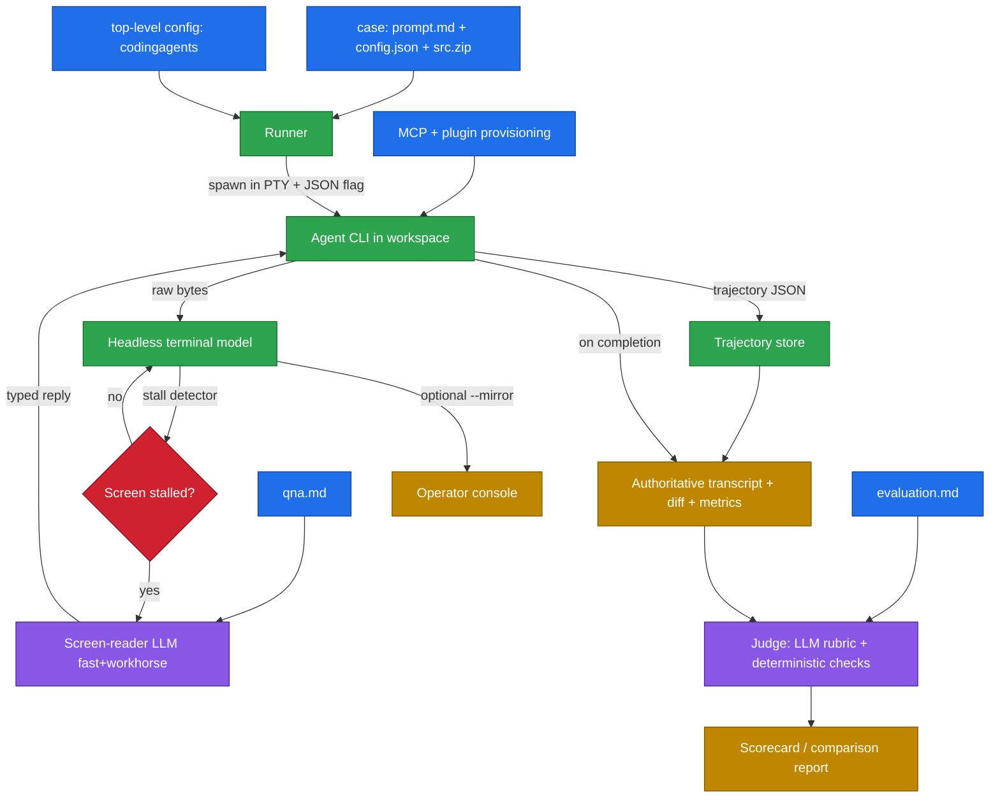

# Coding-Agent Bench — Idea / Concept

> An evals and testing harness that drives interactive coding-agent CLIs (Claude Code, Codex, and peers) through a predefined prompt over a real pseudo-terminal, consumes each CLI's native trajectory JSON as the source of truth, auto-answers interactive prompts via an LLM only when the terminal stalls, then scores each run with an LLM judge plus deterministic checks. Built for CI/CD first, local authoring second.

**Status:** Draft (ideation) — pending user review. No requirements, specs, or code yet.

---

## Problem & Motivation

Coding agents are interactive terminal UIs (TUIs) with non-deterministic behavior, mid-run confirmation prompts, and varied output formats. There is no easy, apples-to-apples way to:

- Feed the **same task** to multiple agents and compare results.
- Get past **interactive prompts** ("Allow edit? (y/n)", "Pick a model", trust dialogs) without a human babysitting each run.
- Produce a **repeatable, scored verdict** (did it actually solve the task?) rather than a vibe check.

This harness automates that loop: one prompt in, N agents driven to completion, one comparable scorecard out.

## Primary Use Cases

- **CI/CD pipelines (primary):** run unattended in a pipeline to benchmark/regress agents on a case suite and gate on verdicts. No human watching; no terminal mirroring; machine-readable output.
- **Regression-testing our own Rosetta harness (primary driver):** provision the Rosetta plugin into an agent, run the case suite, and verify our skills/workflows still behave — the reason this tool exists.
- **Benchmarking coding agents:** compare agents (and with/without a given plugin or MCP set) on identical cases.
- **Local authoring/verification (secondary):** a human runs it while creating cases, tuning `qna.md`, or verifying a fix — with optional live terminal mirroring turned on.

## Goals

- Drive any predefined coding-agent CLI to completion from a **single prompt file**, unattended, in a headless CI environment.
- **Simulate a real user** at a real terminal (PTY), including typing the prompt and answering interactive sub-prompts.
- **Prefer native trajectory JSON** (tool calls, messages, interactions) emitted by each CLI as the authoritative record — fall back to screen-reading only when needed.
- **Auto-answer** interactive prompts using an LLM that reads the rendered screen, but only **after deterministic stall detection** flags that the agent is waiting; guided by a predefined Q&A policy file.
- **Two-tier models:** a fast/cheap model for high-frequency checks, a workhorse model for hard reasoning and judging.
- **Optionally mirror** (behind a `--mirror` flag, off by default) each agent's stdout/stderr live for local debugging.
- **Judge** each completed run with an LLM rubric **and** deterministic checks, then emit a comparable scorecard.

## Non-Goals (v1)

- Not a hosted service or dashboard — a runnable CLI suitable for local use and CI/CD jobs.
- Not pure headless-API integration — we drive the **real interactive TUI** over a PTY; we additionally *consume* each CLI's trajectory-JSON output flag, but do not replace the interactive run with a non-interactive `-p`/`exec` mode (deferred future option).
- Not full multi-pane/multi-terminal orchestration (see Weak Spots) — best-effort single primary PTY per agent in v1.

---

## Core Concept — The Run Loop

For each `(agent, task)` pair:

1. **Discover & validate** the case folder; **unzip `src.zip`** (or start from an empty workspace if absent) into an isolated workspace.
2. **Provision** declared **MCP servers and coding-agent plugins** into the agent's environment (e.g. install the Rosetta plugin) before launch.
3. **Spawn** the agent CLI inside a **PTY** in that workspace, with its **trajectory-JSON output** flag enabled (per-agent config).
4. **Wait for readiness** — detect the agent's input-ready state from the rendered screen.
5. **Submit the prompt** — type the contents of `prompt.md` as a human would (with realistic key/enter sequencing).
6. **Watch & react loop (deterministic-first):**
   - Render PTY output into a clean text screen snapshot; tail the trajectory-JSON stream if the CLI writes it incrementally.
   - **Deterministic stall detector:** track whether the screen/JSON is still changing. While it updates, do nothing but optionally mirror output.
   - **On stall** (no change for a configured quiet window), escalate: the **fast model** classifies "is this waiting for input, finished, or just thinking?"; if it's an input prompt, the **workhorse model** decides the reply from the screen + `qna.md` policy, then we type it.
   - Detect **completion** (trajectory marks done / idle prompt returned / sentinel / exit).
7. **Collect** the **trajectory JSON** (authoritative transcript), final workspace diff, exit code, and runtime metrics; screen capture kept only as fallback evidence.
8. **Judge** the result (LLM judge over `evaluation.md` + deterministic checks) → verdict + score.
9. **Record** to a results store and render a comparison report.



---

## Inputs & Configuration

Two layers: **auto-discovered case folders** (per task, markdown-first) and a **top-level JSON config** (global).

### Auto-discovery (`--source <folder>`)

- `--source` points to a root folder. **Each immediate subfolder is one evaluation case.**
- A subfolder is a **valid, runnable case** only when the required files are present; otherwise it is **skipped with a logged reason**.
- **Required per case:** `prompt.md`, `config.json`, `qna.md`, `evaluation.md`. **Optional:** `src.zip`.
  - *Open question:* you said "4 files" then listed 5 — I'm treating the four `.md`/`.json` as **required** and `src.zip` as **optional** (no zip → empty workspace). Confirm.

Per-case files:

- **`prompt.md`** — the task prompt submitted to the agent (markdown).
- **`config.json`** — case-level config: which agents to run / per-case overrides, timeouts, and any **per-case MCP/plugin provisioning** (below).
- **`qna.md`** — Q&A policy (markdown): how interactive prompts are answered — e.g. "approve file edits", "never approve deletes", plus a hard "if unsure, abort" fallback.
- **`evaluation.md`** — evaluation criteria (markdown) for the LLM judge **and** the deterministic checks to run (build/test/lint, files that must exist, forbidden changes).
- **`src.zip`** — source archive unzipped into the isolated workspace before the agent starts (optional).

### Top-level config (JSON)

A single JSON file. Sections:

- **`codingagents`** — agent profiles, the heart of the system (see below).
- **(reserved)** — all other top-level keys reserved for future use (global defaults, reporting, provisioning defaults, etc.).

### `codingagents` — Agent Profiles (the heart of the system)

Each profile is the single source of truth for one agent's invocation, file/token conventions, and **interaction strategy**. The harness reads the profile and adapts; no per-agent code branching. A profile declares:

- **Invocation:** `command`, `args`, `env`, `cwd`, and the flag/path that enables **trajectory-JSON output**.
- **File formats:** where the trajectory JSON is written, its dialect, and which **adapter** normalizes it to the internal schema; location of any session/log files.
- **Special tokens:** readiness banner, prompt-submit key sequence (enter vs paste-mode), completion sentinel/markers, known interactive-prompt patterns.
- **Interaction strategy** (the fork) — an enum per agent:
  - `json-only` — agent emits a complete trajectory JSON; AI is used **only to interpret JSON / decide replies from it**, never to read the raw screen.
  - `screen-reader` — agent lacks rich JSON; AI **reads the rendered screen** to detect and answer prompts.
  - `hybrid` — JSON is authoritative for understanding/judging, screen-reader is the fallback for driving interactive prompts.
- **Tuning overrides:** stall-detection quiet window, model-tier choices, and a Q&A-policy reference.

### MCP & Plugin Provisioning (before the agent starts)

- The top-level config and/or a case's `config.json` may declare **JSON specs for MCP servers and coding-agent plugins** to install/register **before** the agent launches.
- **Plugin** here = a *coding-agent* plugin (Claude plugin, Copilot plugin, etc.) bundling skills / subagents / prompts / workflows / rules / hooks / MCPs — **not** an IDE extension.
- This is the hook that lets us **install the Rosetta plugin (or any MCP set), then run cases against it** — directly powering both "regression-test our own Rosetta harness" and "benchmark agents with/without a given plugin."
- *Open question:* precedence when both levels define provisioning — proposed default is **top-level = defaults, per-case adds/overrides**.

Illustrative shapes (not final):

```jsonc
// top-level config: <name>.json
{
  "codingagents": {
    "claude-code": {
      "command": "claude",
      "args": ["--output-format", "stream-json", "--verbose"],
      "trajectory": { "mode": "stdout-json", "adapter": "claude-code" },
      "strategy": "json-only",
      "tokens": { "ready": "│ >", "submit": "enter", "complete": "trajectory.done" },
      "stall": { "quietMs": 4000 }
    },
    "some-tui-agent": {
      "command": "some-agent",
      "args": ["chat"],
      "trajectory": { "mode": "none" },
      "strategy": "screen-reader",
      "tokens": { "ready": "Ready", "submit": "paste+enter" },
      "stall": { "quietMs": 6000 },
      "models": { "fast": "gpt-fast", "workhorse": "claude-workhorse" }
    }
  }
  // other top-level sections reserved for future use
}
```

```jsonc
// per-case config.json
{
  "agents": ["claude-code"],
  "timeoutSec": 1800,
  "provision": {
    "mcps":    [ { "name": "fs", "command": "mcp-fs", "args": ["--root", "."] } ],
    "plugins": [ { "type": "claude", "source": "git+https://…/rosetta-plugin" } ]
  }
}
```

## Interaction Engine (the hard part)

- **PTY, not pipes.** TUIs use raw terminal mode; plain redirected stdin/stdout/stderr won't drive them. Use a real pseudo-terminal so the agent behaves as if a human is present.
- **Trajectory JSON first, but per-agent.** Each CLI's native trajectory output (tool calls, messages, interactions) is the **authoritative record** when available — deterministic, structured, far cheaper than the screen. Whether AI reads the screen at all is set by the agent profile's `strategy` (`json-only` / `screen-reader` / `hybrid`), so JSON-capable agents avoid screen-reading entirely while weaker CLIs degrade gracefully to it.
- **Render, don't grep raw ANSI.** Feed PTY bytes into a **headless terminal emulator** that maintains the current screen grid, so the fallback LLM reads a clean snapshot rather than a raw escape-code stream.
- **Deterministic stall detection gates AI.** A cheap loop watches whether the rendered screen / JSON stream is still changing. AI is invoked **only on stall**, which keeps CI cost and latency bounded.
- **Optional live mirroring.** Behind `--mirror` (off by default), stream raw stdout/stderr to the operator console for local debugging.
- **Human-like input.** Type prompt text and replies through the PTY with appropriate enter/submit sequencing (some TUIs need paste-mode or specific key timing).

## Model Tiers (fast + workhorse)

- **Fast model:** high-frequency, low-stakes calls — "is this stall an input prompt, completion, or still thinking?", quick prompt classification. Optimizes cost/latency in the hot loop.
- **Workhorse model:** low-frequency, high-stakes calls — deciding the exact reply to a non-trivial interactive prompt, and the final rubric judging.
- Both tiers are **configurable per role** (provider + model) so CI can dial cost vs. rigor.

## Readiness & Prompt Detection

- **Readiness:** per-agent configurable signal — a stable rendered prompt string, a quiet period after spawn, or a known banner.
- **Needs-input detection:** deterministic stall detector fires → fast model classifies the screen → if it's a question/affirmation, workhorse model decides the reply from snapshot + Q&A policy → type it. Cheap regex heuristics on common prompt shapes short-circuit before any LLM call.
- **Completion detection:** trajectory JSON marks the turn complete, idle return to base prompt, an agreed sentinel, or process exit.

## Judging

- **Deterministic checks (objective gate):** run configured build/test/lint commands in the resulting workspace; assert exit codes, file existence, and diff properties. Fast, trustworthy, cheap.
- **LLM judge (semantic):** the **workhorse model** scores the **trajectory JSON** + final diff against the rubric (correctness, completeness, scope discipline, side-effects) — structured trajectory makes judging more reliable than transcript scraping.
- **Verdict:** combine — e.g. deterministic checks must pass as a hard gate; LLM judge produces the graded score and rationale. Both are recorded.

## Results & Reporting

Per run: agent, task, verdict, score, rationale, wall-clock time, turn count, interactive-prompts answered, and (where parseable) token/cost. Aggregate into a side-by-side comparison across agents for the same task.

## Tech Stack (chosen: Node / TypeScript)

- **PTY:** `node-pty`.
- **Screen model:** a headless terminal emulator (e.g. `@xterm/headless`) to render the PTY stream into a screen snapshot; `strip-ansi` for fallbacks.
- **Trajectory parsing:** per-agent adapters that normalize each CLI's JSON output into one internal trajectory schema.
- **LLM:** Anthropic / OpenAI SDKs for the screen-reader (fast + workhorse) and judge roles (provider + model configurable per role/tier).
- **Config & validation:** JSON config (top-level + per-case) and markdown inputs; `zod` schemas; an unzip lib for `src.zip`; per-case auto-discovery.
- **Deterministic checks:** `execa` to run build/test/lint.
- **Workspace isolation:** git worktree or temp clone per run.

## Architecture Quality (explicit NFRs)

The architecture must be deliberately designed, not emergent:

- **Maintainability:** clear module boundaries — `runner`, `pty/terminal`, `stall-detector`, `agent-adapters` (per-CLI), `screen-reader`, `judge`, `reporting`, `config`. Per-agent quirks live behind a stable adapter interface so adding an agent is additive, not invasive.
- **Fast execution:** deterministic-first hot loop; LLM calls only on stall; fast/workhorse tiering; parallelizable runs; trajectory JSON over screen scraping wherever possible.
- **Reuse over rebuild:** lean on proven packages (`node-pty`, `@xterm/headless`, `execa`, `zod`, vendor SDKs) rather than hand-rolling PTY/terminal/CLI plumbing.
- **CI-friendliness:** machine-readable output, non-zero exit on failure gates, no TTY assumptions when unattended, bounded cost/time budgets.

## Risks & Weak Spots (called out, not hidden)

- **Long scrollback buffers (user-flagged):** thousands of lines exceed a single screen and inflate LLM cost. *Mitigations:* read the rendered **visible screen** (bounded grid) rather than full history; summarize/tail intelligently; only escalate to scrollback when the visible screen is insufficient.
- **Multi-terminal / multi-pane agents (user-flagged):** agents that spawn sub-shells, split panes, or background processes aren't fully captured by one primary PTY. *v1 scope:* single primary PTY + mirror; capture child stdout best-effort; flag unsupported topologies rather than silently mis-driving them.
- **Screen-reader misjudgment:** the LLM answers a prompt wrong (e.g. approves a destructive action). *Mitigations:* Q&A policy hard-denies dangerous replies; sandboxed/isolated workspace; "if unsure, abort" fallback; full audit log of every typed reply.
- **Non-determinism:** agents vary run-to-run. *Mitigation:* multiple runs per task, report distribution not a single score.
- **Brittle prompt detection:** TUI redesigns break patterns. *Mitigation:* config-driven signals + LLM fallback; treat detection rules as data, not code.
- **Cost/latency:** LLM calls per prompt + judging. *Mitigation:* heuristic gating before LLM calls; configurable judge model tiers.

## Assumptions

- Deliverable this round is **idea.md only**; requirements/architecture/build are later, separately approved rounds.
- v1 drives the **real interactive TUI** via PTY, while consuming each CLI's **trajectory-JSON output** as the authoritative record (full headless `-p`/`exec` modes deferred).
- Agents that expose a usable trajectory-JSON mode run `json-only`/`hybrid`; those that don't fall back to `screen-reader` — the **agent profile decides**, so no CLI is excluded (JSON completeness still **verified per agent** during a feasibility spike).
- Each agent CLI is locally installed and authenticated before a run; the harness does not manage auth.
- Runs execute in **isolated, non-production** workspaces (low blast radius by design), primarily inside CI/CD jobs.

## Open Questions (next HITL round)

1. **Which agents in v1?** (Claude Code + Codex only, or also Aider / Gemini CLI / Cursor-agent / others?)
2. **Run topology:** all agents in parallel vs sequential? One workspace per agent, always isolated?
3. **Fixture/task source:** synthetic toy repos, real repo snapshots, or both? Where do tasks live?
4. **Determinism policy:** how many repeats per task, and how is a flaky verdict reported?
5. **Cost ceiling:** budget caps per run / per suite, and which LLM tiers for screen-reader vs judge?
6. **Multi-terminal support:** is best-effort single-PTY acceptable for v1, or is multi-pane capture required up front?
7. **Output format:** JSON results + Markdown report enough, or is a richer dashboard wanted later?
8. **Trajectory schema:** does each target CLI's JSON output carry enough to judge on (tool calls, file edits, final answer), and what's the normalized internal schema?
9. **CI integration shape:** GitHub Actions / GitLab CI first? How are secrets/agent auth provided in the pipeline?

---

## Project Name (candidates — pending selection)

Working title is "Coding-Agent Bench". Goal: a **unique, non-generic** name with allegorical/mythical meaning for *putting agents to the test and weighing the result*. Shortlist (etymology → why it fits):

**Touchstone / proving theme** (a stone that tests the purity of gold — the benchmarking metaphor):
- **Basanio** / **Basanos** — Greek *básanos*, the touchstone used to assay gold; also "trial/ordeal." The strongest fit.
- **Kasoti** — Hindi *kasauti*, touchstone/test.

**Judgment / discernment theme:**
- **Krisio** — Greek *krísis*, the act of judging/deciding (root of "crisis"/"critic").
- **Elencho** — Greek *élenchos*, Socratic cross-examination that refutes and tests a claim. Apt for a harness that interrogates agents.
- **Dokimo** / **Dokimio** — Greek *dokimḗ*, proving/testing that yields *dokimos*, "approved after trial."

**Weighing / scales-of-truth theme:**
- **Mizan** / **Mizanio** — Arabic *mīzān*, the scale on which deeds are weighed; the balance of justice.
- **Examio** — Latin *examen*, the needle/tongue of a balance (and "examination") — literally weighing.
- **Maato** — Egyptian *Ma'at*, weighing the heart against the feather of truth. Mythical.

**Trial / ordeal theme:**
- **Shiren** — Japanese *shiren* (試練), a trial/ordeal one must pass.
- **Probatum** — Latin *probatum est*, "it has been proven."

**Epistemic-standard theme:**
- **Pramano** — Sanskrit *pramāṇa*, a valid means of knowledge / measure / proof.

My top three: **Basanio**, **Krisio**, **Mizanio** — distinct, pronounceable, modern `-io` ending, and each is a clean allegory for what the tool does. (`rosettify-bench` still works as the Rosetta-tie-in fallback, but these are the genuinely-different options you asked for.)

## Confidence & Caveats (reasoning summary)

- **Overall confidence: ~0.82.** Settled decisions: deliverable (idea-only), PTY interaction with **trajectory-JSON as source of truth**, screen-reading demoted to a stall-gated fallback, Node/TS, two-tier models, AI+deterministic judging, CI-first. Trajectory-JSON-first notably *reduces* reliance on the fragile screen-reading path.
- **Lower-confidence areas (~0.6):** whether every target CLI emits a sufficiently complete trajectory JSON (per-agent verification needed), reliability of stall-gated screen-reading for the prompts that remain, and long-buffer + multi-terminal handling. All warrant a **feasibility spike** (one adapter end-to-end) before committing architecture.
- **Caveat:** scores will be comparative and distributional, not absolute — non-determinism in agents is inherent, not a harness defect.
