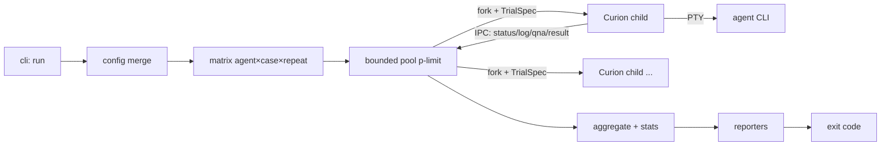

# Curiocity — Technical Solution Design (arch.md)

**This document is self-contained and is the single source of truth for building Curiocity.** [`idea.md`](./idea.md) and [`poc.md`](./poc.md) are the historical concept/PoC records only — do not implement against them; everything binding from them is merged here. The **verified per-agent hook contracts remain separate and binding**: [`docs/hooks/claude-code.md`](../../docs/hooks/claude-code.md), [`docs/hooks/codex.md`](../../docs/hooks/codex.md) (repo root `docs/hooks/`) — implement hook payloads/registration against those files, not memory. Where this doc and any other file conflict, this doc wins (except the hook contracts, which win for hook wire formats).

**Audience:** the implementing model/engineer. This defines structure, interfaces, and contracts — not implementation detail.

---

## 1. What Curiocity Is

An evals/testing harness that drives interactive coding-agent CLIs (v1: **Claude Code**, **Codex CLI**) through a predefined prompt over a real PTY, consumes each CLI's native on-disk session transcript as the source of truth, auto-answers genuine questions via LLM, then scores each run with deterministic checks + an LLM judge and gates a CI pipeline on the aggregate.

- **Curiocity** = orchestrator: discovers cases, builds the trial matrix `(agent × case × repeat)`, dispatches workers, aggregates, reports, gates.
- **Curion** = worker: presides over exactly one trial (one case × one CLI × one repeat) in an isolated workspace, returns one verdict + metrics.

**Primary use cases:** CI/CD regression of the Rosetta plugin (install plugin → run case suite → verify skills/hooks/workflows behaved); benchmarking agents (with/without a plugin or MCP set); local authoring/debugging of cases, hooks, and prompts (single mode + inline mode).

**Non-goals (v1):** hosted service/dashboard; headless agent modes; multi-pane capture (seam reserved, see §16); managing agent CLI auth.

### Binding principles (carried into every design below)

| # | Principle |
|---|---|
| P1 | **Interactive TUI over PTY — never headless** (`-p`/`--print`/`exec`/SDK one-shot are forbidden). Interactive is the code path where plugins actually load; that is what we test. |
| P2 | **Auto-handle permissions** per agent profile (Claude: `--permission-mode auto`; Codex: `-a never` + sandbox). Permission prompts are noise; the agent's *own substantive questions* are answered (that's the harness working). |
| P3 | **A "question" is ONLY**: (a) a structured question tool (Claude Code `AskUserQuestion`), or (b) a genuine free-text question in the turn-final assistant message. **Never** ordinary tool activity (`TaskCreate`/`TaskUpdate`/`Skill`/`Bash`/`Read`/…). Violating this derailed a validated live run (harness injected "answers" to normal tool calls → 30-min run, zero deliverables). Hard rule; see §6 trigger table. |
| P4 | **Native trajectory (on-disk transcript) is authoritative**; the rendered screen is fallback evidence. Deterministic detection gates every LLM call (cost/latency bounded). |
| P5 | **Two model tiers**: `fast` for high-frequency classification, `workhorse` for replies + judging (role `judge` defaults to workhorse). Provider+model configurable per role. |
| P6 | **Repeat runs are a first-class feature, default N=1** (opt-in per case). Report distributions, not single numbers. |
| P7 | **Cost: track + warn, never abort** (aborting contaminates benchmark results). |
| P8 | **Machine-readable JSON + human Markdown output**; clean exit codes; platform-agnostic CI. |
| P9 | **Fresh session id per run**; agent CLIs are pre-installed and pre-authenticated by the user/CI — the harness never manages auth, and secrets are never written to disk or logged. |
| P10 | **The harness process must run unsandboxed** (validated: a sandboxed harness blocks agent writes under `$HOME`, and no transcript appears). `run`/`validate` preflight-check writeability of the agent home and fail fast with a clear message. |
| P11 | **Provisioning must not mutate global agent state.** Everything the harness installs (hooks, MCPs, plugins) is per-invocation or workspace-scoped (launch flags, `--settings` files, workspace config dirs). Global-mutating commands (e.g. `codex mcp add` against the user's `~/.codex`) are forbidden in v1 — they race under concurrency and pollute the user's real setup. If a future provisioning need cannot be workspace-scoped, the fallback is per-trial agent-home isolation (spike required; see §17). |

---

## 2. Locked Decisions

| # | Decision |
|---|---|
| D1 | **Single npm package** at `src/curiocity` (own `package.json`), bin `curiocity`, published for `npx curiocity`; local dev via `npm run` scripts. Strict internal module boundaries (folder = future package). |
| D2 | **Fork-always Curions**: every trial runs in a child process (fork + IPC), even at `--concurrency 1`. One code path for debug and CI. |
| D3 | **Vercel AI SDK** (`ai` + `@ai-sdk/*`) for all harness LLM roles. New provider = dependency + config, no core change. |
| D4 | **One `run` command**; single/debug mode = filters (`--agent`, `--case`, `--repeats`, `--concurrency`, `--mirror`, `--no-evaluate`, …). No second code path. |
| D5 | **Static registries** for agents, evaluators, stats, reporters, combiners. Adding one = drop module in folder + one register line. Config references by name. (A registry is a typed map — not a plugin framework.) |
| D6 | **Evaluator pipeline**: cases declare named evaluators with params in `config.json`; the verdict combiner is a named registry entry. `evaluation.md` stays pure prose for the LLM judge. |
| D7 | **Inline (ephemeral) case**: `--prompt/--qna/--eval/--src` flags synthesize a one-case in-memory case flowing through the identical pipeline. |
| D8 | **Results = timestamped run dir** (raw per-trial JSON + suite summary + Markdown); `curiocity report <dir>` recomputes **stats + reporters + gate** from stored `TrialResult`s (the gatekeeper is a pure function of them) — it never re-runs agents or evaluators/judges. New stats/reporters/gate thresholds apply retroactively. |
| D9 | **Defaults**: suite runs → evaluate + cost + stats **ON**; inline runs → **OFF** (opt-in per flag). |
| D10 | **Mock agent** is a first-class scripted TUI fixture registered like a real agent; reference adapter + integration-test vehicle. |
| D11 | **v1 adapters: Claude Code + Codex CLI**, both first-class, both renderers of the same canonical specs (§5.2). Other CLIs (Copilot, Cursor, Gemini, Windsurf) are future adapters behind the same interface (hook contracts for several already verified in `docs/hooks/`). |
| D12 | **`microsoft/node-pty`** (canonical upstream). Native build at install — document toolchain prerequisite (Xcode CLT / build-essential) for npx users and CI images. |
| D13 | **Precedence**: built-in defaults < top-level config < per-case `config.json` < CLI flags. Provisioning: top-level = defaults; per-case merges by name (same name = override, new = add). |
| D14 | **Setup/teardown scripts**: `setup: []` top-level + per-case are **concatenated** (top-level first); run via execa with `cwd = workspace` and `CURIOCITY_*` env. Setup failure → trial status `setup-error` (never judged, never counted as agent failure, excluded from score statistics). `teardown: []` always runs, even on failure. |
| D15 | **Initial prompt is a launch argument** (validated mechanism; auto-submits on start for both v1 CLIs). The harness *types* into the PTY only for: startup dialogs (deterministic patterns), answers to questions (P3), and session termination. Typed input uses the profile's `submit` sequencing and respects backpressure (§4). |
| D16 | **Case matrix keys** are agent ids and case folder names; every trial gets a fresh workspace, fresh ctrl dir, fresh session id — no cross-trial sharing of any mutable state (see P11). |

---

## 3. Package & Repo Layout

Lives in this repo at `src/curiocity/`, self-contained:

```
src/curiocity/
  package.json            # name: curiocity, type: module, bin: { curiocity: dist/cli.js }
  tsconfig.json
  src/
    cli/                  # commander program; commands: run, report, validate
    config/               # zod schemas, loaders, precedence merge
    cases/                # discovery (--source), validation, ephemeral case builder
    orchestrator/         # matrix builder, bounded pool, gatekeeper (exit codes)
    curion/               # child-process entry + trial lifecycle state machine
    terminal/             # node-pty + @xterm/headless; pane-ready TerminalSession
    interaction/          # stall detector, turn loop, question policy, input typing
    agents/               # registry + AgentAdapter impls: claude-code/, codex/, mock/
    evaluators/           # registry + built-ins: file-exists, command, llm-judge, trajectory-check
    stats/                # registry + built-ins: score-stats, pass-rate, stability, cost, time
    reporters/            # registry + built-ins: json, markdown
    llm/                  # AI SDK role router (fast/workhorse/judge), provider map, pricing, cost meter
    results/              # run-dir store, trial/suite JSON schemas (zod), loader for `report`
    shared/               # trajectory schema, IPC message types, logger, errors, utils
  test/
    unit/                 # parsers, stall detector, merge, evaluators (fixture-driven)
    integration/          # full fork+PTY loop against the mock agent
    fixtures/             # recorded transcripts, mock-agent scripts, sample cases
```

**Tooling:** TypeScript (strict), ESM, Node ≥ 20. `tsx` for dev (`npm run dev`), `tsup` to build `dist/`, `vitest` for tests. Scripts: `dev`, `build`, `test`, `test:integration`, `lint`, `smoke` (mock-agent end-to-end, no tokens).

**Dependency rules (enforced by convention + review):**
- `agents/ evaluators/ stats/ reporters/` import only from `shared/` + their registry types. Core never imports a concrete adapter except through a registry.
- `orchestrator/` talks to `curion/` **only** via IPC message types in `shared/ipc.ts`.
- `cli/` is the only module that reads argv; `config/` is the only module that reads config files.

---

## 4. Runtime Topology



- **Orchestrator (parent):** builds the trial matrix, runs a bounded pool (`--concurrency`, default `min(4, cores-1)`), forks one Curion per cell, streams IPC events, aggregates `TrialResult`s, runs stats + reporters, decides exit code. Enforces per-trial wall-clock timeout (kills the child process tree → status `timeout`). Never an unbounded fan-out (bounds CPU, file handles, PTYs, LLM rate limits).
- **Curion (child):** `curion/main.ts` entry. Receives one `TrialSpec` message, runs the full trial lifecycle (§7), writes its own trial artifacts into the results dir, sends a final `result` message. All LLM calls for QnA and judging happen in the child — the parent's event loop stays hot (see PTY rules below).
- **IPC protocol** (`shared/ipc.ts`): parent→child `{type:'spec', spec: TrialSpec}`; child→parent `{type:'status'|'log'|'mirror'|'qna'|'result'|'fatal', …}`. `mirror` frames stream raw PTY output when `--mirror` is on. All messages zod-validated.
- **Secrets — explicit mechanism, not an assumption:** the orchestrator resolves LLM keys at startup (§12) and holds them in memory. Curions are forked with an **explicit allow-listed `env`** (PATH, HOME, TERM, locale — nothing else), so CI-provided secret env vars are *not* inherited by default `fork` behavior. Keys travel to the child **inside `TrialSpec` over IPC**. The agent PTY env is then constructed separately per profile (§5.2 `buildLaunch` + `envRemove`). Result: no secret can reach the agent process even by accident. Keys are masked in all logs.

**PTY / event-loop rules (binding — these prevent a validated deadlock class):**
- OS pipe/PTY buffers are finite: **always drain output while writing input** — never write-then-block without a concurrent reader (circular-wait deadlock otherwise).
- Respect stream backpressure: `write()` returning `false` → await `'drain'`; chunk large writes; never flood the PTY.
- Never run synchronous CPU-heavy work (transcript parsing, screen rendering, judge-payload assembly) on the loop that drains the PTY — in practice: that work lives in the Curion child, and even there off the hot read path.
- Handle/disable XON/XOFF terminal flow control so agent output is never silently paused.
- Process-per-Curion is the structural cure: one trial's CPU spike or full buffer cannot stall another trial's reader.

---

## 5. Core Interfaces

All in `shared/` or the owning module; shown abridged — implementer fills obvious details. Everything zod-schema'd at boundaries.

### 5.1 Registry (generic)

```ts
interface Registry<T extends { id: string }> {
  register(item: T): void;
  get(id: string): T;            // throws UnknownIdError with known-ids list
  list(): T[];
}
// instances: agentRegistry, evaluatorRegistry, statRegistry, reporterRegistry, combinerRegistry
// each folder's index.ts registers its built-ins; config refers by id
```

### 5.2 Agent layer: profile (data) + adapter (code)

```ts
interface AgentProfile {                 // from top-level config `codingagents`, zod-validated
  adapter: string;                       // registry id: 'claude-code' | 'codex' | 'mock'
  command: string; args: string[];       // template vars: {prompt}, {sessionId}, {workspace}, {ctrlDir}
  envRemove: string[];                   // glob patterns stripped from agent PTY env
  envSet?: Record<string, string>;
  strategy: 'json-only' | 'screen-reader' | 'hybrid';
  readiness: { bannerPattern?: string; quietMs: number };  // TUI ready-for-input signal
  submit: 'enter' | 'paste+enter';       // key sequencing for typed input (some TUIs need paste mode)
  stall: { quietMs: number };            // "output settled" → escalate to turn/question checks
  freeze: { windowMs: number };          // default 10_000 — zero screen+transcript change → fail-safe (§6)
  dialogPatterns?: DialogRule[];         // deterministic screen patterns → keystrokes (trust/theme dialogs)
  models?: Partial<ModelRoles>;          // per-agent tier override
}

interface AgentAdapter {
  id: string;
  /** Pre-spawn orchestration point. NOT free-form: composes the three standard steps below,
   *  in that order, over canonical specs. Adapters may run real commands inside a step
   *  (subject to P11: nothing global-mutating). */
  prepare(ctx: TrialContext): Promise<LaunchPlan>;
  /** Step 1 — render the canonical hook spec into agent-native registration
   *  (Claude: settings file + `--settings`; Codex: workspace .codex/hooks.json + feature/trust flags). */
  renderHooks(spec: CanonicalHookSpec, ctx: TrialContext): Promise<LaunchFragment>;
  /** Step 2 — materialize the merged ProvisionSpec (MCPs + plugins) natively, workspace-scoped (P11). */
  renderProvisioning(spec: ProvisionSpec, ctx: TrialContext): Promise<LaunchFragment>;
  /** Step 3 — command/args/env from profile templates (incl. envRemove filtering, session id). */
  buildLaunch(ctx: TrialContext): LaunchFragment;

  /** Resolve transcript source: ctrl-dir session-start payload (authoritative) or computed fallback. */
  locateTranscript(ctx: TrialContext): Promise<TranscriptSource>;
  /** Normalize one raw transcript line/chunk → internal TrajectoryEvent[] (dialect adapter). */
  parseEvents(raw: string): TrajectoryEvent[];
  /** Normalize a native stop payload → CanonicalStopSignal, then classify the turn. */
  classifyTurn(signal: CanonicalStopSignal): 'question' | 'done' | 'working';
  /** Detect a pending structured question in the trajectory tail (null if agent has none). */
  detectStructuredQuestion(events: TrajectoryEvent[]): StructuredQuestion | null;
  /** Extract the agent's own token usage from the trajectory (cost accounting). */
  extractUsage(events: TrajectoryEvent[]): AgentUsage;
  /** How to end the session cleanly (e.g. type `/exit`, send key). */
  terminate(session: TerminalSession): Promise<void>;
}
```

**Canonical control protocol (core-owned, identical for every agent).** The core — not the adapter — defines *what* is installed and *what comes back*; adapters only translate to/from the agent's native shape:

```ts
interface CanonicalHookSpec {            // core builds this once per trial
  sessionStart: { writeTo: string };     // → <ctrlDir>/session-start.json  (payload must include transcript_path, session_id)
  stop:         { appendTo: string };    // → <ctrlDir>/stop.jsonl          (payload must include last_assistant_message)
}
interface CanonicalStopSignal { sessionId: string; transcriptPath?: string; lastAssistantMessage: string | null }
type LaunchFragment = { args?: string[]; env?: Record<string,string>; files?: FileToWrite[]; commands?: string[] }
// LaunchPlan = ordered merge of the three fragments; core writes files / runs commands / spawns.
```

So the flow is the **same standard pipeline for every agent** — `ctrlDir → renderHooks → renderProvisioning → buildLaunch → spawn → session-start.json → … → stop.jsonl per turn` — and only the *rendering inside each step* is agent-specific. Both v1 CLIs happen to use Claude-style hook files with near-identical snake_case payloads, so these renderers/normalizers are thin; a future agent with a different mechanism still fits the same steps.

**Hook-coexistence contract (correctness precondition):** the harness's capture hooks MUST be additive to the hooks of the plugin under test (Rosetta registers its own `SessionStart`/`Stop`/`PreToolUse` hooks — if injection replaced them, the harness would be testing nothing). Claude's `--settings` file is an additional settings layer that merges alongside existing user/project/plugin hooks (validated in the PoC); Codex's workspace `.codex/hooks.json` is a distinct config location from plugin-bundled hooks. Each adapter's integration test MUST assert both hook sets fired in one session (capture files present **and** plugin hook effects visible in the trajectory).

`TrajectoryEvent` (internal schema, `shared/trajectory.ts`): `{ ts, kind: 'user'|'assistant'|'tool_call'|'tool_result'|'usage'|'lifecycle', name?, payload }` — the one shape evaluators/judges/stats consume regardless of agent.

### 5.3 Terminal (pane-ready)

```ts
interface TerminalSession {              // backed by node-pty + @xterm/headless
  readonly panes: Pane[];                // v1: exactly one primary pane
  readonly primary: Pane;
  write(input: string): Promise<void>;   // respects backpressure ('drain'); applies profile submit sequencing
  onData(cb: (paneId: string, bytes: string) => void): void;
  snapshot(paneId?: string): string;     // rendered visible screen (bounded grid), ANSI-free
  kill(): void;
}
```

Render, don't grep raw ANSI: PTY bytes feed the headless emulator; anything reading the screen reads a clean bounded snapshot (visible grid, not scrollback — keeps LLM fallback cost bounded).

### 5.4 Evaluators & verdict

```ts
interface Evaluator {
  id: string;
  paramsSchema: z.ZodType;               // validated at config load, not at run time
  evaluate(ctx: EvalContext, params: unknown): Promise<EvalResult>;
}
interface EvalContext {                  // assembled by Curion after the run
  workspace: string;                     // final workspace dir
  workspaceDiff: string;                 // unified diff vs unzipped source
  events: TrajectoryEvent[];             // normalized trajectory
  qnaLog: QnaEntry[];
  caseFiles: { evaluationMd?: string; promptMd: string };
  agentId: string;
  models: ModelRouter;                   // for llm-judge
  exec: typeof execa;                    // for command checks
}
interface EvalResult { pass: boolean; score?: number; gate: boolean; details: string; cost?: Usage }
```

Built-ins — see §11 for semantics: `file-exists`, `command`, `trajectory-check`, `llm-judge`.

**Verdict combiner** (registry `combiners`, default **`gated-mean`**): all `gate:true` results must pass, else verdict = fail with score capped (default cap 40); otherwise score = weighted mean of scored results vs `passThreshold` (default 60). `passThreshold` decides the **per-trial** verdict; suite gating is separate (§13).

### 5.5 Stats & reporters

```ts
interface Stat {      id: string; compute(group: TrialResult[]): StatBlock }   // pure reducer
interface Reporter {  id: string; render(suite: SuiteResult): ReportFile[] }
```

Stats run per `(case × agent)` group and suite-wide. Built-ins and definitions in §12.

### 5.6 LLM layer

```ts
type Role = 'fast' | 'workhorse' | 'judge';            // judge defaults to workhorse
interface ModelRouter {
  generateText(role: Role, req): Promise<{ text; usage }>;
  generateObject<T>(role: Role, req, schema: z.ZodType<T>): Promise<{ object: T; usage }>;
}
```

Backed by Vercel AI SDK; details, keys, pricing, cost meter in §12.

---

## 6. Interaction Engine

State machine (in Curion): `launching → ready → submitted → working ⇄ answering → completing → done` (+ terminal states `timeout`, `agent-crash`).

- **Readiness:** per-profile signal — banner pattern on the rendered screen and/or quiet period (`readiness`). The prompt itself is a launch arg (D15), so readiness mainly gates *typed* input (dialog answers, question replies, termination).
- **Deterministic first:** `dialogPatterns` clear known startup dialogs (trust / theme / MCP-consent) with fixed keystrokes. The **stall detector** — hash of screen snapshot + transcript mtime unchanged for `stall.quietMs` — is the *only* thing that can escalate to an LLM screen-read, and only for `screen-reader`/`hybrid` profiles.
- **Turn loop:** driven by Stop-hook signals (`stop.jsonl` appends) normalized to `CanonicalStopSignal` — never by timers alone.

**QnA trigger decision table (hard rules; the single defense against the validated derailing-bug class, P3):**

| Trigger observed | Condition | Action |
|---|---|---|
| Trajectory tail has a **pending structured question** (`detectStructuredQuestion` ≠ null, e.g. Claude `AskUserQuestion` tool_use awaiting input) | stall detector confirms the TUI is waiting | **workhorse** composes the answer from `qna.md` + question payload → typed reply (structured questions may not fire a Stop hook — this path exists precisely for that) |
| **Stop signal** arrives | **fast** model classifies `lastAssistantMessage` as *question* | **workhorse** composes free-text answer from `qna.md` + message + screen snapshot → typed reply |
| **Stop signal** arrives | classified as *done* (task delivered / nothing pending) | adapter `terminate()` → collect |
| **Stop signal** arrives | classified as *working* (e.g. continuation) | keep waiting |
| Stall fires, **no** Stop signal, **no** structured question | `screen-reader`/`hybrid` profile | fast model classifies the screen snapshot: input-prompt → workhorse reply; finished → terminate; thinking → keep waiting |
| **Freeze watchdog** fires (see below) | first window | run the checks above once (dialog patterns → structured question → Stop backlog → screen classification) |
| **Freeze watchdog** fires again | second consecutive window, still zero change | deterministic fail-safe: capture evidence (final snapshot + transcript tail), `terminate()`, trial status **`agent-hung`** |
| Anything else (tool calls, task updates, streaming output) | — | **never** inject input |

**Freeze watchdog (deterministic fail-safe).** Both v1 TUIs repaint continuously while working — spinners, letter-color changes, live token in/out counters — so a **byte-identical rendered screen AND a non-growing transcript for `freeze.windowMs` (default 10 s, per-profile configurable)** deterministically means the agent is *not* working: it is either waiting for input the harness missed or it is dead. It reuses the stall detector's machinery (screen hash + transcript size) with stricter criteria (zero change, not "settled") and a different consequence (fail-safe ladder, not classification). This is also the backstop for silent hook failure (e.g. Codex's strict validation disabling a hook — no Stop signal will ever arrive): the watchdog guarantees no trial waits forever on a signal that cannot come, well before the wall-clock timeout burns CI minutes.

Every answered exchange is appended to the QnA log `{type: 'structured'|'free-text', question, answer, ts}` (full audit trail — every typed reply is recorded). `qna.md` policy always includes a hard "if unsure, abort" fallback; the workhorse must obey deny-rules in it (e.g. "never approve deletes").

**Safety caps:** per-trial max turns + max wall-clock inside the child, in addition to the parent's timeout kill.

---

## 7. Trial Lifecycle & Statuses

Per Curion, in order:

1. `workspace` — mkdtemp; unzip `src.zip` (`extract-zip`; strip `__MACOSX`); ephemeral cases may start empty.
2. `setup` — run concatenated setup scripts (top-level then case) via execa, `cwd=workspace`, env += `CURIOCITY_WORKSPACE, CURIOCITY_CASE, CURIOCITY_AGENT, CURIOCITY_REPEAT, CURIOCITY_CTRL_DIR`. Script paths resolve relative to the file that declared them. Non-zero exit → **`setup-error`**, skip to teardown.
3. `provision` + 4. `launch` — the **standard launch pipeline** (§5.2): core builds ctrlDir + `CanonicalHookSpec` + merged `ProvisionSpec`; adapter `prepare()` runs `renderHooks → renderProvisioning → buildLaunch`; core applies the merged `LaunchPlan` (write files, run commands, spawn PTY) → readiness. Identical sequence for every agent.
5. `interact` — §6 turn loop to completion.
6. `collect` — final trajectory (normalized events), workspace diff, QnA log, usage, timings; screen snapshots kept as fallback evidence.
7. `evaluate` — evaluator pipeline + combiner (skipped when evaluation off).
8. `teardown` — always runs (even after any failure above); then workspace deleted unless `--keep-workspace` or the trial failed (failed-trial workspaces kept, path recorded in trial.json).

**Statuses:** `passed | failed | setup-error | launch-error | timeout | agent-hung | agent-crash | skipped`. Only `passed/failed` carry verdicts; error statuses are reported separately and **never enter score statistics** (D14). Their effect on exit codes: §13.

---

## 8. Cases: Format & Discovery

`--source <folder>`: **each immediate subfolder is one case**. A subfolder is a valid, runnable case only when **all 5 files** are present; otherwise it is skipped with a logged reason (`curiocity validate` lists valid cases and skip reasons).

| File | Role |
|---|---|
| `prompt.md` | The task prompt, passed to the agent as the launch argument (D15). |
| `config.json` | Case config: agents, timeouts, repeats, evaluators, provisioning, setup/teardown (§9). |
| `qna.md` | Q&A policy for answering the agent's questions — approvals, denials, and a hard "if unsure, abort" fallback. Consumed only by the QnA workhorse calls. |
| `evaluation.md` | Pure-prose rubric for the LLM judge, passed **verbatim** (the harness never interprets criteria). Deterministic checks do NOT live here — they are structured `evaluators` entries in `config.json`. |
| `src.zip` | Source archive unzipped into the workspace before launch. "From scratch" tasks ship a minimal/empty-but-present zip. |

**Inline (ephemeral) case (D7):** `--prompt <file|text>` (+ optional `--qna`, `--eval`, `--src <zip|dir>`, `--agent`) builds the same case object in memory — no folder, no discovery, same pipeline. Missing pieces get neutral defaults (empty workspace; permissive qna policy with the abort fallback; no evaluators unless `--evaluate` + `--eval` given).

---

## 9. Configuration

### Layers & precedence (D13)

`defaults (code) < top-level config (--config <file>, default ./curiocity.config.json) < case config.json < CLI flags`.

### Top-level config (zod-validated)

```jsonc
{
  "codingagents": { "claude-code": { /* AgentProfile */ }, "codex": { /* AgentProfile */ } },
  "models": { "fast": "anthropic/claude-haiku-4-5", "workhorse": "anthropic/claude-sonnet-4-6" },
  "pricing": {                                          // optional; enables $ in cost-rollup (§12)
    "anthropic/claude-haiku-4-5":  { "inputPer1M": 1.00, "outputPer1M": 5.00 },
    "anthropic/claude-sonnet-4-6": { "inputPer1M": 3.00, "outputPer1M": 15.00 }
  },
  "provision": { "mcps": [], "plugins": [] },           // defaults; case merges by name; P11 applies
  "setup": ["./scripts/install-rosetta-hook.sh"],       // D14: concatenated before case setup
  "teardown": [],
  "gate": { "minScore": 60, "minPassRate": 0.8, "maxStddev": 10 },
  "concurrency": 4,
  "out": "./curiocity-results"
}
```

### Case `config.json`

```jsonc
{
  "agents": ["claude-code", "codex"],
  "timeoutSec": 1800,
  "repeats": 1,
  "provision": { "mcps": [], "plugins": [] },
  "setup": ["./setup-fixture.sh"],
  "teardown": [],
  "evaluators": [
    { "use": "file-exists", "must": ["plans/healthcheck/*-SPECS.md"], "gate": true },
    { "use": "command", "run": "npm test", "gate": true },
    { "use": "trajectory-check",                       // per-agent patterns: tool vocabularies differ
      "toolPattern": { "claude-code": "Skill|mcp__rosetta__.*", "codex": "mcp__rosetta__.*" },
      "gate": true },
    { "use": "llm-judge", "rubric": "evaluation.md", "artifacts": ["plans/**/*.md"], "weight": 1.0 }
  ],
  "combiner": "gated-mean",
  "models": { "judge": "anthropic/claude-sonnet-4-6" }
}
```

---

## 10. Agent Adapters (v1)

Both v1 adapters are **renderers of the same canonical specs** (§5.2 standard launch pipeline) implementing the same **Option-B hook strategy** (validated live for Claude Code 2026-06-23; hook contract verified for Codex per docs/hooks): inject `SessionStart` + `Stop` hooks → `SessionStart` payload delivers the authoritative `transcript_path`; `Stop` payload delivers `last_assistant_message` for turn classification. The sections below list only each adapter's *rendering specifics* — the flow, ctrl-dir layout, and signal shapes are core-owned and identical. Hook wire formats: implement against [`docs/hooks/claude-code.md`](../../docs/hooks/claude-code.md) / [`docs/hooks/codex.md`](../../docs/hooks/codex.md).

### 10.1 `claude-code` (mechanics validated by live experiment 2026-06-23 + live end-to-end PoC run)

- **Launch:** `claude "<prompt>" --permission-mode auto --session-id <fresh-uuid> --settings <ctrlDir>/settings.json`, PTY cwd = workspace.
- **Hooks:** injected via a `--settings` file; this settings layer **merges alongside** existing user/project/plugin hooks (validated — precondition per §5.2). Shape:
  ```json
  { "hooks": {
      "SessionStart": [{ "hooks": [{ "type": "command", "command": "cat > <ctrlDir>/session-start.json" }] }],
      "Stop":         [{ "hooks": [{ "type": "command", "command": "cat >> <ctrlDir>/stop.jsonl" }] }] } }
  ```
  `SessionStart` stdin: `{ session_id, transcript_path, cwd, model, source, … }`. `Stop` stdin: `{ session_id, transcript_path, last_assistant_message, stop_hook_active, … }`. Output validation is lenient (see hook doc).
- **Env (validated root causes — each caused silent `events: 0` failures when violated):**
  - strip `CLAUDECODE` + all `CLAUDE_CODE*` — else claude runs as a *nested child session* and never persists its transcript;
  - strip `ANTHROPIC_API_KEY`, `ANTHROPIC_AUTH_TOKEN`, `ANTHROPIC_BASE_URL` — else the agent silently bills the harness key;
  - leave `CLAUDE_CONFIG_DIR` unset — transcripts must go to `~/.claude`; claude's own auth is its stored config (P9).
- **Session id:** fresh `randomUUID()` per run — reuse exits instantly with "Session ID already in use".
- **Transcript:** live-appended (≤ ~1 s latency) to the path from the `SessionStart` payload (authoritative). **Fallback (validated):** computed path `~/.claude/projects/<encoded-cwd>/<session-id>.jsonl` where `<encoded-cwd>` = `realpath(cwd)` with every `/` → `-` (macOS temp dirs resolve through `/private`). Tail via `fs.watch`.
- **Not usable:** `--output-format stream-json` is headless-only (P1 forbids); `--debug`/`--debug-file` never logs the transcript path — useful only as a per-run failure-diagnostics log (auth/hook/MCP errors).
- **Structured questions:** `AskUserQuestion` tool_use in the trajectory tail → `detectStructuredQuestion`.
- **Dialect:** Claude session JSONL → `TrajectoryEvent`; usage from per-message `usage` fields.
- **Known startup dialogs:** trust folder / theme / MCP consent — deterministic `dialogPatterns`.

### 10.2 `codex` (hook contract verified per docs/hooks/codex.md; CLI flags observed live 2026-07-02 on codex-cli 0.142.2)

- **Launch:** `codex "<prompt>" -a never --sandbox workspace-write --dangerously-bypass-hook-trust -c features.hooks=true -c 'projects."<workspace>".trust_level="trusted"'`, PTY cwd = workspace. (`-a never` + sandbox = auto-permission analog; trust seeded via `-c` so no trust dialog; `--dangerously-bypass-hook-trust` lets injected hooks run without the interactive `/hooks` content-hash trust step. **Build-start preflight:** assert these flags against the pinned CLI version before implementing further — they are observed CLI behavior, not part of the approved hook contract.)
- **Hooks:** workspace `.codex/hooks.json` (same registration shape as Claude; strict per-event output validation — an invalid payload marks the hook FAILED and the event **runs unhooked**, so treat "ctrl file never appeared" as a first-class fallback path, not an error). `SessionStart`/`Stop` common input includes `transcript_path`, `session_id`, `cwd`; `Stop` adds `last_assistant_message`, `turn_id`. *(Reading trap in the hook doc: the events table marks Stop's **matcher** as unsupported — the Stop hook itself is verified working.)*
- **Session id:** no `--session-id` flag — id comes from the `SessionStart` payload / rollout `session_meta`.
- **Transcript:** rollout JSONL `~/.codex/sessions/YYYY/MM/DD/rollout-<ts>-<uuid>.jsonl`. **Fallback location (no hook):** scan recent rollouts for `session_meta.cwd == workspace` and mtime ≥ trial start — the workspace path is unique per trial, so this is concurrency-safe; **never** select by "newest" alone.
- **Dialect:** rollout JSONL — `session_meta`, `turn_context`, `response_item` (`message|reasoning|function_call|function_call_output`), `event_msg` (`task_started|agent_message|user_message|token_count|task_complete`), `compacted` → `TrajectoryEvent`. Usage from `event_msg:token_count`; `event_msg:task_complete` corroborates the Stop signal.
- **Structured questions:** none — `detectStructuredQuestion` returns null; questions arrive as free-text via `Stop.last_assistant_message`.
- **Provisioning (P11):** per-invocation `-c` dotted-path TOML overrides (e.g. `-c 'mcp_servers.foo.command="…"'`) and workspace `.codex/` files only. `codex mcp add` / `codex plugin add` mutate the user's global `~/.codex` — **forbidden**.

### 10.3 `mock` (test fixture, D10)

A tiny scripted TUI (`test/fixtures/mock-agent/`, plain Node, runs from the repo — registered as a normal profile). Scenes driven by a JSON script: print banner → wait for prompt → emit "work" output → optionally ask a question → write a transcript JSONL (its own simple dialect) → exit. Purposes: (1) reference `AgentAdapter` implementation, (2) deterministic integration tests of fork + PTY + stall + QnA + evaluate with zero tokens (`npm run smoke`), (3) reproduction harness for interaction-engine bugs.

---

## 11. Evaluation & Verdict

Built-in evaluators (all params zod-validated at config load):

| Evaluator | Semantics |
|---|---|
| `file-exists` | Globs that must / must-not exist in the final workspace. Typically `gate:true`. |
| `command` | Run build/test/lint via execa in the workspace; assert exit code. Typically `gate:true`. |
| `trajectory-check` | Assert `tool_call` events matching a pattern occurred — the "did our plugin actually run" gate. `toolPattern` is either one regex or a **per-agent map** (tool vocabularies differ across agents; a single pattern would produce false failures on cross-agent suites). |
| `llm-judge` | Judge-role model scores 0–100 with rationale via `generateObject`. **Input (fixed contract):** [1] `evaluation.md` verbatim, [2] distilled trajectory (tool steps, trimmed results, assistant text), [3] produced artifacts — `workspaceDiff` **plus only** files matching the evaluator's `artifacts` globs, each size-capped with explicit truncation markers (never the unbounded workspace), [4] QnA log. The harness interprets no criteria. |

Combiner (§5.4 `gated-mean` default) produces the per-trial verdict `{pass, score, rationale}`; both deterministic results and judge output are recorded in `trial.json`.

---

## 12. LLM Layer, Cost & Keys

- **Roles → models:** config maps `fast` / `workhorse` / `judge` (defaults to workhorse) to `"provider/model"` strings; a small provider map in `llm/providers.ts` resolves the prefix to an `@ai-sdk/*` factory. Adding a provider = add dependency + one map entry. Per-agent and per-case `models` overrides merge per D13.
- **Keys:** resolved once at orchestrator startup — `CURIOCITY_<PROVIDER>_KEY` env, falling back to provider-standard vars, or a `.env` file; typically injected by the CI secret store. Held in memory, shipped to Curions via IPC only (§4 secrets mechanism), masked in logs, never on disk.
- **Cost meter:** every router call records `{role, model, usage}`; adapter `extractUsage` adds the agent's own tokens from the trajectory. Token counts are always reported. **Dollar amounts are computed only from the config `pricing` map** (`provider/model → {inputPer1M, outputPer1M}`); models missing from the map report tokens-only with a warning. Over configured budget → warn, never abort (P7).

**Stats built-ins (definitions):**

| Stat | Definition |
|---|---|
| `score-stats` | min / max / mean / median / stddev of scores per `(case×agent)` group (repeats > 1) |
| `pass-rate` | passed / (passed + failed); error-status trials excluded (D14) |
| `stability` | classification per group: **stable-pass** (pass-rate ≥ threshold, tight spread), **flaky** (mixed or wide spread), **stable-fail**. A tight high band beats a wide one with the same mean. |
| `cost-rollup` | tokens (+$ if priced) itemized: agent usage vs harness `fast`/`workhorse`/`judge`, by model — makes visible *what drives cost* (cheap agent needing many interventions vs expensive one-shot agent) |
| `time-rollup` | wall-clock breakdown: agent runtime vs harness-LLM time vs deterministic checks |

Because raw trial JSON is stored, new stats apply retroactively via `curiocity report` (D8).

---

## 13. CLI Surface & Exit Codes

```
curiocity run --source <dir> [options]           # suite mode (evaluate/cost/stats ON)
curiocity run --prompt <file|text> [options]     # inline mode (OFF by default; --evaluate etc. to enable)
curiocity report <resultsDir> [--reporter json,markdown]
curiocity validate --source <dir>                # discovery dry-run: valid cases + skip reasons; preflight checks (P10)
```

Key `run` options (all override config; every one usable in CI):

| Option | Meaning |
|---|---|
| `--agent <id>` (repeatable) | limit agents |
| `--case <glob>` (repeatable) | limit cases |
| `--repeats <n>` | override case repeats |
| `--concurrency <n>` | pool size (1 = serial debugging) |
| `--timeout <sec>` | per-trial cap |
| `--evaluate/--no-evaluate`, `--collect-cost/--no-collect-cost` | feature toggles (D9 defaults) |
| `--only-evaluator <id>` / `--skip-evaluator <id>` | narrow the eval pipeline |
| `--mirror` | stream PTY output live |
| `--keep-workspace` | keep all workspaces |
| `--dry-run` | print resolved matrix + config, run nothing |
| `--qna <file|text>`, `--eval <file>`, `--src <zip|dir>` | inline-case inputs |
| `--fast-model / --workhorse-model / --judge-model <provider/model>` | tier overrides |
| `--out <dir>`, `--config <file>` | paths |

**Suite gating (aggregation contract):** the `gate` config is evaluated **per `(case×agent)` group**: `minScore` against the group's mean score, `minPassRate` against its pass-rate, `maxStddev` against its score stddev (stddev applies only when repeats > 1). **Any violating group fails the suite.** This is the dual gate: "looks fine on average but unreliable" must not pass. The gatekeeper is a pure function of stored `TrialResult`s, so `report` can re-gate with changed thresholds (D8).

**Exit codes:**

| Code | Meaning |
|---|---|
| `0` | all groups pass all gates; no error-status trials |
| `1` | gate failure (score / pass-rate / flakiness) |
| `2` | config error or total infrastructure failure (invalid config, no runnable trials, preflight failed) |
| `3` | partial infrastructure failure: some trials ended in an error status (`setup-error`/`launch-error`/`timeout`/`agent-hung`/`agent-crash`) but every gate on completed trials passes — distinguishable in CI from both "all good" and "benchmark failed" |

(Gate failure takes precedence over partial-infra: if both occur, exit `1`; suite.json carries the full detail.)

---

## 14. Results Store

```
<out>/run-2026-07-02T14-30-00Z/
  suite.json           # SuiteResult: config snapshot, matrix, per-group stats, gate outcome
  suite.md             # human report (markdown reporter)
  trials/<case>/<agent>/<repeat>/
    trial.json         # TrialResult: status, verdict, per-evaluator results, cost, timings, qna
    trajectory.jsonl   # normalized TrajectoryEvents
    raw-transcript.jsonl
    screen.log         # rendered snapshots at key moments (evidence)
    workspace.diff     # final diff vs unzipped source
```

`trial.json` / `suite.json` schemas live in `results/schema.ts` (zod) with a `schemaVersion` field. `curiocity report` loads any run dir, re-runs stats + reporters + gate — new stats/reporters/thresholds work on old runs; it never re-runs agents or evaluators.

Per-trial reported fields include: agent, case, repeat, status, verdict + score + rationale, per-evaluator results, turn count, questions answered (QnA log), cost block (tokens/$ itemized per §12), time breakdown, workspace path (if kept).

---

## 15. Testing Strategy

- **Unit (vitest):** trajectory dialect parsers (recorded fixtures incl. real transcript samples under `docs/hooks/`), stall detector, config precedence merge, evaluators, combiner, stats, cost meter/pricing. LLM router mocked.
- **Integration:** full `run` against mock-agent cases — fork (env-scrubbed), PTY, readiness, dialog patterns, prompt submit, structured + free-text question round-trips, transcript tail, evaluation, results-dir shape, exit codes. Deterministic, token-free, runs in CI. This is `npm run smoke`.
- **Adapter contract tests:** per real adapter, the hook-coexistence assertion (§5.2) and a capture smoke (hooks fire, ctrl files appear, transcript tails) against the locally installed CLI. Codex additionally preflights its launch flags (§10.2).
- **Live E2E (tagged, manual/nightly):** one real case × claude-code and × codex; requires authenticated CLIs + unsandboxed run (P10). Not part of default CI.

---

## 16. Dependencies (all active, widely maintained)

| Package | Use |
|---|---|
| `node-pty` | PTY (D12; native build — document toolchain prereq) |
| `@xterm/headless` | screen grid rendering |
| `ai`, `@ai-sdk/anthropic`, `@ai-sdk/openai` | LLM roles (D3); more providers on demand |
| `zod` | every boundary schema |
| `execa` | setup/teardown scripts, command evaluator |
| `commander` | CLI |
| `extract-zip` | `src.zip` |
| `p-limit` | bounded pool |
| `strip-ansi` | fallback ANSI cleanup |
| `pino` | structured NDJSON logging (child logs forwarded over IPC) |
| dev: `typescript`, `tsx`, `tsup`, `vitest` | toolchain |

Node built-ins otherwise (`crypto.randomUUID`, `fs.watch`, `child_process.fork`).

---

## 17. Extension Recipes (the point of the design)

| To add… | Do |
|---|---|
| **an agent** | new folder `agents/<id>/` implementing `AgentAdapter` (the three standard render steps + transcript dialect + signal normalizer) + register; add a profile under `codingagents` in config. No core changes, no new flow. |
| **an evaluator** | new module in `evaluators/` (id + paramsSchema + evaluate) + register; reference by `use` in case config. |
| **a stat** | pure reducer in `stats/` + register; appears in suite.json/report automatically; applies retroactively via `report`. |
| **a reporter** | module in `reporters/` + register; select via `--reporter`. |
| **a model provider** | `npm i @ai-sdk/<provider>`; one entry in `llm/providers.ts`; use `"<provider>/<model>"` in config (+ optional `pricing` entry). |
| **a verdict policy** | new combiner + register; `"combiner"` in case config. |

---

## 18. Risks & Open Items

- **node-pty native build on npx** (accepted, D12): fails without a compiler toolchain; README must state prerequisites; CI images need build tools.
- **Codex launch flags** (`--dangerously-bypass-hook-trust`, `-c features.hooks=true`, trust seeding): observed on codex-cli 0.142.2 but outside the approved hook contract — verified again by the build-start preflight (§10.2) before the adapter is built out.
- **Codex hook strictness:** strict output-schema validation means an invalid hook payload silently runs unhooked — the computed-rollout fallback (§10.2) is a first-class path, not an error branch.
- **Plugin provisioning beyond workspace scope:** if a case ever *requires* globally-installed plugins (P11 forbids mutating the user's real agent home), the fallback is per-trial agent-home isolation (`CLAUDE_CONFIG_DIR` / `CODEX_HOME` pointed at an ephemeral seeded home). This needs a dedicated spike: auth lives in those homes, and the validated Claude findings assumed the default home — re-verify transcript persistence + auth under an isolated home before adopting.
- **Unsandboxed requirement (P10):** preflight in `validate`/`run`; clearest failure mode is "no transcript ever appears".
- **Future adapters** (Copilot, Cursor, Gemini, Windsurf): hook contracts partially verified in `docs/hooks/`; each needs the same capture spike + adapter contract tests before implementation.
- **Multi-pane TUIs:** `TerminalSession.panes` is the reserved seam; v1 implements exactly one pane. Implement full multi-pane capture only if a selected tool requires it.
- **Brittle TUI detection:** readiness banners / dialog patterns are config (data), not code — TUI redesigns are absorbed by profile updates, with the LLM screen-read as the stall-gated fallback.
