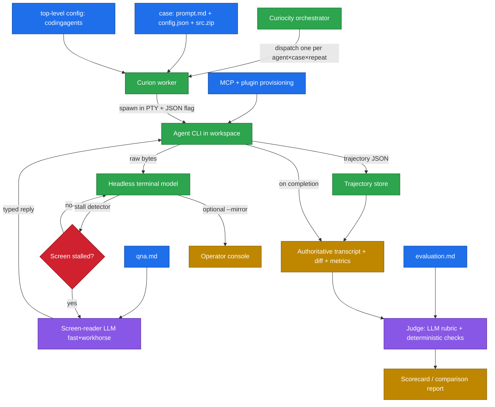

# Curiocity — a Tribunal for Coding Agents (Idea / Concept)

> **Name: LOCKED.** **Curiocity** is the project (the orchestrator — the "city of *curiae*"). **Curion** is the per-trial worker: one Curion presides over exactly **one case × one CLI × one repeat** — runs it, watches it, answers prompts, and judges it. (Historically a *curion* was the priest presiding over a single *curia*.) Metaphor world: **Tribunal**; both names npm-free.

> An evals and testing harness that drives interactive coding-agent CLIs (Claude Code, Codex, Gemini, Cursor, Copilot) through a predefined prompt over a real pseudo-terminal, consumes each CLI's native trajectory JSON as the source of truth, auto-answers interactive prompts via an LLM only when the terminal stalls, then scores each run with an LLM judge plus deterministic checks. Built for CI/CD first, local authoring second.

**Status:** Final (ideation concept). Name and scope locked; remaining items are feasibility spikes (see Open Questions). The next phase — requirements / architecture / build — is a separate, separately-approved effort.

---

## Core Principle — Interactive Mode + Auto Permissions (we test our harness)

**What every case tests:** that **our Rosetta harness — skills, subagents, workflows, hooks, MCPs — executes properly** inside a real coding agent. The point is *our plugins behaving correctly*, not permission UX.

- **Real interactive TUI via PTY — never headless** (`-p` / `--print` / `exec` / SDK one-shot). Interactive is how a user runs it and how our plugins actually load and behave; headless is a different code path that wouldn't validate the harness.
- **Auto-handle permissions.** Tool-permission prompts ("Claude wants to run bash…") are noise we don't care about — run in **auto mode** so they don't block the run. (Claude Code: `--permission-mode auto`.)
- **Substantive questions are still answered as a user.** Auto mode does **not** suppress the agent's own clarifying questions (e.g. from our HITL skill) or stop plugins/skills/subagents/MCPs from running — Curiocity answers those via `qna.md`. That *is* the harness working, and it matters.
- **Initial prompt** is passed as a launch argument (interactive + auto-submit). We simulate user input only where needed (answering a real question, ending the session).
- **Trajectory** = the agent's on-disk interactive **session transcript** (written automatically — no special flag) plus the screen as needed.
- **No extremes:** not headless, and not babysitting every permission prompt. Interactive + auto, judged on whether our harness ran correctly. Applies to all 5 CLIs (the auto-permission mechanism is declared per-agent in its profile).

---

## Problem & Motivation

Coding agents are interactive terminal UIs (TUIs) with non-deterministic behavior, mid-run confirmation prompts, and varied output formats. There is no easy, apples-to-apples way to:

- Feed the **same task** to multiple agents and compare results.
- Get past **interactive prompts** ("Allow edit? (y/n)", "Pick a model", trust dialogs) without a human babysitting each run.
- Produce a **repeatable, scored verdict** (did it actually solve the task?) rather than a vibe check.

This harness automates that loop: one prompt in, N agents driven to completion, one comparable scorecard out.

## Primary Use Cases

- **CI/CD pipelines (primary):** run unattended in a pipeline to benchmark/regress agents on a case suite and gate on verdicts. No human watching; no terminal mirroring; machine-readable output.
- **Regression-testing our own Rosetta harness (primary driver):** provision the Rosetta plugin into an agent, run the case suite, and verify our skills/workflows still behave — the reason this tool exists.
- **Benchmarking coding agents:** compare agents (and with/without a given plugin or MCP set) on identical cases.
- **Local authoring/verification (secondary):** a human runs it while creating cases, tuning `qna.md`, or verifying a fix — with optional live terminal mirroring turned on.

## Goals

- Drive any predefined coding-agent CLI to completion from a **single prompt file**, unattended (no human), running the tool in its **normal interactive mode** (never headless `-p`/`exec`).
- **Run as a real user** at a real terminal (PTY): submit the prompt as a launch arg, **auto-handle permission prompts**, and answer the agent's substantive questions per `qna.md`.
- **Prefer native trajectory JSON** (tool calls, messages, interactions) emitted by each CLI as the authoritative record — fall back to screen-reading only when needed.
- **Answer the agent's substantive questions** (e.g. clarifying questions) via an LLM that reads the screen on stall, guided by `qna.md`; tool-**permission** prompts are handled by **auto mode**, not answered one-by-one.
- **Two-tier models:** a fast/cheap model for high-frequency checks, a workhorse model for hard reasoning and judging.
- **Stability testing:** repeat each case N times to measure **score range and variance**, not just a single pass — distinguishing a reliably-good agent from a lucky-once flaky one.
- **Optionally mirror** (behind a `--mirror` flag, off by default) each agent's stdout/stderr live for local debugging.
- **Judge** each completed run with an LLM rubric **and** deterministic checks, then emit a comparable scorecard.

## Non-Goals (v1)

- Not a hosted service or dashboard — a runnable CLI suitable for local use and CI/CD jobs.
- **No headless / non-interactive mode** (`-p`, `--print`, `exec`, SDK one-shot) — firmly out of scope (see Core Principle). We drive the **real interactive TUI** over a PTY; trajectory is captured from interactive-session artifacts (e.g. on-disk session transcript) and/or the screen, **not** from a headless print stream.
- Full multi-pane/multi-terminal *capture* is **deferred** in v1 (single primary PTY) — but the terminal layer is **designed pane-ready** so it can be added if a selected tool needs it, without rework. See Risks.

---

## Core Concept — Orchestrator & Workers

- **Curiocity (orchestrator):** discovers cases under `--source`, reads the top-level config, builds the trial matrix `(agent × case × repeat)`, dispatches a **Curion** per cell in parallel, then aggregates and reports.
- **Curion (worker):** presides over exactly one trial — one case, one CLI, one repeat. Each Curion runs the loop below in its own isolated workspace and returns a single verdict + metrics.

### The Run Loop (one Curion, one trial)

1. **Discover & validate** the case folder; **unzip `src.zip`** into the isolated workspace.
2. **Provision** declared **MCP servers and coding-agent plugins** into the agent's environment (e.g. install the Rosetta plugin) before launch.
3. **Spawn** the agent CLI inside a **PTY** in that workspace, with its **trajectory-JSON output** flag enabled (per-agent config).
4. **Wait for readiness** — detect the agent's input-ready state from the rendered screen.
5. **Submit the prompt** — type the contents of `prompt.md` as a human would (with realistic key/enter sequencing).
6. **Watch & react loop (deterministic-first):**
   - Render PTY output into a clean text screen snapshot; tail the trajectory-JSON stream if the CLI writes it incrementally.
   - **Deterministic stall detector:** track whether the screen/JSON is still changing. While it updates, do nothing but optionally mirror output.
   - **On stall** (no change for a configured quiet window), escalate: the **fast model** classifies "is this waiting for input, finished, or just thinking?"; if it's an input prompt, the **workhorse model** decides the reply from the screen + `qna.md` policy, then we type it.
   - Detect **completion** (trajectory marks done / idle prompt returned / sentinel / exit).
7. **Collect** the **trajectory JSON** (authoritative transcript), final workspace diff, exit code, and runtime metrics; screen capture kept only as fallback evidence.
8. **Judge** the result (LLM judge over `evaluation.md` + deterministic checks) → verdict + score.
9. **Record** to a results store and render a comparison report.



---

## Inputs & Configuration

Two layers: **auto-discovered case folders** (per task, markdown-first) and a **top-level JSON config** (global).

### Auto-discovery (`--source <folder>`)

- `--source` points to a root folder. **Each immediate subfolder is one evaluation case.**
- A subfolder is a **valid, runnable case** only when the required files are present; otherwise it is **skipped with a logged reason**.
- **Required per case (all 5):** `prompt.md`, `config.json`, `qna.md`, `evaluation.md`, `src.zip`. A subfolder missing any of the five is **not** a valid case and is skipped with a logged reason.

Per-case files:

- **`prompt.md`** — the task prompt submitted to the agent (markdown).
- **`config.json`** — case-level config: which agents to run / per-case overrides, timeouts, and any **per-case MCP/plugin provisioning** (below).
- **`qna.md`** — Q&A policy (markdown): how interactive prompts are answered — e.g. "approve file edits", "never approve deletes", plus a hard "if unsure, abort" fallback.
- **`evaluation.md`** — evaluation criteria (markdown) for the LLM judge **and** the deterministic checks to run (build/test/lint, files that must exist, forbidden changes).
- **`src.zip`** — source archive (required) unzipped into the isolated workspace before the agent starts. For "from scratch" tasks, ship a minimal/empty-but-present zip.

### Top-level config (JSON)

A single JSON file. Sections:

- **`codingagents`** — agent profiles, the heart of the system (see below).
- **(reserved)** — all other top-level keys reserved for future use (global defaults, reporting, provisioning defaults, etc.).

### `codingagents` — Agent Profiles (the heart of the system)

Each profile is the single source of truth for one agent's invocation, file/token conventions, and **interaction strategy**. The harness reads the profile and adapts; no per-agent code branching. A profile declares:

- **Invocation:** `command`, `args`, `env`, `cwd`, and the flag/path that enables **trajectory-JSON output**.
- **File formats:** where the trajectory JSON is written, its dialect, and which **adapter** normalizes it to the internal schema; location of any session/log files.
- **Special tokens:** readiness banner, prompt-submit key sequence (enter vs paste-mode), completion sentinel/markers, known interactive-prompt patterns.
- **Interaction strategy** (the fork) — an enum per agent:
  - `json-only` — agent emits a complete trajectory JSON; AI is used **only to interpret JSON / decide replies from it**, never to read the raw screen.
  - `screen-reader` — agent lacks rich JSON; AI **reads the rendered screen** to detect and answer prompts.
  - `hybrid` — JSON is authoritative for understanding/judging, screen-reader is the fallback for driving interactive prompts.
- **Tuning overrides:** stall-detection quiet window, model-tier choices, and a Q&A-policy reference.

### MCP & Plugin Provisioning (before the agent starts)

- The top-level config and/or a case's `config.json` may declare **JSON specs for MCP servers and coding-agent plugins** to install/register **before** the agent launches.
- **Plugin** here = a *coding-agent* plugin (Claude plugin, Copilot plugin, etc.) bundling skills / subagents / prompts / workflows / rules / hooks / MCPs — **not** an IDE extension.
- This is the hook that lets us **install the Rosetta plugin (or any MCP set), then run cases against it** — directly powering both "regression-test our own Rosetta harness" and "benchmark agents with/without a given plugin."
- *Open question:* precedence when both levels define provisioning — proposed default is **top-level = defaults, per-case adds/overrides**.

Illustrative shapes (not final):

```jsonc
// top-level config: <name>.json
{
  "codingagents": {
    "claude-code": {
      "command": "claude",
      "args": ["--output-format", "stream-json", "--verbose"],
      "trajectory": { "mode": "stdout-json", "adapter": "claude-code" },
      "strategy": "json-only",
      "tokens": { "ready": "│ >", "submit": "enter", "complete": "trajectory.done" },
      "stall": { "quietMs": 4000 }
    },
    "some-tui-agent": {
      "command": "some-agent",
      "args": ["chat"],
      "trajectory": { "mode": "none" },
      "strategy": "screen-reader",
      "tokens": { "ready": "Ready", "submit": "paste+enter" },
      "stall": { "quietMs": 6000 },
      "models": { "fast": "gpt-fast", "workhorse": "claude-workhorse" }
    }
  }
  // other top-level sections reserved for future use
}
```

```jsonc
// per-case config.json
{
  "agents": ["claude-code"],
  "timeoutSec": 1800,
  "runs": 5,
  "stability": { "minPassRate": 0.8, "maxStddev": 10 },
  "provision": {
    "mcps":    [ { "name": "fs", "command": "mcp-fs", "args": ["--root", "."] } ],
    "plugins": [ { "type": "claude", "source": "git+https://…/rosetta-plugin" } ]
  }
}
```

## Interaction Engine (the hard part)

- **PTY, not pipes.** TUIs use raw terminal mode; plain redirected stdin/stdout/stderr won't drive them. Use a real pseudo-terminal so the agent behaves as if a human is present.
- **Trajectory JSON first, but per-agent.** Each CLI's native trajectory output (tool calls, messages, interactions) is the **authoritative record** when available — deterministic, structured, far cheaper than the screen. Whether AI reads the screen at all is set by the agent profile's `strategy` (`json-only` / `screen-reader` / `hybrid`), so JSON-capable agents avoid screen-reading entirely while weaker CLIs degrade gracefully to it.
- **Render, don't grep raw ANSI.** Feed PTY bytes into a **headless terminal emulator** that maintains the current screen grid, so the fallback LLM reads a clean snapshot rather than a raw escape-code stream.
- **Deterministic stall detection gates AI.** A cheap loop watches whether the rendered screen / JSON stream is still changing. AI is invoked **only on stall**, which keeps CI cost and latency bounded.
- **Optional live mirroring.** Behind `--mirror` (off by default), stream raw stdout/stderr to the operator console for local debugging.
- **Human-like input.** Type prompt text and replies through the PTY with appropriate enter/submit sequencing (some TUIs need paste-mode or specific key timing).

## Model Tiers (fast + workhorse)

- **Fast model:** high-frequency, low-stakes calls — "is this stall an input prompt, completion, or still thinking?", quick prompt classification. Optimizes cost/latency in the hot loop.
- **Workhorse model:** low-frequency, high-stakes calls — deciding the exact reply to a non-trivial interactive prompt, and the final rubric judging.
- Both tiers are **configurable per role** (provider + model) so CI can dial cost vs. rigor.

## Readiness & Prompt Detection

- **Readiness:** per-agent configurable signal — a stable rendered prompt string, a quiet period after spawn, or a known banner.
- **Needs-input detection:** deterministic stall detector fires → fast model classifies the screen → if it's a question/affirmation, workhorse model decides the reply from snapshot + Q&A policy → type it. Cheap regex heuristics on common prompt shapes short-circuit before any LLM call.
- **Completion detection:** trajectory JSON marks the turn complete, idle return to base prompt, an agreed sentinel, or process exit.

## Judging

- **Deterministic checks (objective gate):** run configured build/test/lint commands in the resulting workspace; assert exit codes, file existence, and diff properties. Fast, trustworthy, cheap.
- **LLM judge (semantic):** the **workhorse model** scores the **trajectory JSON** + final diff against the rubric (correctness, completeness, scope discipline, side-effects) — structured trajectory makes judging more reliable than transcript scraping.
- **Verdict:** combine — e.g. deterministic checks must pass as a hard gate; LLM judge produces the graded score and rationale. Both are recorded.

## Stability & Score Range (repeat runs)

A single run is a sample, not a measurement. Agents are non-deterministic, so each case can be **run N times** and the spread reported — this is a first-class feature, not an afterthought.

- **Configurable repeats, default `N=1`:** stability testing is **opt-in** per case (set `runs > 1`); single-run is the default to keep cost low. A case that cares about flakiness raises `runs`.
- **Per-case statistics:** min / max / mean / median score, **variance / stddev**, and **pass-rate across runs** (e.g. 4/5 runs passed).
- **Stability rating:** classify a case as *stable-pass*, *flaky*, or *stable-fail* by combining pass-rate with score spread — a tight high-scoring band beats a wide one with the same mean.
- **Dual CI gate:** fail the pipeline if mean score is too low **or** the spread/flakiness exceeds a threshold (a "looks fine on average but unreliable" agent should not pass).
- **Determinism aids:** fixed seeds/temperature where an agent supports them, so variance reflects the agent, not avoidable noise.

## Results & Reporting

- **Per run:** agent, case, verdict, score, rationale, turn count, interactive-prompts answered.
- **Cost / token / time accounting (per run, rolled up per case and suite):**
  - **Total wall-clock time** and time breakdown (agent thinking vs. harness AI vs. deterministic checks).
  - **Total token consumption and total cost**, itemized **by model and cost tier** — the agent's own model usage (from trajectory JSON where available) *plus* the harness's **fast** and **workhorse** model usage (screen-reader + judge).
  - This separation makes it visible *what is actually driving cost* — e.g. an agent that's cheap per run but needs many workhorse-model interventions, or an expensive agent that finishes in one shot. Different agents on different model tiers become directly comparable.
- **Per case (across N runs):** the stability statistics above — distribution and range, not a single number — alongside mean/range of time, tokens, and cost.
- **Aggregate:** side-by-side comparison across agents for the same case suite, surfacing *how good*, *how consistent*, and *at what cost* each agent is.

## Tech Stack (chosen: Node / TypeScript)

- **PTY:** `node-pty`.
- **Screen model:** a headless terminal emulator (e.g. `@xterm/headless`) to render the PTY stream into a screen snapshot; `strip-ansi` for fallbacks.
- **Trajectory parsing:** per-agent adapters that normalize each CLI's JSON output into one internal trajectory schema.
- **LLM:** Anthropic / OpenAI SDKs for the screen-reader (fast + workhorse) and judge roles (provider + model configurable per role/tier).
- **Config & validation:** JSON config (top-level + per-case) and markdown inputs; `zod` schemas; an unzip lib for `src.zip`; per-case auto-discovery.
- **Deterministic checks:** `execa` to run build/test/lint.
- **Workspace isolation:** git worktree or temp clone per run.

## Concurrency & Parallelization

The trial matrix `(agent × case × repeat)` is run in parallel (see Resolved Decisions). Node/TS is single‑threaded, so the concurrency model must be explicit:

- **Single‑threaded ≠ serial.** The harness work is **I/O‑bound**: each **Curion** supervises a PTY whose `claude` is a **separate OS process**, and makes async LLM calls. Node's event loop multiplexes many sessions' PTY I/O and network calls concurrently without blocking — and the actual agent compute is **already parallel across cores** because each agent is its own process. The harness only watches their I/O.
- **Where the single thread bottlenecks:** CPU‑heavy harness work under high fan‑out — parsing large transcripts, headless‑terminal screen rendering for many sessions, judge‑payload assembly. On the main loop these serialize and add latency.
- **Proper technique:** run each Curion (or a small pool) in **its own worker — `worker_threads`, or preferably a process‑per‑Curion (child process)** — so PTY I/O + CPU parsing per trial is isolated and uses other cores. **Curiocity (orchestrator)** owns a **bounded work queue / pool** (concurrency cap ≈ CPU cores or a configured limit) and coordinates workers via **IPC / message passing**; results stream back as each Curion finishes.
- **Why process‑per‑Curion:** fault isolation (a hung PTY or crashed agent can't take down the suite), clean per‑trial resource teardown, and a natural 1:1 mapping to each matrix cell.
- **Backpressure:** cap concurrency to avoid exhausting CPU / file handles / PTYs / LLM rate limits; queue the remainder. Never an unbounded fan‑out.

### Buffer deadlock & backpressure on stdin/stdout (critical)

Driving an interactive process over a PTY has a notorious failure mode that single‑threaded Node makes worse:

- **The classic pipe/PTY deadlock (circular wait).** OS pipe / PTY buffers are finite. If the harness writes to the agent's **stdin** while the agent writes to **stdout** and nobody drains, the agent blocks writing stdout (buffer full) → stops reading its stdin → the harness blocks writing stdin (the agent's stdin buffer is full) → **both wait on each other forever**. Rule: **always be draining output while you write input** — never write‑then‑block without a concurrent reader.
- **Don't block the event loop = don't stop draining.** Node is single‑threaded: a synchronous CPU task (parsing a huge transcript, rendering a screen) stalls the PTY read loop → buffers fill → the agent blocks → with many sessions on one loop this **head‑of‑line blocking cascades to every session**. Keep the read loop hot; push heavy parsing/judging to workers / child processes.
- **Respect stream backpressure.** Node `write()` returns `false` when its buffer is full — await `'drain'`, chunk large prompts, don't flood the PTY. Ignoring it bloats memory and, against a non‑draining peer, deadlocks.
- **Terminal flow control.** A PTY's line discipline can apply XON/XOFF (Ctrl‑S/Ctrl‑Q) flow control that silently pauses the agent's output; consume promptly and handle/disable flow control so output isn't throttled or lost.
- **Process‑per‑Curion is the structural cure.** Isolating each trial in its own process means one session's CPU spike or full buffer cannot stall another session's reader — which is *why* the per‑process model above matters, beyond fault isolation.

## Architecture Quality (explicit NFRs)

The architecture must be deliberately designed, not emergent:

- **Maintainability:** clear module boundaries — `curiocity` (orchestrator/scheduler), `curion` (per-trial worker), `pty/terminal` (pane-ready: 1..N panes behind one interface), `stall-detector`, `agent-adapters` (per-CLI), `screen-reader`, `judge`, `reporting`, `config`. Per-agent quirks live behind a stable adapter interface so adding an agent is additive, not invasive.
- **Fast execution:** deterministic-first hot loop; LLM calls only on stall; fast/workhorse tiering; parallelizable runs; trajectory JSON over screen scraping wherever possible.
- **Reuse over rebuild:** lean on proven packages (`node-pty`, `@xterm/headless`, `execa`, `zod`, vendor SDKs) rather than hand-rolling PTY/terminal/CLI plumbing.
- **CI-friendliness:** machine-readable output, non-zero exit on failure gates, no TTY assumptions when unattended, bounded cost/time budgets.

## Risks & Weak Spots (called out, not hidden)

- **Long scrollback buffers (user-flagged):** thousands of lines exceed a single screen and inflate LLM cost. *Mitigations:* read the rendered **visible screen** (bounded grid) rather than full history; summarize/tail intelligently; only escalate to scrollback when the visible screen is insufficient.
- **Multi-terminal / multi-pane agents (design-ready, implement-on-demand):** v1 drives a **single primary PTY**, but the terminal layer is built around a **pane abstraction** (a session = 1..N panes behind one interface; routing, per-pane screen rendering, and merge points are stubbed for one pane). The spike checks whether any of the 5 selected CLIs actually spawn panes/sub-terminals; if one does, full capture + input routing is implemented then — without reworking the rest. Keeps v1 lean while avoiding a future rewrite.
- **Screen-reader misjudgment:** the LLM answers a prompt wrong (e.g. approves a destructive action). *Mitigations:* Q&A policy hard-denies dangerous replies; sandboxed/isolated workspace; "if unsure, abort" fallback; full audit log of every typed reply.
- **Non-determinism:** agents vary run-to-run. *Mitigation:* opt-in repeat runs (default `N=1`) with the stability statistics + range reporting described above.
- **Brittle prompt detection:** TUI redesigns break patterns. *Mitigation:* config-driven signals + LLM fallback; treat detection rules as data, not code.
- **Cost/latency:** LLM calls per prompt + judging. *Mitigation:* heuristic gating before LLM calls; configurable model tiers; cost/tokens tracked and **warned** (no hard cap, to avoid aborting and contaminating benchmark results).

## Assumptions

- Deliverable this round is **idea.md only**; requirements/architecture/build are later, separately approved rounds.
- v1 drives the **real interactive TUI** via PTY, while consuming each CLI's **trajectory-JSON output** as the authoritative record (full headless `-p`/`exec` modes deferred).
- Agents that expose a usable trajectory-JSON mode run `json-only`/`hybrid`; those that don't fall back to `screen-reader` — the **agent profile decides**, so no CLI is excluded (JSON completeness still **verified per agent** during a feasibility spike).
- Each agent CLI is locally installed and authenticated before a run; the harness does not manage auth.
- Runs execute in **isolated, non-production** workspaces (low blast radius by design), primarily inside CI/CD jobs.

## Resolved Decisions

1. **v1 agents (5):** **Claude Code, Codex CLI, Gemini CLI, Cursor CLI, Copilot CLI** — each gets a trajectory adapter + profile.
2. **Case files:** **all 5 required** (`prompt.md`, `config.json`, `qna.md`, `evaluation.md`, `src.zip`); missing any → skipped.
3. **Run topology:** **isolated workspace per `(agent × case × repeat)`, run in parallel** — no cross-talk.
4. **Case source (v1):** **hand-authored** cases under the `--source` folder, curated for Rosetta regression + targeted benchmarks.
5. **CI target:** **platform-agnostic CLI** — clean exit codes + JSON/Markdown artifacts any CI can consume; no platform-specific glue required.
6. **Auth/secrets:** credentials/API keys injected as **env vars from the CI secret store**; nothing written to disk; Curio masks and never logs raw values.
7. **Determinism:** **default `N=1`, repeats opt-in** per case; stability stats/range only when `runs > 1`.
8. **Multi-terminal:** **start simple (single primary PTY), but design a multi-pane-ready terminal abstraction** (a session = 1..N panes behind one stable interface). Implement full multi-pane capture **only if a selected tool requires it** — determined per agent in the spike. Keeps v1 lean while avoiding a future rewrite.
9. **Output:** **JSON + Markdown** — machine-readable JSON for CI plus a human-readable Markdown summary. (Richer dashboard deferred.)
10. **Cost handling:** **track + warn, no hard cap** — record tokens/cost by model tier, warn on overage, never abort (keeps benchmark results uncontaminated).

## MVP Scope

**v1 builds for Claude Code only**, then extends to the other CLIs behind the same adapter interface. Launch the interactive TUI via PTY with `claude "<prompt>" --permission-mode auto` (no `-p`), and capture the trajectory by tailing the on‑disk transcript at the **directly‑computed path** `~/.claude/projects/<realpath(cwd) "/"→"-">/<session-id>.jsonl`. The interactive‑capture mechanism is **validated by experiment** — see "Findings & Decisions — Claude Code Interactive Trajectory Capture" below for the exact requirements (strip `CLAUDE_CODE*` env, run unsandboxed, fresh uuid) and the root causes of earlier failures.

## Findings & Decisions — Claude Code Interactive Trajectory Capture (validated by real experiment, 2026‑06‑23)

**True findings (tested, not assumed):**
- Interactive `claude` (TUI over node‑pty, **no `--print`**) **does** persist its session transcript to `~/.claude/projects/<encoded-cwd>/<session-id>.jsonl`, **live‑appended within ~1 second** (confirmed: file present at the first 1 s poll, ≥21 lines, growing).
- **TWO VALIDATED CAPTURE OPTIONS — alternatives, both proven; keep both (choose per agent):**
  - **Option A — Computed path.** Tail `~/.claude/projects/<encoded-cwd>/<session-id>.jsonl`, where `<encoded-cwd>` = `realpath(cwd)` with every `/` → `-` (macOS temp dirs resolve through `/private`). We set the cwd and `--session-id`, so the path is **deterministic — no `find`/search**. Simplest; no extra config. Risk: relies on the encoding holding per agent/OS.
  - **Option B — `SessionStart`/`Stop` hooks** (injected via `--settings`). `SessionStart` stdin gives the **authoritative `transcript_path`** (no encoding/compute); `Stop` stdin gives `last_assistant_message` + a clean completion signal (also the free‑text‑question trigger). Only the **two basic, cross‑agent hooks** are used — portable; richer per‑event hooks differ per agent and are avoided. Most robust/portable.
  - Both validated live (~1 s latency, transcript live‑appended). A = least setup; B = most portable & authoritative. The PoC currently wires B with A as fallback, but A standalone is a fully valid alternative.
- The live **structured** stream (`--output-format stream-json`) is **headless‑only** and is NOT used; the interactive on‑disk transcript carries the same events.
- **`--debug` / `--debug-file` does NOT log the transcript path or write events** (its categories are `STARTUP`, `FileIndex`, `init`, `Bootstrap`, `keybindings`, hooks, etc.). So debug is **not** a way to discover the path — it's only useful as a **per‑run failure‑diagnostics log** (auth/hook/MCP errors).

**Previously‑unforeseen issues (root causes of every earlier `events: 0`):**
1. **Sandboxing.** A sandboxed harness process blocks/redirects `claude`'s writes to `~/.claude`, so no transcript appears. The harness must run **unsandboxed**.
2. **Inherited Claude‑Code child‑session env markers.** Spawning `claude` from inside Claude Code inherits `CLAUDECODE=1`, `CLAUDE_CODE_CHILD_SESSION=1`, `CLAUDE_CODE_SESSION_ID=<parent>` → it runs as a **nested child** that doesn't persist its own transcript. **Strip `CLAUDECODE` + all `CLAUDE_CODE*`** from the child env.
3. **Session‑id collision.** Reusing a `--session-id` → `"Session ID already in use"` and instant exit. Use a **fresh uuid per run**.
4. **API key leaking via env.** Any `ANTHROPIC_API_KEY` in the environment is inherited by `claude` and billed (a shared/org key). The key lives **only in a config file / custom var (`CURION_LLM_KEY`)**, passed directly to the LLM client, **never in `process.env`**, never reaching `claude`.
5. **Auth is a stored source.** `claude` uses API‑billing from `~/.claude` config (not env); independent of #4, not harness‑controlled. `CLAUDE_CONFIG_DIR` is unset (transcripts go to `~/.claude`).

**Live end‑to‑end run findings (2026‑06‑23, Option A computed‑path, real `npm run dev`, exit 0):**
- **Capture validated end‑to‑end:** `trajectory.events: 94`, tool calls captured (`Skill`, `ToolSearch`, `TaskCreate`, `Bash`, `Read`, `AskUserQuestion`, …) — confirms the Rosetta plugin ran and the trajectory is captured live via the computed path.
- **Judge validated:** correctly returned **fail / 15** with an accurate rationale (no `SPECS.md`/`PLAN.md` artifacts produced; run ended on `AskUserQuestion` without delivering). The generic, criteria‑driven judge works.
- **🐞 CRITICAL bug — question‑detector is over‑eager.** The interaction loop treated **normal agent tool calls as user questions** — it grabbed `TaskCreate` and `TaskUpdate` `tool_use` events and **injected Haiku‑generated "answers" into the PTY**, derailing the agent (≈30‑min run, zero deliverables). **Fix: a "question" is ONLY the `AskUserQuestion` tool (structured) or a genuine free‑text prompt — never arbitrary tool calls** (`TaskCreate`/`TaskUpdate`/`Skill`/`Bash`/`Read` are normal workflow). This is exactly the misfire Option B's `Stop`‑hook + `last_assistant_message` classification should avoid (verify in the hook‑driven run).

**Decisions (locked):**
- Trajectory capture = **interactive TUI + tail the on‑disk transcript**, located by **either Option A (computed path) or Option B (`SessionStart`/`Stop` hooks)** above — *both are valid alternatives*; choose per agent (B where `SessionStart` is supported, A otherwise). No headless. (PoC implements B with A as fallback.)
- Child `claude` env = inherited minus `CLAUDECODE`/`CLAUDE_CODE*`; LLM key never present in env.
- Completion / turn boundaries detected via the **`Stop` hook's `last_assistant_message`** (Option B) or **trajectory turn‑state** (Option A); on each, classify question‑vs‑done; **never inject unsolicited input**.
- Judge input = **dynamic validation file (verbatim) + distilled trajectory + produced artifacts + Q&A log**; harness interprets no criteria.
- A "question" we answer = **only** a genuine user question: the **`AskUserQuestion` tool** (structured) or a real **free‑text prompt**. **Never** other tool calls (`TaskCreate`/`TaskUpdate`/`Skill`/`Bash`/`Read` are normal workflow — answering them derails the agent, per the live‑run bug above). The Q&A log records each handled exchange (`{type, question, answer, timestamp}`).

## Open Questions (remaining — feasibility spikes, not pure decisions)

1. **Other 4 CLIs (Codex, Gemini, Cursor, Copilot):** confirm each persists an equivalent on‑disk transcript (and its path/format) the same way — Claude Code is now validated; the others are not yet.
2. **Multi-pane need + mechanics:** do any of the 5 CLIs actually spawn panes/sub-terminals (vs. a single PTY)? If yes, how to capture + drive them portably with `node-pty` / `@xterm/headless`; if no, the pane abstraction stays single-pane for v1.
3. **Default model tiers:** which concrete fast vs. workhorse models to default to for screen-reader and judge (configurable per role regardless).

---

## Project Name & Command Lexicon (✅ LOCKED: Curiocity + Curion)

**Status: ✅ LOCKED — Tribunal world.** **Curiocity** = the project / orchestrator (the "city of *curiae*"). **Curion** = the per-trial worker (one case × one CLI × one repeat). Both npm-free.

### ⚖️ Tribunal — command lexicon

| Core action | Tribunal verb |
|---|---|
| scaffold a new case | `arraign` |
| discover / load cases from `--source` | `summon` |
| drive an agent through a case (core) | `try` |
| answer interactive prompts (the guard) | `cross-examine` |
| judge the result | `deliberate` |
| emit verdict / collect & report | `rule` / `docket` |
| clean artifacts / workspaces | `dismiss` |

### Your top‑5 names (the ones you shortlisted)

The *curio* family carries a triple meaning: *curia* (the court) + *curious* (the probing investigator) + *cure* (fixing Rosetta).

- **Curiocity** — ✅ **selected** (project / orchestrator); *curiosity* + *city of cases* (npm-free).
- **Curion** — ✅ **selected** (per-trial worker); the priest presiding over a curia (npm-free).
- **Curio** — cleanest bare word; npm bare name taken → use scoped `@scope/curio` (binary still `curio`).
- **Curiata** — the Roman *Comitia Curiata*; most authentic court meaning (npm-free; you excluded it).
- **Curiosify** — *curia/curious/cure* in one (npm-free).

> Other metaphor worlds explored during selection (Augury, Forge/Assay, Pastoral, Fates, Watchtower, Arena, Dojo, Lapidary, Navigation, Distillation, Rosetta) were dropped after **Tribunal** was chosen. The Rosetta/Decipherment variant is archived in **[`./rosetta.md`](./rosetta.md)**; the reusable naming method is in **[`./name-it.md`](./name-it.md)**.

## Confidence & Caveats (reasoning summary)

- **Overall confidence: ~0.82.** Settled decisions: deliverable (idea-only), PTY interaction with **trajectory-JSON as source of truth**, screen-reading demoted to a stall-gated fallback, Node/TS, two-tier models, AI+deterministic judging, CI-first. Trajectory-JSON-first notably *reduces* reliance on the fragile screen-reading path.
- **Lower-confidence areas (~0.6):** whether every target CLI emits a sufficiently complete trajectory JSON (per-agent verification needed), reliability of stall-gated screen-reading for the prompts that remain, and long-buffer + multi-terminal handling. All warrant a **feasibility spike** (one adapter end-to-end) before committing architecture.
- **Caveat:** scores will be comparative and distributional, not absolute — non-determinism in agents is inherent, not a harness defect.
